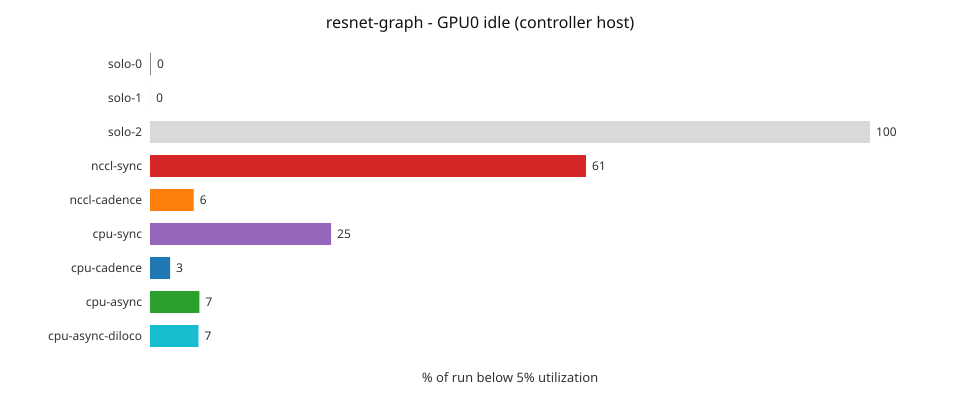

# DDP Benchmark Report

> **What "sync" means here**: every mode runs the same ElChe-scheduled
> engine with work-weighted averaging. The `*-sync` modes are its
> tightest cadence, not per-batch lockstep DDP - data is an equal
> split, and the reduce fires as soon as every alive rank has made at
> least one step since the last reduce. On a homogeneous rig that
> degenerates to classic DDP; on this heterogeneous rig the fast GPU
> runs several steps per reduce within its equal share, then idles once
> it is exhausted (visible as fast-GPU idle in the sync rows). The
> `*-cadence` modes dispatch data proportionally to measured throughput
> and reduce once every rank completes its planned ElChe window;
> `cpu-async` adds bounded overshoot and decoupled averaging, and
> `cpu-async-diloco` runs a DiLoCo outer optimizer (Nesterov on the
> pseudo-gradient) on top of it. The per-rank `share` column is the
> balancer's allocation view: it equals delivered work under
> cadence/async; under sync it is ElChe's capacity shadow (dispatch
> stays equal). See
> [What "sync" means in flodl](ddp.md#elchemode---cadence--backend-in-one-name).
>
> This sweep ran on a 3-GPU heterogeneous rig spanning two hosts - an
> RTX 5060 Ti on the controller host and two GTX 1060s inside a VM on
> the same box, coordinated over TCP as a real multi-host cluster (the
> slowest card sits behind a PCIe x1 riser, ~12x slower than the RTX
> in delivered throughput on the big models).
>
> This report is generated by `ddp-bench`. Reproduce on your own hardware:
>
> ```bash
> fdl setup                                # auto-detect GPUs, build libtorch + Docker image
> fdl @cluster ddp-bench --model resnet-graph --mode cpu-cadence --epochs 200   # one cell
> fdl ddp-bench --report --charts resnet-graph                                  # regenerate this report
> ```


## Hardware

- gpu r0 [exa-cuda:cuda0]: NVIDIA GeForce RTX 5060 Ti (15GB, sm_120)
- gpu r1 [flodl-pascal:cuda0]: NVIDIA GeForce GTX 1060 6GB (6GB, sm_61)
- gpu r2 [flodl-pascal:cuda1]: NVIDIA GeForce GTX 1060 6GB (6GB, sm_61)

- **Models**: 8
- **Modes**: 9
- **GPU speed ratio** (solo-1 / solo-0 wall time):
  - char-rnn: 7.44x (30s vs 223s)
  - conv-ae: 2.76x (2s vs 5s)
  - gpt-nano: 4.42x (64s vs 284s)
  - lenet: 1.98x (3s vs 6s)
  - logistic: 2.30x (1s vs 2s)
  - mlp: 1.55x (2s vs 3s)
  - resnet-graph: 4.56x (699s vs 3186s)
- **GPU speed ratio** (solo-2 / solo-0 wall time):
  - char-rnn: 11.46x (30s vs 343s)
  - conv-ae: 2.97x (2s vs 6s)
  - gpt-nano: 4.54x (64s vs 291s)
  - lenet: 2.13x (3s vs 7s)
  - logistic: 2.90x (1s vs 3s)
  - mlp: 1.72x (2s vs 4s)
  - resnet-graph: 4.75x (699s vs 3318s)

## Notes

DDP modes are expected to show slightly lower eval than solo on small models with few epochs. Distributed training converges slower in early epochs due to gradient averaging across devices with different data views, and ElChe (cadence/async) modes need calibration time to find the optimal sync interval, which further penalizes short runs. On longer training (200 epochs), every DDP mode surpasses solo convergence while completing faster -- the whole point of multi-GPU training.

**Mode semantics**: every mode runs the same ElChe-scheduled engine with work-weighted (sum-and-count) averaging; they differ in reduce cadence and dispatch. `*-sync` = equal data split, reduce fires as soon as every alive rank has made at least one step since the last reduce (NOT per-batch lockstep DDP -- on heterogeneous rigs the fast GPU runs several steps per reduce within its equal share, then idles once it is exhausted; degenerates to classic DDP on homogeneous rigs). `*-cadence` = throughput-proportional dispatch, reduce fires once every rank completes its planned ElChe window. `cpu-async` = cadence plus bounded overshoot and decoupled averaging. `cpu-async` is expected to trail `cpu-cadence` on fixed-epoch wall time, most visibly on short runs: async's weight-space divergence runs higher by nature (EASGD blending, decoupled application), so the convergence guard grows its reduce window more slowly -- more reduces early in the run -- and each reduce triggers mid-flight (in-flight drain plus snapshot transport against continued streaming). The surplus amortizes as the window reaches the epoch cap on longer runs. Async's edge is jitter tolerance when rank speeds fluctuate, not steady-state wall time.

## Charts - resnet-graph


*Training loss per epoch, all modes (log scale - the convergence tail is where modes differ).*


*Train accuracy per epoch, all modes (the LR-schedule steps are the visible jumps); each mode's final eval - measured once after training - is in the legend.*


*ElChe's smoothed allocation share for the fast rank, per epoch. Under `*-sync` dispatch is an equal split and this is the balancer's capacity shadow.*


*Window growth made visible: a flattening curve = the anchor amortizing sync cost; a steep straight line = per-step reduces.*


*Total wall time per mode (same epochs, same seed).*



*Idle share of the controller host's GPU only - cluster cells cannot sample remote GPUs (see Notes).*

## Incomplete Runs

- resnet/solo-1
- resnet/solo-2
- resnet/nccl-sync
- resnet/cpu-sync
- resnet/cpu-cadence
- resnet/cpu-async

## Per-Model Results

GPU columns = compute utilization % (not load), labeled by the host-physical device id the run's timeline sampled; `-` = device not sampled by that run. Idle = total time with <5% utilization.

**Known gap - remote-GPU columns**: the resource sampler runs on the controller host only, so cluster rows report util/VRAM/idle for the controller's GPU and show `-` for remote-host GPUs (on a heterogeneous rig that reads as "the fast card reports, the remote cards don't"). The remote-rank activity itself is fully accounted - allocation shares and throughput in the Per-Rank Schedule are rank-reported over the wire, as are the trajectory charts. Per-rank resource samples already cross the wire for the live dashboard; persisting them into the timeline (which fills these columns) is planned for an upcoming release.

### char-rnn

> Published: Shakespeare CE loss ~1.5, eval=val loss ([Karpathy 2015](https://karpathy.github.io/2015/05/21/rnn-effectiveness/))

| Mode | Loss | Eval | vs Ref | Total (s) | Syncs | Avg Sync (ms) | GPU0 | GPU1 | Idle (s) |
|------|------|------|--------|-----------|-------|--------------|------|------|----------|
| cpu-async | 1.044360 | 1.5893 | +0.0893 | 39.5 | 44 | 203.1 | 70% | - | 12.0 |
| cpu-async-diloco | 0.975095 | 1.7453 | +0.2453 | 40.5 | 44 | 204.5 | 65% | - | 14.0 |
| cpu-cadence | 1.013144 | 1.6526 | +0.1526 | 34.9 | 50 | 108.1 | 83% | - | 5.9 |
| cpu-sync | 1.086139 | 1.5670 | +0.0670 | 156.3 | 292 | 187.0 | 26% | - | 115.5 |
| nccl-cadence | 1.014466 | 1.6476 | +0.1476 | 31.5 | 51 | 0.1 | 84% | - | 5.0 |
| nccl-sync | 1.072311 | 1.5684 | +0.0684 | 128.8 | 491 | 0.1 | 30% | - | 90.1 |
| solo-0 | 0.992323 | 1.7245 | +0.2245 | 30.0 | 0 | 0.0 | 98% | - | 0.6 |
| solo-1 | 0.982739 | 1.7414 | +0.2414 | 223.2 | 0 | 0.0 | 100% | 0% | 224.2 |
| solo-2 | 0.998677 | 1.7451 | +0.2451 | 343.5 | 0 | 0.0 | 0% | 100% | 344.6 |

### conv-ae

> Published: MNIST reconstruction, eval=MSE ([PyTorch AE tutorial](https://pytorch.org/tutorials/beginner/introyt/autoencoders_intro.html))

| Mode | Loss | Eval | Total (s) | Syncs | Avg Sync (ms) | GPU0 | GPU1 | Idle (s) |
|------|------|------|-----------|-------|--------------|------|------|----------|
| cpu-async | 0.001097 | 0.0009 | 8.0 | 14 | 41.8 | 32% | - | 5.4 |
| cpu-async-diloco | 0.001182 | 0.0010 | 8.0 | 19 | 41.7 | 25% | - | 6.0 |
| cpu-cadence | 0.000985 | 0.0009 | 8.3 | 17 | 40.7 | 30% | - | 5.8 |
| cpu-sync | 0.000868 | 0.0008 | 8.0 | 21 | 45.1 | 13% | - | 7.0 |
| nccl-cadence | 0.001129 | 0.0010 | 9.5 | 20 | 0.1 | 37% | - | 6.0 |
| nccl-sync | 0.000766 | 0.0007 | 9.5 | 45 | 0.0 | 21% | - | 7.5 |
| solo-0 | 0.000638 | 0.0006 | 1.9 | 0 | 0.0 | 79% | - | 0.0 |
| solo-1 | 0.000670 | 0.0006 | 5.2 | 0 | 0.0 | 90% | 0% | 6.4 |
| solo-2 | 0.000714 | 0.0007 | 5.6 | 0 | 0.0 | 0% | 98% | 6.6 |

### gpt-nano

> Published: Shakespeare CE loss ~1.5-2.0, eval=val loss ([nanoGPT](https://github.com/karpathy/nanoGPT), [Vaswani 2017](https://arxiv.org/abs/1706.03762))

| Mode | Loss | Eval | Total (s) | Syncs | Avg Sync (ms) | GPU0 | GPU1 | Idle (s) |
|------|------|------|-----------|-------|--------------|------|------|----------|
| cpu-async | 1.864621 | 1.9184 | 53.3 | 46 | 168.0 | 84% | - | 8.4 |
| cpu-async-diloco | 1.699657 | 1.8144 | 52.3 | 46 | 179.1 | 83% | - | 8.8 |
| cpu-cadence | 1.827199 | 1.9017 | 53.5 | 53 | 99.1 | 91% | - | 4.9 |
| cpu-sync | 1.944666 | 1.9795 | 151.8 | 525 | 165.0 | 44% | - | 83.8 |
| nccl-cadence | 1.829329 | 1.8930 | 52.8 | 53 | 0.1 | 88% | - | 6.2 |
| nccl-sync | 1.920028 | 1.9584 | 106.7 | 819 | 0.1 | 49% | - | 54.9 |
| solo-0 | 1.619856 | 1.7599 | 64.1 | 0 | 0.0 | 99% | - | 0.7 |
| solo-1 | 1.627371 | 1.7615 | 283.6 | 0 | 0.0 | 100% | 0% | 284.7 |
| solo-2 | 1.657932 | 1.7879 | 290.8 | 0 | 0.0 | 0% | 100% | 291.9 |

### lenet

> Published: MNIST ~99% acc ([LeCun 1998](http://yann.lecun.com/exdb/publis/pdf/lecun-98.pdf))

| Mode | Loss | Eval | vs Ref | Total (s) | Syncs | Avg Sync (ms) | GPU0 | GPU1 | Idle (s) |
|------|------|------|--------|-----------|-------|--------------|------|------|----------|
| cpu-async | 0.050002 | 0.9864 | -0.0036 | 8.0 | 13 | 42.2 | 44% | - | 4.4 |
| cpu-async-diloco | 0.042979 | 0.9866 | -0.0034 | 8.0 | 14 | 40.1 | 32% | - | 5.4 |
| cpu-cadence | 0.046119 | 0.9889 | -0.0011 | 9.2 | 24 | 40.6 | 44% | - | 5.2 |
| cpu-sync | 0.042717 | 0.9894 | -0.0006 | 9.0 | 29 | 45.1 | 0% | - | 9.0 |
| nccl-cadence | 0.044710 | 0.9857 | -0.0043 | 42.5 | 28 | 1143.0 | 7% | - | 39.6 |
| nccl-sync | 0.039078 | 0.9893 | -0.0007 | 11.0 | 54 | 0.1 | 42% | - | 6.2 |
| solo-0 | 0.028122 | 0.9874 | -0.0026 | 3.2 | 0 | 0.0 | 81% | - | 0.7 |
| solo-1 | 0.028762 | 0.9858 | -0.0042 | 6.3 | 0 | 0.0 | 92% | 0% | 7.6 |
| solo-2 | 0.028860 | 0.9861 | -0.0039 | 6.8 | 0 | 0.0 | 0% | 98% | 7.8 |

### logistic

> Published: MNIST ~92% acc (linear baseline)

| Mode | Loss | Eval | vs Ref | Total (s) | Syncs | Avg Sync (ms) | GPU0 | GPU1 | Idle (s) |
|------|------|------|--------|-----------|-------|--------------|------|------|----------|
| cpu-async | 0.308260 | 0.9201 | +0.0001 | 7.0 | 13 | 40.9 | 22% | - | 5.4 |
| cpu-async-diloco | 0.291003 | 0.9230 | +0.0030 | 7.0 | 13 | 39.8 | 14% | - | 5.9 |
| cpu-cadence | 0.302837 | 0.9196 | -0.0004 | 7.0 | 18 | 41.9 | 29% | - | 4.9 |
| cpu-sync | 0.299058 | 0.9203 | +0.0003 | 9.0 | 18 | 44.9 | 6% | - | 8.3 |
| nccl-cadence | 0.304353 | 0.9192 | -0.0008 | 10.0 | 21 | 0.1 | 20% | - | 8.0 |
| nccl-sync | 0.299186 | 0.9192 | -0.0008 | 9.2 | 50 | 0.0 | 37% | - | 5.6 |
| solo-0 | 0.277819 | 0.9236 | +0.0036 | 1.1 | 0 | 0.0 | 40% | - | 0.8 |
| solo-1 | 0.277921 | 0.9234 | +0.0034 | 2.5 | 0 | 0.0 | 75% | 0% | 3.7 |
| solo-2 | 0.277801 | 0.9241 | +0.0041 | 3.1 | 0 | 0.0 | 0% | 94% | 4.4 |

### mlp

> Published: MNIST ~97-98% acc ([PyTorch tutorial](https://pytorch.org/tutorials/beginner/basics/quickstart_tutorial.html))

| Mode | Loss | Eval | vs Ref | Total (s) | Syncs | Avg Sync (ms) | GPU0 | GPU1 | Idle (s) |
|------|------|------|--------|-----------|-------|--------------|------|------|----------|
| cpu-async | 0.106089 | 0.9685 | -0.0065 | 7.0 | 13 | 42.0 | 29% | - | 4.9 |
| cpu-async-diloco | 0.084519 | 0.9741 | -0.0009 | 7.1 | 13 | 46.5 | 36% | - | 4.5 |
| cpu-cadence | 0.110666 | 0.9683 | -0.0067 | 7.8 | 19 | 43.5 | 19% | - | 6.3 |
| cpu-sync | 0.097623 | 0.9702 | -0.0048 | 7.0 | 46 | 44.1 | 43% | - | 3.9 |
| nccl-cadence | 0.107037 | 0.9707 | -0.0043 | 40.3 | 24 | 1333.4 | 5% | - | 38.3 |
| nccl-sync | 0.089523 | 0.9723 | -0.0027 | 8.5 | 51 | 0.1 | 32% | - | 5.6 |
| solo-0 | 0.045615 | 0.9714 | -0.0036 | 2.2 | 0 | 0.0 | 82% | - | 0.0 |
| solo-1 | 0.044935 | 0.9730 | -0.0020 | 3.4 | 0 | 0.0 | 84% | 0% | 4.6 |
| solo-2 | 0.045637 | 0.9731 | -0.0019 | 3.8 | 0 | 0.0 | 0% | 96% | 4.8 |

### resnet

> Published: CIFAR-10 91.25% acc ([He et al. 2015](https://arxiv.org/abs/1512.03385), Table 6)

| Mode | Loss | Eval | vs Ref | Total (s) | Syncs | Avg Sync (ms) | GPU0 | Idle (s) |
|------|------|------|--------|-----------|-------|--------------|------|----------|
| nccl-cadence | 0.038213 | 0.9160 | +0.0035 | 535.9 | 397 | 0.1 | 94% | 32.0 |
| solo-0 | 0.011651 | 0.9173 | +0.0048 | 688.6 | 0 | 0.0 | 100% | 0.8 |

### resnet-graph

> Published: CIFAR-10 91.25% acc, Graph builder ([He et al. 2015](https://arxiv.org/abs/1512.03385), Table 6)

| Mode | Loss | Eval | vs Ref | Total (s) | Syncs | Avg Sync (ms) | GPU0 | GPU1 | Idle (s) |
|------|------|------|--------|-----------|-------|--------------|------|------|----------|
| cpu-async | 0.043645 | 0.9208 | +0.0083 | 529.4 | 206 | 74.5 | 93% | - | 35.5 |
| cpu-async-diloco | 0.025059 | 0.9236 | +0.0111 | 524.1 | 216 | 73.9 | 93% | - | 35.3 |
| cpu-cadence | 0.040880 | 0.9167 | +0.0042 | 511.8 | 236 | 53.8 | 97% | - | 13.9 |
| cpu-sync | 0.032485 | 0.9162 | +0.0037 | 1650.2 | 15940 | 67.1 | 75% | - | 414.9 |
| nccl-cadence | 0.040028 | 0.9206 | +0.0081 | 547.7 | 438 | 0.1 | 94% | - | 32.8 |
| nccl-sync | 0.034981 | 0.9198 | +0.0073 | 1172.6 | 11255 | 0.0 | 39% | - | 710.1 |
| solo-0 | 0.012164 | 0.9210 | +0.0085 | 698.7 | 0 | 0.0 | 100% | - | 1.1 |
| solo-1 | 0.012515 | 0.9170 | +0.0045 | 3186.3 | 0 | 0.0 | 100% | 0% | 3187.5 |
| solo-2 | 0.012322 | 0.9194 | +0.0069 | 3318.0 | 0 | 0.0 | 0% | 100% | 3319.0 |

## Best Mode per Model

| Model | Best Eval | Mode | Fastest (within 2% of solo-0) | Mode |
|-------|-----------|------|-------------------------------|------|
| char-rnn | 1.5670 | cpu-sync | 31.5s | nccl-cadence |
| conv-ae | 0.0006 | solo-1 | - | - |
| gpt-nano | 1.7599 | solo-0 | - | - |
| lenet | 0.9894 | cpu-sync | 8.0s | cpu-async-diloco |
| logistic | 0.9241 | solo-2 | 7.0s | cpu-async-diloco |
| mlp | 0.9741 | cpu-async-diloco | 7.0s | cpu-async |
| resnet | 0.9173 | solo-0 | 535.9s | nccl-cadence |
| resnet-graph | 0.9236 | cpu-async-diloco | 511.8s | cpu-cadence |

## Eval Quality (vs solo-0)

| Model | cpu-async | cpu-async-diloco | cpu-cadence | cpu-sync | nccl-cadence | nccl-sync | solo-1 | solo-2 |
|-------|-----------|------------------|-------------|----------|--------------|-----------|--------|--------|
| char-rnn | -0.1352 | +0.0208 | -0.0719 | -0.1575 | -0.0769 | -0.1561 | +0.0169 | +0.0206 |
| conv-ae | +0.0003 | +0.0004 | +0.0003 | +0.0002 | +0.0004 | +0.0001 | 0 | +0.0001 |
| gpt-nano | +0.1585 | +0.0545 | +0.1418 | +0.2196 | +0.1331 | +0.1985 | +0.0016 | +0.0280 |
| lenet | -0.0010 | -0.0008 | +0.0015 | +0.0020 | -0.0017 | +0.0019 | -0.0016 | -0.0013 |
| logistic | -0.0035 | -0.0006 | -0.0040 | -0.0033 | -0.0044 | -0.0044 | -0.0002 | +0.0005 |
| mlp | -0.0029 | +0.0027 | -0.0031 | -0.0012 | -0.0007 | +0.0009 | +0.0016 | +0.0017 |
| resnet | - | - | - | - | -0.0013 | - | - | - |
| resnet-graph | -0.0002 | +0.0026 | -0.0043 | -0.0048 | -0.0004 | -0.0012 | -0.0040 | -0.0016 |

## Convergence Quality (loss ratio vs solo-0)

| Model | cpu-async | cpu-async-diloco | cpu-cadence | cpu-sync | nccl-cadence | nccl-sync | solo-1 | solo-2 |
|-------|-----------|------------------|-------------|----------|--------------|-----------|--------|--------|
| char-rnn | 1.05x | 0.98x | 1.02x | 1.09x | 1.02x | 1.08x | 0.99x | 1.01x |
| conv-ae | 1.72x | 1.85x | 1.54x | 1.36x | 1.77x | 1.20x | 1.05x | 1.12x |
| gpt-nano | 1.15x | 1.05x | 1.13x | 1.20x | 1.13x | 1.19x | 1.00x | 1.02x |
| lenet | 1.78x | 1.53x | 1.64x | 1.52x | 1.59x | 1.39x | 1.02x | 1.03x |
| logistic | 1.11x | 1.05x | 1.09x | 1.08x | 1.10x | 1.08x | 1.00x | 1.00x |
| mlp | 2.33x | 1.85x | 2.43x | 2.14x | 2.35x | 1.96x | 0.99x | 1.00x |
| resnet | - | - | - | - | 3.28x | - | - | - |
| resnet-graph | 3.59x | 2.06x | 3.36x | 2.67x | 3.29x | 2.88x | 1.03x | 1.01x |

## Per-Epoch Loss Trajectory

### char-rnn (sampled, 50 epochs)

| Mode | E0 | E3 | E5 | E8 | E10 | E13 | E15 | E18 | E21 | E23 | E26 | E28 | E31 | E34 | E36 | E39 | E41 | E44 | E46 | E49 |
|------|------|------|------|------|------|------|------|------|------|------|------|------|------|------|------|------|------|------|------|------|
| cpu-async | 2.7903 | 1.6316 | 1.5028 | 1.4034 | 1.3655 | 1.3195 | 1.2948 | 1.2626 | 1.2341 | 1.2154 | 1.1928 | 1.1759 | 1.1557 | 1.1334 | 1.1183 | 1.1005 | 1.0855 | 1.0679 | 1.0569 | 1.0444 |
| cpu-async-diloco | 2.8095 | 1.5755 | 1.4539 | 1.3507 | 1.3125 | 1.2625 | 1.2345 | 1.1994 | 1.1645 | 1.1471 | 1.1195 | 1.1001 | 1.0788 | 1.0554 | 1.0396 | 1.0246 | 1.0096 | 0.9964 | 0.9866 | 0.9751 |
| cpu-cadence | 2.6724 | 1.5837 | 1.4675 | 1.3809 | 1.3442 | 1.2991 | 1.2744 | 1.2405 | 1.2116 | 1.1938 | 1.1683 | 1.1512 | 1.1269 | 1.1039 | 1.0905 | 1.0706 | 1.0578 | 1.0390 | 1.0284 | 1.0131 |
| cpu-sync | 2.4267 | 1.5967 | 1.4974 | 1.4163 | 1.3815 | 1.3389 | 1.3176 | 1.2879 | 1.2632 | 1.2488 | 1.2269 | 1.2137 | 1.1929 | 1.1758 | 1.1632 | 1.1439 | 1.1320 | 1.1150 | 1.1044 | 1.0861 |
| nccl-cadence | 2.6966 | 1.5667 | 1.4616 | 1.3755 | 1.3385 | 1.2938 | 1.2701 | 1.2377 | 1.2097 | 1.1921 | 1.1668 | 1.1492 | 1.1262 | 1.1033 | 1.0901 | 1.0706 | 1.0587 | 1.0414 | 1.0291 | 1.0145 |
| nccl-sync | 2.4369 | 1.5966 | 1.4948 | 1.4123 | 1.3756 | 1.3327 | 1.3110 | 1.2795 | 1.2532 | 1.2384 | 1.2146 | 1.2026 | 1.1805 | 1.1606 | 1.1480 | 1.1307 | 1.1184 | 1.0991 | 1.0893 | 1.0723 |
| solo-0 | 2.3012 | 1.5243 | 1.4225 | 1.3394 | 1.3009 | 1.2544 | 1.2291 | 1.1942 | 1.1633 | 1.1428 | 1.1161 | 1.1005 | 1.0774 | 1.0581 | 1.0457 | 1.0294 | 1.0212 | 1.0093 | 1.0019 | 0.9923 |
| solo-1 | 2.2647 | 1.5090 | 1.4128 | 1.3315 | 1.2937 | 1.2486 | 1.2224 | 1.1863 | 1.1554 | 1.1339 | 1.1061 | 1.0894 | 1.0670 | 1.0464 | 1.0344 | 1.0199 | 1.0111 | 0.9987 | 0.9924 | 0.9827 |
| solo-2 | 2.2797 | 1.5254 | 1.4273 | 1.3454 | 1.3069 | 1.2619 | 1.2358 | 1.2018 | 1.1709 | 1.1504 | 1.1239 | 1.1068 | 1.0847 | 1.0644 | 1.0530 | 1.0369 | 1.0279 | 1.0154 | 1.0081 | 0.9987 |

### conv-ae

| Mode | E0 | E1 | E2 | E3 | E4 |
|------|------|------|------|------|------|
| cpu-async | 0.0447 | 0.0030 | 0.0018 | 0.0013 | 0.0011 |
| cpu-async-diloco | 0.0454 | 0.0038 | 0.0020 | 0.0015 | 0.0012 |
| cpu-cadence | 0.0416 | 0.0026 | 0.0016 | 0.0012 | 0.0010 |
| cpu-sync | 0.0173 | 0.0016 | 0.0012 | 0.0010 | 0.0009 |
| nccl-cadence | 0.0374 | 0.0030 | 0.0018 | 0.0014 | 0.0011 |
| nccl-sync | 0.0191 | 0.0015 | 0.0011 | 0.0009 | 0.0008 |
| solo-0 | 0.0164 | 0.0014 | 0.0009 | 0.0007 | 0.0006 |
| solo-1 | 0.0177 | 0.0015 | 0.0010 | 0.0008 | 0.0007 |
| solo-2 | 0.0160 | 0.0016 | 0.0011 | 0.0009 | 0.0007 |

### gpt-nano (sampled, 50 epochs)

| Mode | E0 | E3 | E5 | E8 | E10 | E13 | E15 | E18 | E21 | E23 | E26 | E28 | E31 | E34 | E36 | E39 | E41 | E44 | E46 | E49 |
|------|------|------|------|------|------|------|------|------|------|------|------|------|------|------|------|------|------|------|------|------|
| cpu-async | 4.1350 | 3.0414 | 2.7561 | 2.5541 | 2.4914 | 2.3967 | 2.3243 | 2.2290 | 2.1529 | 2.1105 | 2.0579 | 2.0257 | 1.9853 | 1.9518 | 1.9331 | 1.9095 | 1.8966 | 1.8805 | 1.8730 | 1.8646 |
| cpu-async-diloco | 4.2057 | 2.9905 | 2.7029 | 2.5208 | 2.4567 | 2.3392 | 2.2497 | 2.1394 | 2.0486 | 1.9950 | 1.9285 | 1.8884 | 1.8382 | 1.7992 | 1.7761 | 1.7497 | 1.7353 | 1.7186 | 1.7096 | 1.6997 |
| cpu-cadence | 4.2374 | 3.0425 | 2.6970 | 2.5351 | 2.4759 | 2.3757 | 2.3034 | 2.2078 | 2.1301 | 2.0861 | 2.0259 | 1.9915 | 1.9494 | 1.9145 | 1.8961 | 1.8718 | 1.8590 | 1.8436 | 1.8360 | 1.8272 |
| cpu-sync | 4.2234 | 3.1171 | 2.7771 | 2.5773 | 2.5163 | 2.4454 | 2.3939 | 2.3124 | 2.2410 | 2.1971 | 2.1369 | 2.1057 | 2.0641 | 2.0310 | 2.0127 | 1.9897 | 1.9763 | 1.9610 | 1.9535 | 1.9447 |
| nccl-cadence | 4.2508 | 3.0026 | 2.6816 | 2.5341 | 2.4711 | 2.3574 | 2.2877 | 2.1940 | 2.1186 | 2.0774 | 2.0223 | 1.9901 | 1.9485 | 1.9149 | 1.8963 | 1.8729 | 1.8601 | 1.8450 | 1.8367 | 1.8293 |
| nccl-sync | 4.2250 | 3.1033 | 2.7535 | 2.5728 | 2.5132 | 2.4465 | 2.3908 | 2.3004 | 2.2221 | 2.1784 | 2.1195 | 2.0865 | 2.0444 | 2.0096 | 1.9907 | 1.9664 | 1.9537 | 1.9371 | 1.9300 | 1.9200 |
| solo-0 | 4.0660 | 2.7778 | 2.5847 | 2.4675 | 2.3658 | 2.1893 | 2.0927 | 1.9803 | 1.8953 | 1.8492 | 1.7931 | 1.7623 | 1.7243 | 1.6944 | 1.6785 | 1.6582 | 1.6472 | 1.6340 | 1.6270 | 1.6199 |
| solo-1 | 4.0995 | 2.7638 | 2.5838 | 2.4730 | 2.3672 | 2.2019 | 2.1127 | 2.0027 | 1.9151 | 1.8677 | 1.8088 | 1.7761 | 1.7357 | 1.7051 | 1.6888 | 1.6674 | 1.6561 | 1.6421 | 1.6351 | 1.6274 |
| solo-2 | 4.1086 | 2.7685 | 2.5849 | 2.4807 | 2.3990 | 2.2436 | 2.1546 | 2.0482 | 1.9632 | 1.9150 | 1.8535 | 1.8194 | 1.7762 | 1.7424 | 1.7237 | 1.7007 | 1.6882 | 1.6742 | 1.6662 | 1.6579 |

### lenet

| Mode | E0 | E1 | E2 | E3 | E4 |
|------|------|------|------|------|------|
| cpu-async | 0.3481 | 0.0872 | 0.0671 | 0.0556 | 0.0500 |
| cpu-async-diloco | 0.3363 | 0.0835 | 0.0624 | 0.0488 | 0.0430 |
| cpu-cadence | 0.3317 | 0.0828 | 0.0598 | 0.0511 | 0.0461 |
| cpu-sync | 0.2102 | 0.0730 | 0.0567 | 0.0457 | 0.0427 |
| nccl-cadence | 0.3358 | 0.0799 | 0.0600 | 0.0490 | 0.0447 |
| nccl-sync | 0.1994 | 0.0673 | 0.0524 | 0.0413 | 0.0391 |
| solo-0 | 0.1957 | 0.0607 | 0.0449 | 0.0354 | 0.0281 |
| solo-1 | 0.1865 | 0.0597 | 0.0438 | 0.0345 | 0.0288 |
| solo-2 | 0.1884 | 0.0609 | 0.0426 | 0.0347 | 0.0289 |

### logistic

| Mode | E0 | E1 | E2 | E3 | E4 |
|------|------|------|------|------|------|
| cpu-async | 0.7964 | 0.3974 | 0.3476 | 0.3231 | 0.3083 |
| cpu-async-diloco | 0.7582 | 0.3783 | 0.3310 | 0.3058 | 0.2910 |
| cpu-cadence | 0.7713 | 0.3901 | 0.3387 | 0.3164 | 0.3028 |
| cpu-sync | 0.5833 | 0.3637 | 0.3284 | 0.3103 | 0.2991 |
| nccl-cadence | 0.7771 | 0.3867 | 0.3417 | 0.3189 | 0.3044 |
| nccl-sync | 0.5908 | 0.3576 | 0.3246 | 0.3098 | 0.2992 |
| solo-0 | 0.5496 | 0.3292 | 0.3002 | 0.2863 | 0.2778 |
| solo-1 | 0.5505 | 0.3296 | 0.3004 | 0.2865 | 0.2779 |
| solo-2 | 0.5504 | 0.3290 | 0.3001 | 0.2863 | 0.2778 |

### mlp

| Mode | E0 | E1 | E2 | E3 | E4 |
|------|------|------|------|------|------|
| cpu-async | 0.4687 | 0.2163 | 0.1603 | 0.1271 | 0.1061 |
| cpu-async-diloco | 0.4455 | 0.1976 | 0.1415 | 0.1074 | 0.0845 |
| cpu-cadence | 0.4608 | 0.2197 | 0.1675 | 0.1324 | 0.1107 |
| cpu-sync | 0.3994 | 0.2004 | 0.1484 | 0.1172 | 0.0976 |
| nccl-cadence | 0.4552 | 0.2227 | 0.1668 | 0.1311 | 0.1070 |
| nccl-sync | 0.3421 | 0.1738 | 0.1317 | 0.1054 | 0.0895 |
| solo-0 | 0.3107 | 0.1318 | 0.0869 | 0.0619 | 0.0456 |
| solo-1 | 0.3114 | 0.1338 | 0.0877 | 0.0620 | 0.0449 |
| solo-2 | 0.3123 | 0.1346 | 0.0889 | 0.0632 | 0.0456 |

### resnet (sampled, 200 epochs)

| Mode | E0 | E10 | E21 | E31 | E42 | E52 | E63 | E73 | E84 | E94 | E105 | E115 | E126 | E136 | E147 | E157 | E168 | E178 | E189 | E199 |
|------|------|------|------|------|------|------|------|------|------|------|------|------|------|------|------|------|------|------|------|------|
| nccl-cadence | 1.8080 | 0.5912 | 0.4484 | 0.3980 | 0.3640 | 0.3408 | 0.3195 | 0.3134 | 0.2985 | 0.2968 | 0.1274 | 0.0988 | 0.0856 | 0.0753 | 0.0663 | 0.0442 | 0.0416 | 0.0399 | 0.0391 | 0.0382 |
| solo-0 | 1.7213 | 0.4918 | 0.3850 | 0.3455 | 0.3246 | 0.3128 | 0.3002 | 0.2962 | 0.2870 | 0.2868 | 0.1085 | 0.0710 | 0.0546 | 0.0447 | 0.0435 | 0.0190 | 0.0164 | 0.0137 | 0.0125 | 0.0117 |

### resnet-graph (sampled, 200 epochs)

| Mode | E0 | E10 | E21 | E31 | E42 | E52 | E63 | E73 | E84 | E94 | E105 | E115 | E126 | E136 | E147 | E157 | E168 | E178 | E189 | E199 |
|------|------|------|------|------|------|------|------|------|------|------|------|------|------|------|------|------|------|------|------|------|
| cpu-async | 1.8208 | 0.6134 | 0.4650 | 0.4022 | 0.3728 | 0.3462 | 0.3348 | 0.3238 | 0.3163 | 0.3038 | 0.1353 | 0.1081 | 0.0957 | 0.0827 | 0.0757 | 0.0509 | 0.0458 | 0.0477 | 0.0443 | 0.0436 |
| cpu-async-diloco | 1.8272 | 0.5386 | 0.4105 | 0.3603 | 0.3366 | 0.3186 | 0.3087 | 0.2985 | 0.2913 | 0.2895 | 0.1399 | 0.0962 | 0.0773 | 0.0666 | 0.0614 | 0.0385 | 0.0323 | 0.0274 | 0.0265 | 0.0251 |
| cpu-cadence | 1.8743 | 0.5971 | 0.4597 | 0.4014 | 0.3570 | 0.3410 | 0.3244 | 0.3137 | 0.3101 | 0.3060 | 0.1337 | 0.1045 | 0.0878 | 0.0776 | 0.0694 | 0.0491 | 0.0456 | 0.0450 | 0.0430 | 0.0409 |
| cpu-sync | 1.7634 | 0.5399 | 0.3995 | 0.3407 | 0.3109 | 0.2900 | 0.2731 | 0.2634 | 0.2527 | 0.2478 | 0.1051 | 0.0783 | 0.0649 | 0.0579 | 0.0490 | 0.0370 | 0.0353 | 0.0333 | 0.0328 | 0.0325 |
| nccl-cadence | 1.8536 | 0.5921 | 0.4518 | 0.3947 | 0.3630 | 0.3364 | 0.3241 | 0.3098 | 0.3030 | 0.2910 | 0.1287 | 0.1034 | 0.0854 | 0.0771 | 0.0678 | 0.0452 | 0.0432 | 0.0427 | 0.0400 | 0.0400 |
| nccl-sync | 1.7814 | 0.5846 | 0.4381 | 0.3754 | 0.3392 | 0.3218 | 0.3021 | 0.2902 | 0.2779 | 0.2713 | 0.1139 | 0.0879 | 0.0763 | 0.0651 | 0.0581 | 0.0400 | 0.0382 | 0.0361 | 0.0338 | 0.0350 |
| solo-0 | 1.6957 | 0.4979 | 0.3850 | 0.3514 | 0.3298 | 0.3146 | 0.2982 | 0.2986 | 0.2885 | 0.2799 | 0.1064 | 0.0697 | 0.0527 | 0.0471 | 0.0464 | 0.0198 | 0.0143 | 0.0147 | 0.0119 | 0.0122 |
| solo-1 | 1.6783 | 0.4941 | 0.3904 | 0.3535 | 0.3249 | 0.3124 | 0.3068 | 0.3027 | 0.2947 | 0.2862 | 0.1096 | 0.0676 | 0.0530 | 0.0461 | 0.0469 | 0.0217 | 0.0166 | 0.0138 | 0.0126 | 0.0125 |
| solo-2 | 1.6834 | 0.4975 | 0.3943 | 0.3541 | 0.3312 | 0.3196 | 0.3094 | 0.3037 | 0.2951 | 0.2903 | 0.1134 | 0.0755 | 0.0558 | 0.0495 | 0.0458 | 0.0209 | 0.0174 | 0.0156 | 0.0136 | 0.0123 |

## Speedup vs solo-0

| Model | cpu-async | cpu-async-diloco | cpu-cadence | cpu-sync | nccl-cadence | nccl-sync | solo-1 | solo-2 |
|-------|-----------|------------------|-------------|----------|--------------|-----------|--------|--------|
| char-rnn | 0.7x | 0.7x | 0.8x | 0.2x | 0.9x | 0.2x | 0.1x | 0.1x |
| conv-ae | 0.2x | 0.2x | 0.2x | 0.2x | 0.2x | 0.2x | 0.3x | 0.3x |
| gpt-nano | 1.2x | 1.2x | 1.1x | 0.4x | 1.2x | 0.6x | 0.2x | 0.2x |
| lenet | 0.4x | 0.4x | 0.3x | 0.3x | 0.1x | 0.3x | 0.5x | 0.4x |
| logistic | 0.1x | 0.1x | 0.1x | 0.1x | 0.1x | 0.1x | 0.3x | 0.3x |
| mlp | 0.3x | 0.3x | 0.3x | 0.3x | 0.0x | 0.2x | 0.6x | 0.5x |
| resnet | - | - | - | - | 1.2x | - | - | - |
| resnet-graph | 1.3x | 1.3x | 1.3x | 0.4x | 1.2x | 0.6x | 0.2x | 0.2x |


Speedup denominator uses solo-0's `# train_only:` time when reported (baseline-eval models), so the ratio compares DDP wall time against solo's training-only wall time. Solo's per-epoch eval is excluded from this comparison because DDP runs only eval once at the end.

## Per-Rank Schedule

`share` is the balancer's smoothed allocation view (ElChe `batch_counts`, sums to ~1); `tput` is samples/ms of the rank's own work (peer-wait excluded). Under cadence/async modes dispatch follows the balancer, so `share` IS the delivered work split - the fast GPU consumes a proportionally larger share to keep pace with the slow ones. Under `*-sync` modes dispatch is an EQUAL split regardless: there `share` shows what ElChe would allocate (a capacity shadow), not delivered work - the delivered imbalance surfaces as fast-GPU idle instead.

| Model | Mode | Rank | Device | Share | Tput (samp/ms) |
|-------|------|------|--------|-------|----------------|
| char-rnn | cpu-async | 0 | cuda:0 | 0.8232 | 18.6 |
| char-rnn | cpu-async | 1 | cuda:1 | 0.1014 | 2.3 |
| char-rnn | cpu-async | 2 | cuda:2 | 0.0754 | 1.6 |
| char-rnn | cpu-async-diloco | 0 | cuda:0 | 0.8221 | 18.7 |
| char-rnn | cpu-async-diloco | 1 | cuda:1 | 0.1015 | 2.4 |
| char-rnn | cpu-async-diloco | 2 | cuda:2 | 0.0765 | 1.5 |
| char-rnn | cpu-cadence | 0 | cuda:0 | 0.8482 | 14.4 |
| char-rnn | cpu-cadence | 1 | cuda:1 | 0.0921 | 1.8 |
| char-rnn | cpu-cadence | 2 | cuda:2 | 0.0598 | 1.2 |
| char-rnn | cpu-sync | 0 | cuda:0 | 0.7971 | 13.2 |
| char-rnn | cpu-sync | 1 | cuda:1 | 0.1172 | 1.7 |
| char-rnn | cpu-sync | 2 | cuda:2 | 0.0857 | 1.2 |
| char-rnn | nccl-cadence | 0 | cuda:0 | 0.8481 | 14.1 |
| char-rnn | nccl-cadence | 1 | cuda:1 | 0.0926 | 1.9 |
| char-rnn | nccl-cadence | 2 | cuda:2 | 0.0593 | 1.2 |
| char-rnn | nccl-sync | 0 | cuda:0 | 0.7971 | 13.7 |
| char-rnn | nccl-sync | 1 | cuda:1 | 0.1168 | 1.7 |
| char-rnn | nccl-sync | 2 | cuda:2 | 0.0861 | 1.2 |
| conv-ae | cpu-async | 0 | cuda:0 | 0.5520 | 211.0 |
| conv-ae | cpu-async | 1 | cuda:1 | 0.2357 | 80.4 |
| conv-ae | cpu-async | 2 | cuda:2 | 0.2122 | 65.3 |
| conv-ae | cpu-async-diloco | 0 | cuda:0 | 0.5903 | 343.8 |
| conv-ae | cpu-async-diloco | 1 | cuda:1 | 0.2192 | 119.4 |
| conv-ae | cpu-async-diloco | 2 | cuda:2 | 0.1905 | 97.0 |
| conv-ae | cpu-cadence | 0 | cuda:0 | 0.6240 | 248.7 |
| conv-ae | cpu-cadence | 1 | cuda:1 | 0.2026 | 81.2 |
| conv-ae | cpu-cadence | 2 | cuda:2 | 0.1735 | 76.9 |
| conv-ae | cpu-sync | 0 | cuda:0 | 0.7600 | 130.8 |
| conv-ae | cpu-sync | 1 | cuda:1 | 0.1158 | 58.9 |
| conv-ae | cpu-sync | 2 | cuda:2 | 0.1243 | 53.3 |
| conv-ae | nccl-cadence | 0 | cuda:0 | 0.5861 | 294.5 |
| conv-ae | nccl-cadence | 1 | cuda:1 | 0.2179 | 113.1 |
| conv-ae | nccl-cadence | 2 | cuda:2 | 0.1961 | 100.0 |
| conv-ae | nccl-sync | 0 | cuda:0 | 0.5852 | 138.1 |
| conv-ae | nccl-sync | 1 | cuda:1 | 0.2218 | 63.6 |
| conv-ae | nccl-sync | 2 | cuda:2 | 0.1930 | 54.8 |
| gpt-nano | cpu-async | 0 | cuda:0 | 0.6757 | 9.4 |
| gpt-nano | cpu-async | 1 | cuda:1 | 0.1645 | 1.9 |
| gpt-nano | cpu-async | 2 | cuda:2 | 0.1598 | 2.0 |
| gpt-nano | cpu-async-diloco | 0 | cuda:0 | 0.6770 | 9.3 |
| gpt-nano | cpu-async-diloco | 1 | cuda:1 | 0.1636 | 2.0 |
| gpt-nano | cpu-async-diloco | 2 | cuda:2 | 0.1594 | 1.9 |
| gpt-nano | cpu-cadence | 0 | cuda:0 | 0.6973 | 7.1 |
| gpt-nano | cpu-cadence | 1 | cuda:1 | 0.1544 | 1.6 |
| gpt-nano | cpu-cadence | 2 | cuda:2 | 0.1483 | 1.6 |
| gpt-nano | cpu-sync | 0 | cuda:0 | 0.6399 | 6.9 |
| gpt-nano | cpu-sync | 1 | cuda:1 | 0.1801 | 1.8 |
| gpt-nano | cpu-sync | 2 | cuda:2 | 0.1801 | 1.7 |
| gpt-nano | nccl-cadence | 0 | cuda:0 | 0.6983 | 7.1 |
| gpt-nano | nccl-cadence | 1 | cuda:1 | 0.1533 | 1.6 |
| gpt-nano | nccl-cadence | 2 | cuda:2 | 0.1484 | 1.6 |
| gpt-nano | nccl-sync | 0 | cuda:0 | 0.6368 | 6.9 |
| gpt-nano | nccl-sync | 1 | cuda:1 | 0.1817 | 1.7 |
| gpt-nano | nccl-sync | 2 | cuda:2 | 0.1814 | 1.7 |
| lenet | cpu-async | 0 | cuda:0 | 0.5388 | 126.9 |
| lenet | cpu-async | 1 | cuda:1 | 0.2439 | 59.0 |
| lenet | cpu-async | 2 | cuda:2 | 0.2173 | 53.3 |
| lenet | cpu-async-diloco | 0 | cuda:0 | 0.5261 | 145.4 |
| lenet | cpu-async-diloco | 1 | cuda:1 | 0.2531 | 68.1 |
| lenet | cpu-async-diloco | 2 | cuda:2 | 0.2208 | 66.8 |
| lenet | cpu-cadence | 0 | cuda:0 | 0.5393 | 316.3 |
| lenet | cpu-cadence | 1 | cuda:1 | 0.2359 | 145.5 |
| lenet | cpu-cadence | 2 | cuda:2 | 0.2248 | 141.9 |
| lenet | cpu-sync | 0 | cuda:0 | 0.6829 | 98.6 |
| lenet | cpu-sync | 1 | cuda:1 | 0.1567 | 44.8 |
| lenet | cpu-sync | 2 | cuda:2 | 0.1604 | 42.7 |
| lenet | nccl-cadence | 0 | cuda:0 | 0.5209 | 302.3 |
| lenet | nccl-cadence | 1 | cuda:1 | 0.2528 | 155.3 |
| lenet | nccl-cadence | 2 | cuda:2 | 0.2262 | 134.0 |
| lenet | nccl-sync | 0 | cuda:0 | 0.5468 | 92.1 |
| lenet | nccl-sync | 1 | cuda:1 | 0.2351 | 45.3 |
| lenet | nccl-sync | 2 | cuda:2 | 0.2182 | 42.9 |
| logistic | cpu-async | 0 | cuda:0 | 0.5981 | 361.0 |
| logistic | cpu-async | 1 | cuda:1 | 0.2478 | 167.8 |
| logistic | cpu-async | 2 | cuda:2 | 0.1540 | 135.5 |
| logistic | cpu-async-diloco | 0 | cuda:0 | 0.5728 | 380.7 |
| logistic | cpu-async-diloco | 1 | cuda:1 | 0.2414 | 167.3 |
| logistic | cpu-async-diloco | 2 | cuda:2 | 0.1858 | 148.1 |
| logistic | cpu-cadence | 0 | cuda:0 | 0.5913 | 603.0 |
| logistic | cpu-cadence | 1 | cuda:1 | 0.2349 | 257.8 |
| logistic | cpu-cadence | 2 | cuda:2 | 0.1738 | 198.9 |
| logistic | cpu-sync | 0 | cuda:0 | 0.8097 | 166.3 |
| logistic | cpu-sync | 1 | cuda:1 | 0.0828 | 81.3 |
| logistic | cpu-sync | 2 | cuda:2 | 0.1075 | 70.9 |
| logistic | nccl-cadence | 0 | cuda:0 | 0.5784 | 421.7 |
| logistic | nccl-cadence | 1 | cuda:1 | 0.2401 | 206.7 |
| logistic | nccl-cadence | 2 | cuda:2 | 0.1815 | 155.8 |
| logistic | nccl-sync | 0 | cuda:0 | 0.5632 | 168.6 |
| logistic | nccl-sync | 1 | cuda:1 | 0.2157 | 96.9 |
| logistic | nccl-sync | 2 | cuda:2 | 0.2211 | 98.2 |
| mlp | cpu-async | 0 | cuda:0 | 0.5092 | 211.8 |
| mlp | cpu-async | 1 | cuda:1 | 0.2508 | 122.9 |
| mlp | cpu-async | 2 | cuda:2 | 0.2399 | 127.0 |
| mlp | cpu-async-diloco | 0 | cuda:0 | 0.4826 | 209.0 |
| mlp | cpu-async-diloco | 1 | cuda:1 | 0.2830 | 130.4 |
| mlp | cpu-async-diloco | 2 | cuda:2 | 0.2343 | 114.7 |
| mlp | cpu-cadence | 0 | cuda:0 | 0.4862 | 318.8 |
| mlp | cpu-cadence | 1 | cuda:1 | 0.2723 | 196.9 |
| mlp | cpu-cadence | 2 | cuda:2 | 0.2415 | 172.8 |
| mlp | cpu-sync | 0 | cuda:0 | 0.3757 | 133.3 |
| mlp | cpu-sync | 1 | cuda:1 | 0.3413 | 112.6 |
| mlp | cpu-sync | 2 | cuda:2 | 0.2830 | 103.0 |
| mlp | nccl-cadence | 0 | cuda:0 | 0.4267 | 405.3 |
| mlp | nccl-cadence | 1 | cuda:1 | 0.3061 | 241.8 |
| mlp | nccl-cadence | 2 | cuda:2 | 0.2672 | 269.5 |
| mlp | nccl-sync | 0 | cuda:0 | 0.5589 | 138.2 |
| mlp | nccl-sync | 1 | cuda:1 | 0.2205 | 98.0 |
| mlp | nccl-sync | 2 | cuda:2 | 0.2206 | 86.4 |
| resnet | nccl-cadence | 0 | cuda:0 | 0.6913 | 30.7 |
| resnet | nccl-cadence | 1 | cuda:1 | 0.1589 | 7.0 |
| resnet | nccl-cadence | 2 | cuda:2 | 0.1496 | 6.7 |
| resnet-graph | cpu-async | 0 | cuda:0 | 0.6885 | 21.1 |
| resnet-graph | cpu-async | 1 | cuda:1 | 0.1604 | 4.4 |
| resnet-graph | cpu-async | 2 | cuda:2 | 0.1512 | 4.3 |
| resnet-graph | cpu-async-diloco | 0 | cuda:0 | 0.6890 | 21.5 |
| resnet-graph | cpu-async-diloco | 1 | cuda:1 | 0.1593 | 4.6 |
| resnet-graph | cpu-async-diloco | 2 | cuda:2 | 0.1517 | 4.4 |
| resnet-graph | cpu-cadence | 0 | cuda:0 | 0.6926 | 17.8 |
| resnet-graph | cpu-cadence | 1 | cuda:1 | 0.1580 | 4.5 |
| resnet-graph | cpu-cadence | 2 | cuda:2 | 0.1494 | 4.2 |
| resnet-graph | cpu-sync | 0 | cuda:0 | 0.6241 | 15.0 |
| resnet-graph | cpu-sync | 1 | cuda:1 | 0.1887 | 4.1 |
| resnet-graph | cpu-sync | 2 | cuda:2 | 0.1872 | 4.0 |
| resnet-graph | nccl-cadence | 0 | cuda:0 | 0.6891 | 33.5 |
| resnet-graph | nccl-cadence | 1 | cuda:1 | 0.1589 | 7.7 |
| resnet-graph | nccl-cadence | 2 | cuda:2 | 0.1520 | 8.0 |
| resnet-graph | nccl-sync | 0 | cuda:0 | 0.6537 | 15.1 |
| resnet-graph | nccl-sync | 1 | cuda:1 | 0.1806 | 3.7 |
| resnet-graph | nccl-sync | 2 | cuda:2 | 0.1657 | 3.5 |

## VRAM Usage

| Model | Mode | GPU0 Peak (MB) | GPU0 Mean (MB) | GPU1 Peak (MB) | GPU1 Mean (MB) |
|-------|------|---------------|---------------|---------------|---------------|
| char-rnn | solo-0 | 274 | 272 | - | - |
| char-rnn | solo-1 | 274 | 273 | 0 | 0 |
| char-rnn | solo-2 | 0 | 0 | 274 | 273 |
| conv-ae | solo-0 | 216 | 202 | - | - |
| conv-ae | solo-1 | 216 | 204 | 0 | 0 |
| conv-ae | solo-2 | 0 | 0 | 216 | 209 |
| gpt-nano | solo-0 | 466 | 464 | - | - |
| gpt-nano | solo-1 | 440 | 439 | 0 | 0 |
| gpt-nano | solo-2 | 0 | 0 | 440 | 439 |
| lenet | solo-0 | 238 | 228 | - | - |
| lenet | solo-1 | 238 | 227 | 0 | 0 |
| lenet | solo-2 | 0 | 0 | 238 | 230 |
| logistic | solo-0 | 232 | 203 | - | - |
| logistic | solo-1 | 232 | 198 | 0 | 0 |
| logistic | solo-2 | 0 | 0 | 232 | 209 |
| mlp | solo-0 | 236 | 222 | - | - |
| mlp | solo-1 | 236 | 214 | 0 | 0 |
| mlp | solo-2 | 0 | 0 | 236 | 222 |
| resnet | solo-0 | 848 | 847 | - | - |
| resnet-graph | solo-0 | 846 | 845 | - | - |
| resnet-graph | solo-1 | 846 | 845 | 0 | 0 |
| resnet-graph | solo-2 | 0 | 0 | 846 | 845 |

## GPU Idle Analysis

Idle gaps >= 500ms, classified by nearest event.

### char-rnn

| Mode | GPU | Start (s) | Duration (s) | Cause |
|------|-----|-----------|-------------|-------|
| cpu-async | gpu0 | 37.9 | 1.6 | cpu-avg |
| cpu-async | gpu0 | 7.4 | 0.5 | cpu-avg |
| cpu-async | gpu0 | 36.9 | 0.5 | cpu-avg |
| cpu-async | gpu0 | 5.9 | 0.5 | cpu-avg |
| cpu-async | gpu0 | 11.4 | 0.5 | cpu-avg |
| cpu-async | gpu0 | 14.4 | 0.5 | cpu-avg |
| cpu-async | gpu0 | 22.9 | 0.5 | cpu-avg |
| cpu-async | gpu0 | 26.4 | 0.5 | cpu-avg |
| cpu-async | gpu0 | 27.9 | 0.5 | cpu-avg |
| cpu-async | gpu0 | 30.4 | 0.5 | cpu-avg |
| cpu-async-diloco | gpu0 | 38.7 | 1.8 | cpu-avg |
| cpu-async-diloco | gpu0 | 27.7 | 1.0 | cpu-avg |
| cpu-async-diloco | gpu0 | 20.1 | 1.0 | cpu-avg |
| cpu-async-diloco | gpu0 | 7.2 | 0.5 | cpu-avg |
| cpu-async-diloco | gpu0 | 9.2 | 0.5 | cpu-avg |
| cpu-async-diloco | gpu0 | 11.7 | 0.5 | cpu-avg |
| cpu-async-diloco | gpu0 | 14.2 | 0.5 | cpu-avg |
| cpu-async-diloco | gpu0 | 31.2 | 0.5 | cpu-avg |
| cpu-async-diloco | gpu0 | 5.6 | 0.5 | cpu-avg |
| cpu-async-diloco | gpu0 | 8.2 | 0.5 | cpu-avg |
| cpu-cadence | gpu0 | 34.0 | 0.9 | unexplained |
| cpu-cadence | gpu0 | 4.5 | 0.5 | cpu-avg |
| cpu-cadence | gpu0 | 16.5 | 0.5 | cpu-avg |
| cpu-sync | gpu0 | 140.1 | 5.5 | cpu-avg |
| cpu-sync | gpu0 | 146.1 | 5.4 | cpu-avg |
| cpu-sync | gpu0 | 152.0 | 4.2 | cpu-avg |
| cpu-sync | gpu0 | 58.0 | 3.5 | cpu-avg |
| cpu-sync | gpu0 | 15.0 | 3.0 | cpu-avg |
| cpu-sync | gpu0 | 49.0 | 3.0 | cpu-avg |
| cpu-sync | gpu0 | 18.5 | 2.5 | cpu-avg |
| cpu-sync | gpu0 | 21.6 | 2.5 | cpu-avg |
| cpu-sync | gpu0 | 46.0 | 2.5 | cpu-avg |
| cpu-sync | gpu0 | 52.6 | 2.5 | cpu-avg |
| nccl-cadence | gpu0 | 30.2 | 1.3 | unexplained |
| nccl-sync | gpu0 | 126.5 | 2.2 | unexplained |
| nccl-sync | gpu0 | 4.1 | 2.0 | sync |
| nccl-sync | gpu0 | 78.0 | 2.0 | sync |
| nccl-sync | gpu0 | 97.6 | 2.0 | sync |
| nccl-sync | gpu0 | 7.1 | 2.0 | sync |
| nccl-sync | gpu0 | 26.5 | 2.0 | sync |
| nccl-sync | gpu0 | 43.5 | 2.0 | sync |
| nccl-sync | gpu0 | 46.0 | 2.0 | sync |
| nccl-sync | gpu0 | 65.6 | 2.0 | sync |
| nccl-sync | gpu0 | 73.0 | 2.0 | sync |

### conv-ae

| Mode | GPU | Start (s) | Duration (s) | Cause |
|------|-----|-----------|-------------|-------|
| cpu-async | gpu0 | 6.3 | 1.7 | cpu-avg |
| cpu-async | gpu0 | 3.7 | 0.5 | cpu-avg |
| cpu-async-diloco | gpu0 | 5.5 | 2.5 | cpu-avg |
| cpu-cadence | gpu0 | 6.2 | 2.1 | cpu-avg |
| cpu-sync | gpu0 | 5.9 | 2.1 | cpu-avg |
| cpu-sync | gpu0 | 3.8 | 1.5 | cpu-avg |
| nccl-cadence | gpu0 | 7.9 | 1.6 | unexplained |
| nccl-cadence | gpu0 | 5.9 | 0.5 | sync |
| nccl-sync | gpu0 | 7.6 | 1.9 | sync |
| nccl-sync | gpu0 | 4.6 | 1.5 | sync |

### gpt-nano

| Mode | GPU | Start (s) | Duration (s) | Cause |
|------|-----|-----------|-------------|-------|
| cpu-async | gpu0 | 51.7 | 1.6 | cpu-avg |
| cpu-async | gpu0 | 3.6 | 0.5 | cpu-avg |
| cpu-async | gpu0 | 7.7 | 0.5 | cpu-avg |
| cpu-async | gpu0 | 10.2 | 0.5 | cpu-avg |
| cpu-async | gpu0 | 22.2 | 0.5 | cpu-avg |
| cpu-async | gpu0 | 5.1 | 0.5 | cpu-avg |
| cpu-async | gpu0 | 6.2 | 0.5 | cpu-avg |
| cpu-async | gpu0 | 11.7 | 0.5 | cpu-avg |
| cpu-async-diloco | gpu0 | 50.7 | 1.6 | cpu-avg |
| cpu-async-diloco | gpu0 | 44.1 | 0.5 | cpu-avg |
| cpu-async-diloco | gpu0 | 4.6 | 0.5 | cpu-avg |
| cpu-async-diloco | gpu0 | 7.2 | 0.5 | cpu-avg |
| cpu-async-diloco | gpu0 | 8.7 | 0.5 | cpu-avg |
| cpu-async-diloco | gpu0 | 34.6 | 0.5 | cpu-avg |
| cpu-async-diloco | gpu0 | 47.6 | 0.5 | cpu-avg |
| cpu-cadence | gpu0 | 52.5 | 1.0 | cpu-avg |
| cpu-cadence | gpu0 | 3.9 | 0.5 | cpu-avg |
| cpu-sync | gpu0 | 148.9 | 2.9 | cpu-avg |
| cpu-sync | gpu0 | 60.0 | 2.5 | cpu-avg |
| cpu-sync | gpu0 | 117.5 | 2.0 | cpu-avg |
| cpu-sync | gpu0 | 63.4 | 2.0 | cpu-avg |
| cpu-sync | gpu0 | 74.5 | 2.0 | cpu-avg |
| cpu-sync | gpu0 | 97.4 | 2.0 | cpu-avg |
| cpu-sync | gpu0 | 10.4 | 2.0 | cpu-avg |
| cpu-sync | gpu0 | 21.9 | 2.0 | cpu-avg |
| cpu-sync | gpu0 | 31.0 | 2.0 | cpu-avg |
| cpu-sync | gpu0 | 114.5 | 2.0 | cpu-avg |
| nccl-cadence | gpu0 | 51.0 | 1.7 | unexplained |
| nccl-cadence | gpu0 | 5.0 | 0.5 | sync |
| nccl-cadence | gpu0 | 11.5 | 0.5 | sync |
| nccl-sync | gpu0 | 104.0 | 2.7 | sync |
| nccl-sync | gpu0 | 15.0 | 1.5 | sync |
| nccl-sync | gpu0 | 49.5 | 1.0 | sync |
| nccl-sync | gpu0 | 43.5 | 1.0 | sync |
| nccl-sync | gpu0 | 5.0 | 1.0 | sync |
| nccl-sync | gpu0 | 7.0 | 1.0 | sync |
| nccl-sync | gpu0 | 9.0 | 1.0 | sync |
| nccl-sync | gpu0 | 11.0 | 1.0 | sync |
| nccl-sync | gpu0 | 13.0 | 1.0 | sync |
| nccl-sync | gpu0 | 17.5 | 1.0 | sync |

### lenet

| Mode | GPU | Start (s) | Duration (s) | Cause |
|------|-----|-----------|-------------|-------|
| cpu-async | gpu0 | 6.9 | 1.1 | unexplained |
| cpu-async-diloco | gpu0 | 5.1 | 1.0 | cpu-avg |
| cpu-async-diloco | gpu0 | 7.1 | 0.9 | unexplained |
| cpu-cadence | gpu0 | 7.9 | 1.3 | cpu-avg |
| nccl-cadence | gpu0 | 8.0 | 34.5 | sync |
| nccl-cadence | gpu0 | 6.0 | 1.0 | sync |
| nccl-sync | gpu0 | 4.8 | 2.4 | sync |
| nccl-sync | gpu0 | 8.7 | 2.3 | sync |

### logistic

| Mode | GPU | Start (s) | Duration (s) | Cause |
|------|-----|-----------|-------------|-------|
| cpu-async | gpu0 | 5.5 | 1.5 | cpu-avg |
| cpu-async-diloco | gpu0 | 4.7 | 2.3 | cpu-avg |
| cpu-cadence | gpu0 | 5.6 | 1.4 | cpu-avg |
| cpu-sync | gpu0 | 7.6 | 1.3 | cpu-avg |
| nccl-cadence | gpu0 | 7.4 | 2.6 | sync |
| nccl-sync | gpu0 | 5.1 | 1.5 | sync |
| nccl-sync | gpu0 | 8.1 | 1.1 | unexplained |

### mlp

| Mode | GPU | Start (s) | Duration (s) | Cause |
|------|-----|-----------|-------------|-------|
| cpu-async | gpu0 | 5.3 | 1.7 | cpu-avg |
| cpu-async-diloco | gpu0 | 5.7 | 1.4 | cpu-avg |
| cpu-cadence | gpu0 | 5.2 | 2.6 | cpu-avg |
| cpu-sync | gpu0 | 6.2 | 0.8 | cpu-avg |
| cpu-sync | gpu0 | 4.7 | 0.5 | cpu-avg |
| nccl-cadence | gpu0 | 6.6 | 33.7 | sync |
| nccl-sync | gpu0 | 4.3 | 1.5 | sync |
| nccl-sync | gpu0 | 7.3 | 1.2 | unexplained |

### resnet

| Mode | GPU | Start (s) | Duration (s) | Cause |
|------|-----|-----------|-------------|-------|
| nccl-cadence | gpu0 | 532.8 | 3.1 | sync |
| nccl-cadence | gpu0 | 36.3 | 0.5 | sync |
| nccl-cadence | gpu0 | 46.7 | 0.5 | sync |
| nccl-cadence | gpu0 | 106.7 | 0.5 | sync |
| nccl-cadence | gpu0 | 138.7 | 0.5 | sync |
| nccl-cadence | gpu0 | 191.3 | 0.5 | sync |
| nccl-cadence | gpu0 | 212.7 | 0.5 | sync |
| nccl-cadence | gpu0 | 254.7 | 0.5 | sync |
| nccl-cadence | gpu0 | 275.3 | 0.5 | sync |
| nccl-cadence | gpu0 | 284.3 | 0.5 | sync |

### resnet-graph

| Mode | GPU | Start (s) | Duration (s) | Cause |
|------|-----|-----------|-------------|-------|
| cpu-async | gpu0 | 525.0 | 2.0 | cpu-avg |
| cpu-async | gpu0 | 527.6 | 1.8 | unexplained |
| cpu-async | gpu0 | 5.0 | 0.5 | cpu-avg |
| cpu-async | gpu0 | 48.5 | 0.5 | cpu-avg |
| cpu-async | gpu0 | 51.0 | 0.5 | cpu-avg |
| cpu-async | gpu0 | 67.1 | 0.5 | cpu-avg |
| cpu-async | gpu0 | 96.5 | 0.5 | cpu-avg |
| cpu-async | gpu0 | 115.6 | 0.5 | cpu-avg |
| cpu-async | gpu0 | 134.1 | 0.5 | cpu-avg |
| cpu-async | gpu0 | 144.6 | 0.5 | cpu-avg |
| cpu-async-diloco | gpu0 | 522.6 | 1.5 | cpu-avg |
| cpu-async-diloco | gpu0 | 117.6 | 0.5 | cpu-avg |
| cpu-async-diloco | gpu0 | 19.6 | 0.5 | cpu-avg |
| cpu-async-diloco | gpu0 | 25.7 | 0.5 | cpu-avg |
| cpu-async-diloco | gpu0 | 27.6 | 0.5 | cpu-avg |
| cpu-async-diloco | gpu0 | 29.6 | 0.5 | cpu-avg |
| cpu-async-diloco | gpu0 | 31.6 | 0.5 | cpu-avg |
| cpu-async-diloco | gpu0 | 103.1 | 0.5 | cpu-avg |
| cpu-async-diloco | gpu0 | 124.7 | 0.5 | cpu-avg |
| cpu-async-diloco | gpu0 | 162.7 | 0.5 | cpu-avg |
| cpu-cadence | gpu0 | 510.5 | 1.3 | unexplained |
| cpu-cadence | gpu0 | 68.6 | 0.5 | cpu-avg |
| cpu-cadence | gpu0 | 90.0 | 0.5 | cpu-avg |
| cpu-cadence | gpu0 | 15.0 | 0.5 | cpu-avg |
| cpu-cadence | gpu0 | 33.5 | 0.5 | cpu-avg |
| cpu-cadence | gpu0 | 49.5 | 0.5 | cpu-avg |
| cpu-cadence | gpu0 | 52.6 | 0.5 | cpu-avg |
| cpu-cadence | gpu0 | 60.5 | 0.5 | cpu-avg |
| cpu-cadence | gpu0 | 66.1 | 0.5 | cpu-avg |
| cpu-cadence | gpu0 | 74.0 | 0.5 | cpu-avg |
| cpu-sync | gpu0 | 1640.2 | 5.5 | unexplained |
| cpu-sync | gpu0 | 1298.7 | 2.5 | cpu-avg |
| cpu-sync | gpu0 | 1646.2 | 2.5 | unexplained |
| cpu-sync | gpu0 | 360.6 | 2.5 | cpu-avg |
| cpu-sync | gpu0 | 848.7 | 2.5 | cpu-avg |
| cpu-sync | gpu0 | 980.2 | 2.5 | cpu-avg |
| cpu-sync | gpu0 | 1529.8 | 2.5 | cpu-avg |
| cpu-sync | gpu0 | 239.6 | 2.5 | cpu-avg |
| cpu-sync | gpu0 | 247.7 | 2.5 | cpu-avg |
| cpu-sync | gpu0 | 288.2 | 2.5 | cpu-avg |
| nccl-cadence | gpu0 | 545.4 | 2.3 | unexplained |
| nccl-cadence | gpu0 | 4.8 | 1.0 | sync |
| nccl-cadence | gpu0 | 7.4 | 0.5 | sync |
| nccl-cadence | gpu0 | 48.3 | 0.5 | sync |
| nccl-cadence | gpu0 | 56.3 | 0.5 | sync |
| nccl-cadence | gpu0 | 72.3 | 0.5 | sync |
| nccl-cadence | gpu0 | 146.4 | 0.5 | sync |
| nccl-cadence | gpu0 | 162.8 | 0.5 | sync |
| nccl-cadence | gpu0 | 179.3 | 0.5 | sync |
| nccl-cadence | gpu0 | 190.4 | 0.5 | sync |
| nccl-sync | gpu0 | 6.7 | 4.5 | sync |
| nccl-sync | gpu0 | 31.1 | 4.0 | sync |
| nccl-sync | gpu0 | 101.1 | 4.0 | sync |
| nccl-sync | gpu0 | 252.1 | 4.0 | sync |
| nccl-sync | gpu0 | 957.2 | 4.0 | sync |
| nccl-sync | gpu0 | 980.2 | 4.0 | sync |
| nccl-sync | gpu0 | 519.2 | 4.0 | sync |
| nccl-sync | gpu0 | 1073.2 | 4.0 | sync |
| nccl-sync | gpu0 | 432.2 | 3.9 | sync |
| nccl-sync | gpu0 | 770.2 | 3.9 | sync |

## Idle Breakdown by Cause

| Model | Mode | GPU | Epoch Boundary | Sync | CPU Avg | Unexplained | Total Idle |
|-------|------|-----|---------------|------|---------|-------------|------------|
| char-rnn | cpu-async | gpu0 | 0.0s | 0.0s | 7.6s | 0.0s | 12.0s |
| char-rnn | cpu-async-diloco | gpu0 | 0.0s | 0.0s | 9.9s | 0.0s | 14.0s |
| char-rnn | cpu-cadence | gpu0 | 0.0s | 0.0s | 1.0s | 0.9s | 5.9s |
| char-rnn | cpu-sync | gpu0 | 0.0s | 0.0s | 112.0s | 0.0s | 115.5s |
| char-rnn | nccl-cadence | gpu0 | 0.0s | 0.0s | 0.0s | 1.3s | 5.0s |
| char-rnn | nccl-sync | gpu0 | 0.0s | 84.8s | 0.0s | 2.2s | 90.1s |
| conv-ae | cpu-async | gpu0 | 0.0s | 0.0s | 2.2s | 0.0s | 5.4s |
| conv-ae | cpu-async-diloco | gpu0 | 0.0s | 0.0s | 2.5s | 0.0s | 6.0s |
| conv-ae | cpu-cadence | gpu0 | 0.0s | 0.0s | 2.1s | 0.0s | 5.8s |
| conv-ae | cpu-sync | gpu0 | 0.0s | 0.0s | 3.6s | 0.0s | 7.0s |
| conv-ae | nccl-cadence | gpu0 | 0.0s | 0.5s | 0.0s | 1.6s | 6.0s |
| conv-ae | nccl-sync | gpu0 | 0.0s | 3.4s | 0.0s | 0.0s | 7.5s |
| gpt-nano | cpu-async | gpu0 | 0.0s | 0.0s | 5.1s | 0.0s | 8.4s |
| gpt-nano | cpu-async-diloco | gpu0 | 0.0s | 0.0s | 4.6s | 0.0s | 8.8s |
| gpt-nano | cpu-cadence | gpu0 | 0.0s | 0.0s | 1.5s | 0.0s | 4.9s |
| gpt-nano | cpu-sync | gpu0 | 0.0s | 0.0s | 81.4s | 0.0s | 83.8s |
| gpt-nano | nccl-cadence | gpu0 | 0.0s | 1.0s | 0.0s | 1.7s | 6.2s |
| gpt-nano | nccl-sync | gpu0 | 0.0s | 51.3s | 0.0s | 0.0s | 54.9s |
| lenet | cpu-async | gpu0 | 0.0s | 0.0s | 0.0s | 1.1s | 4.4s |
| lenet | cpu-async-diloco | gpu0 | 0.0s | 0.0s | 1.0s | 0.9s | 5.4s |
| lenet | cpu-cadence | gpu0 | 0.0s | 0.0s | 1.3s | 0.0s | 5.2s |
| lenet | cpu-sync | gpu0 | 0.0s | 0.0s | 0.0s | 0.0s | 9.0s |
| lenet | nccl-cadence | gpu0 | 0.0s | 35.5s | 0.0s | 0.0s | 39.6s |
| lenet | nccl-sync | gpu0 | 0.0s | 4.7s | 0.0s | 0.0s | 6.2s |
| logistic | cpu-async | gpu0 | 0.0s | 0.0s | 1.5s | 0.0s | 5.4s |
| logistic | cpu-async-diloco | gpu0 | 0.0s | 0.0s | 2.3s | 0.0s | 5.9s |
| logistic | cpu-cadence | gpu0 | 0.0s | 0.0s | 1.4s | 0.0s | 4.9s |
| logistic | cpu-sync | gpu0 | 0.0s | 0.0s | 1.3s | 0.0s | 8.3s |
| logistic | nccl-cadence | gpu0 | 0.0s | 2.6s | 0.0s | 0.0s | 8.0s |
| logistic | nccl-sync | gpu0 | 0.0s | 1.5s | 0.0s | 1.1s | 5.6s |
| mlp | cpu-async | gpu0 | 0.0s | 0.0s | 1.7s | 0.0s | 4.9s |
| mlp | cpu-async-diloco | gpu0 | 0.0s | 0.0s | 1.4s | 0.0s | 4.5s |
| mlp | cpu-cadence | gpu0 | 0.0s | 0.0s | 2.6s | 0.0s | 6.3s |
| mlp | cpu-sync | gpu0 | 0.0s | 0.0s | 1.3s | 0.0s | 3.9s |
| mlp | nccl-cadence | gpu0 | 0.0s | 33.7s | 0.0s | 0.0s | 38.3s |
| mlp | nccl-sync | gpu0 | 0.0s | 1.5s | 0.0s | 1.2s | 5.6s |
| resnet | nccl-cadence | gpu0 | 0.0s | 25.8s | 0.0s | 1.0s | 32.0s |
| resnet-graph | cpu-async | gpu0 | 0.0s | 0.0s | 29.7s | 1.8s | 35.5s |
| resnet-graph | cpu-async-diloco | gpu0 | 0.0s | 0.0s | 31.7s | 0.0s | 35.3s |
| resnet-graph | cpu-cadence | gpu0 | 0.0s | 0.0s | 9.1s | 1.3s | 13.9s |
| resnet-graph | cpu-sync | gpu0 | 0.0s | 0.0s | 402.4s | 9.1s | 414.9s |
| resnet-graph | nccl-cadence | gpu0 | 0.0s | 23.2s | 0.0s | 5.3s | 32.8s |
| resnet-graph | nccl-sync | gpu0 | 0.0s | 702.1s | 0.0s | 3.8s | 710.1s |

## ElChe Calibration

| Model | Mode | Anchors | Throttles | Syncs | Avg Sync (ms) | Sync Interval P50/P95 (ms) | CPU Avgs | Avg CPU (ms) |
|-------|------|---------|-----------|-------|--------------|---------------------------|---------|-------------|
| char-rnn | cpu-async | 0 | 0 | 44 | 203.1 | 730/948 | 44 | 203.0 |
| char-rnn | cpu-async-diloco | 1 | 0 | 44 | 204.5 | 740/1191 | 44 | 204.5 |
| char-rnn | cpu-cadence | 0 | 0 | 50 | 108.1 | 590/655 | 50 | 108.0 |
| char-rnn | cpu-sync | 0 | 0 | 292 | 187.0 | 223/1968 | 292 | 186.9 |
| char-rnn | nccl-cadence | 0 | 0 | 51 | 0.1 | 496/555 | 0 | 0.0 |
| char-rnn | nccl-sync | 0 | 0 | 491 | 0.1 | 81/1881 | 0 | 0.0 |
| conv-ae | cpu-async | 5 | 0 | 14 | 41.8 | 227/457 | 14 | 41.8 |
| conv-ae | cpu-async-diloco | 3 | 0 | 19 | 41.7 | 144/415 | 19 | 41.7 |
| conv-ae | cpu-cadence | 4 | 0 | 17 | 40.7 | 120/517 | 17 | 40.7 |
| conv-ae | cpu-sync | 0 | 0 | 21 | 45.1 | 44/1891 | 21 | 45.1 |
| conv-ae | nccl-cadence | 4 | 0 | 20 | 0.1 | 102/638 | 0 | 0.0 |
| conv-ae | nccl-sync | 0 | 0 | 45 | 0.0 | 34/182 | 0 | 0.0 |
| gpt-nano | cpu-async | 2 | 0 | 46 | 168.0 | 1050/1267 | 46 | 167.9 |
| gpt-nano | cpu-async-diloco | 2 | 0 | 46 | 179.1 | 1050/1265 | 46 | 179.0 |
| gpt-nano | cpu-cadence | 1 | 0 | 53 | 99.1 | 954/980 | 53 | 99.1 |
| gpt-nano | cpu-sync | 0 | 0 | 525 | 165.0 | 187/1074 | 525 | 165.0 |
| gpt-nano | nccl-cadence | 1 | 0 | 53 | 0.1 | 900/1146 | 0 | 0.0 |
| gpt-nano | nccl-sync | 0 | 0 | 819 | 0.1 | 80/1128 | 0 | 0.0 |
| lenet | cpu-async | 5 | 0 | 13 | 42.2 | 144/595 | 13 | 42.1 |
| lenet | cpu-async-diloco | 5 | 0 | 14 | 40.1 | 128/630 | 14 | 40.1 |
| lenet | cpu-cadence | 4 | 0 | 24 | 40.6 | 110/385 | 24 | 40.6 |
| lenet | cpu-sync | 0 | 0 | 29 | 45.1 | 44/454 | 29 | 45.1 |
| lenet | nccl-cadence | 5 | 0 | 28 | 1143.0 | 96/450 | 0 | 0.0 |
| lenet | nccl-sync | 0 | 0 | 54 | 0.1 | 41/221 | 0 | 0.0 |
| logistic | cpu-async | 5 | 0 | 13 | 40.9 | 154/361 | 13 | 40.9 |
| logistic | cpu-async-diloco | 5 | 0 | 13 | 39.8 | 129/437 | 13 | 39.8 |
| logistic | cpu-cadence | 6 | 0 | 18 | 41.9 | 97/405 | 18 | 41.9 |
| logistic | cpu-sync | 0 | 0 | 18 | 44.9 | 44/1878 | 18 | 44.8 |
| logistic | nccl-cadence | 4 | 0 | 21 | 0.1 | 88/299 | 0 | 0.0 |
| logistic | nccl-sync | 0 | 0 | 50 | 0.0 | 4/177 | 0 | 0.0 |
| mlp | cpu-async | 5 | 0 | 13 | 42.0 | 132/268 | 13 | 42.0 |
| mlp | cpu-async-diloco | 5 | 0 | 13 | 46.5 | 130/488 | 13 | 46.4 |
| mlp | cpu-cadence | 5 | 0 | 19 | 43.5 | 97/462 | 19 | 43.4 |
| mlp | cpu-sync | 0 | 0 | 46 | 44.1 | 43/97 | 46 | 44.1 |
| mlp | nccl-cadence | 3 | 0 | 24 | 1333.4 | 88/363 | 0 | 0.0 |
| mlp | nccl-sync | 0 | 0 | 51 | 0.1 | 41/121 | 0 | 0.0 |
| resnet | nccl-cadence | 4 | 0 | 397 | 0.1 | 1365/1628 | 0 | 0.0 |
| resnet-graph | cpu-async | 9 | 0 | 206 | 74.5 | 2686/2888 | 206 | 74.5 |
| resnet-graph | cpu-async-diloco | 10 | 0 | 216 | 73.9 | 2533/2811 | 216 | 73.9 |
| resnet-graph | cpu-cadence | 5 | 0 | 236 | 53.8 | 2469/2493 | 236 | 53.7 |
| resnet-graph | cpu-sync | 0 | 0 | 15940 | 67.1 | 76/95 | 15940 | 67.1 |
| resnet-graph | nccl-cadence | 6 | 0 | 438 | 0.1 | 1311/1759 | 0 | 0.0 |
| resnet-graph | nccl-sync | 0 | 0 | 11255 | 0.0 | 50/90 | 0 | 0.0 |

