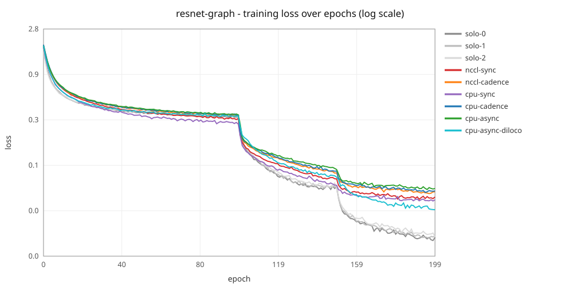
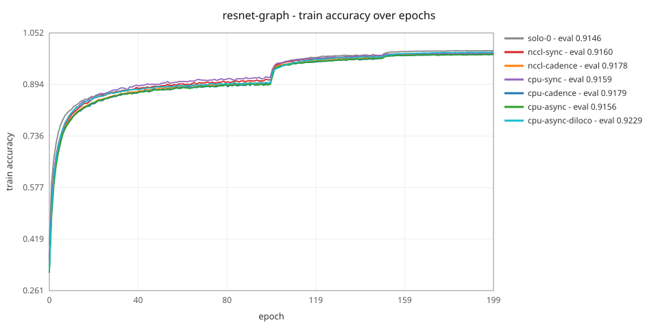
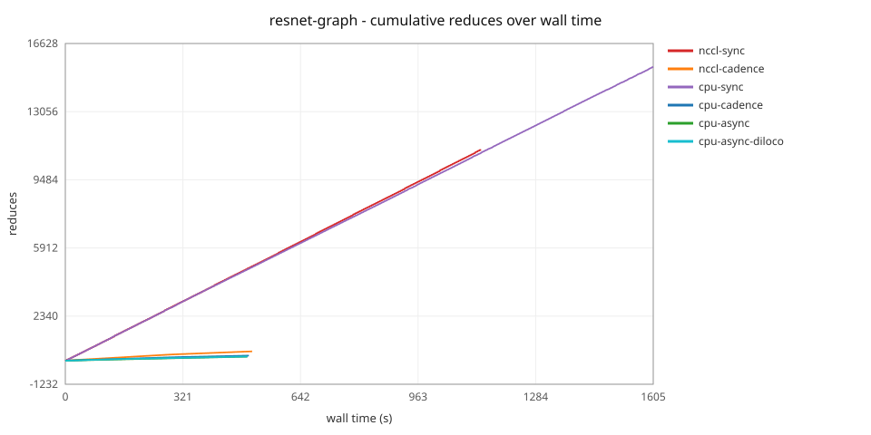
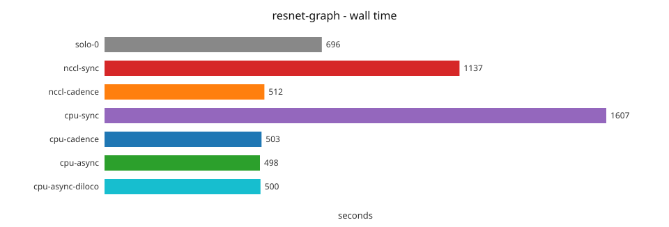
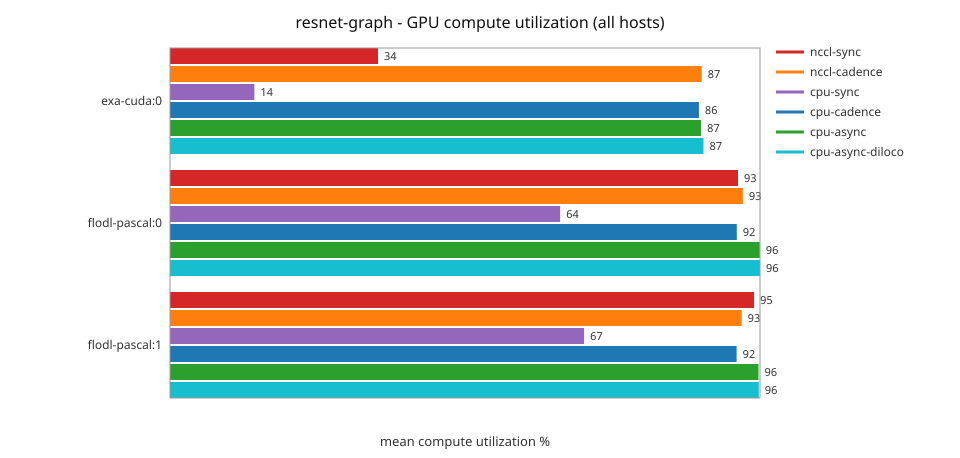

# DDP Benchmark Report

> **What "sync" means here**: every mode runs the same ElChe-scheduled
> engine with work-weighted averaging. The `*-sync` modes are its
> tightest cadence, not per-batch lockstep DDP - data is an equal
> split, and the reduce fires as soon as every alive rank has made at
> least one step since the last reduce. On a homogeneous rig that
> degenerates to classic DDP; on this heterogeneous rig the fast GPU
> runs several steps per reduce within its equal share. The
> `*-cadence` modes dispatch data proportionally to measured throughput
> and reduce once every rank completes its planned ElChe window;
> `cpu-async` adds bounded overshoot and decoupled averaging, and
> `cpu-async-diloco` runs a DiLoCo outer optimizer (Nesterov on the
> pseudo-gradient) on top of it. The per-rank `share` column is the
> balancer's allocation view: it equals delivered work under
> cadence/async; under sync it is ElChe's capacity shadow (dispatch
> stays equal). See
> [What "sync" means in flodl](ddp/01-reference.md#elchemode---cadence--backend-in-one-name).
>
> This sweep ran on a 3-GPU heterogeneous rig spanning two hosts - an
> RTX 5060 Ti on the controller host and two GTX 1060s inside a VM on
> the same box, coordinated over TCP as a real multi-host cluster (the
> slowest card sits behind a PCIe x1 riser, ~12x slower than the RTX
> in delivered throughput on the big models).
>
> **On the GPU columns, and what this sweep does not measure.** Every
> column names a physical device on a named host, sourced from the
> ranks' own samples: earlier sweeps could see the controller box only
> and printed `-` for both Pascal cards, so cross-host coverage is new
> here. The price is idle analysis. Gap detection reads the local
> poller's dense timeline, and this rig's controller owns no rank of
> its own (`hostname` matches no worker name in `cluster.yml`), so it
> correctly polls CPU/RAM only rather than reporting GPUs another node
> trains on. No cluster run in this sweep therefore carried a
> dense-sampled device: the dense set is exactly the 20 solo runs, the
> Idle column reads `-` on the other 43, and the idle sections below
> state that coverage rather than implying a finding. Read a `-` as
> unmeasured, never as zero. To measure idle again, run a cell with the
> controller co-located with a rank.
>
> The two GPU-column kinds are also not directly comparable, which
> matters when reading this against an older sweep: a dense figure is
> NVML's load-style active percentage, a `~` figure is the rank's own
> compute duty cycle. Where both existed they disagreed, and the sparse
> one was the more honest of the two. Under `cpu-sync` the fast card
> takes an equal third of the data at roughly 12x the Pascals' rate, so
> its duty cycle should land near a twelfth of theirs; the rank-reported
> ~14% against their ~64-67% matches that, while the old dense reading
> of 75% on the same configuration did not.
>
> This report is generated by `ddp-bench`. Reproduce on your own hardware:
>
> ```bash
> fdl setup                                # auto-detect GPUs, build libtorch + Docker image
> fdl @cluster ddp-bench --model resnet-graph --mode cpu-cadence --epochs 200   # one cell
> fdl ddp-bench --report --charts resnet-graph                                  # regenerate this report
> ```


## Hardware

- gpu r0 [exa-cuda:cuda0]: NVIDIA GeForce RTX 5060 Ti (15GB, sm_120)
- gpu r1 [flodl-pascal:cuda0]: NVIDIA GeForce GTX 1060 6GB (6GB, sm_61)
- gpu r2 [flodl-pascal:cuda1]: NVIDIA GeForce GTX 1060 6GB (6GB, sm_61)

- **Models**: 8
- **Modes**: 9
- **GPU speed ratio** (solo-1 / solo-0 wall time):
  - char-rnn: 7.33x (30s vs 222s)
  - conv-ae: 2.37x (2s vs 4s)
  - gpt-nano: 4.44x (60s vs 265s)
  - lenet: 1.81x (3s vs 5s)
  - logistic: 1.53x (1s vs 1s)
  - mlp: 1.20x (2s vs 2s)
- **GPU speed ratio** (solo-2 / solo-0 wall time):
  - char-rnn: 11.36x (30s vs 344s)
  - conv-ae: 2.63x (2s vs 4s)
  - gpt-nano: 4.59x (60s vs 274s)
  - lenet: 1.96x (3s vs 6s)
  - logistic: 1.78x (1s vs 2s)
  - mlp: 1.32x (2s vs 3s)

## Notes

DDP modes are expected to show slightly lower eval than solo on small models with few epochs. Distributed training converges slower in early epochs due to gradient averaging across devices with different data views, and ElChe (cadence/async) modes need calibration time to find the optimal sync interval, which further penalizes short runs. On longer training (200 epochs), every DDP mode surpasses solo convergence while completing faster -- the whole point of multi-GPU training.

**Mode semantics**: every mode runs the same ElChe-scheduled engine with work-weighted (sum-and-count) averaging; they differ in reduce cadence and dispatch. `*-sync` = equal data split, reduce fires as soon as every alive rank has made at least one step since the last reduce (NOT per-batch lockstep DDP -- on heterogeneous rigs the fast GPU runs several steps per reduce within its equal share, then idles once it is exhausted; degenerates to classic DDP on homogeneous rigs). `*-cadence` = throughput-proportional dispatch, reduce fires once every rank completes its planned ElChe window. `cpu-async` = cadence plus bounded overshoot and decoupled averaging: ranks keep training while the average round-trips, and the EASGD blend folds the consensus back into whatever local progress accumulated meanwhile, so the reduce barrier mostly leaves the wall clock. Async's remaining per-window costs are the snapshot D2H and the blend's writeback staging -- both stream through reused buffers (pinned snapshot staging; a single largest-tensor GPU staging buffer for the blend) rather than materializing model-sized copies. Its structural trade is higher weight-space divergence (decoupled application), which the convergence guard prices by growing the reduce window more slowly early in a run; whether async or cadence wins fixed-epoch wall time on a given rig is therefore an empirical question the tables answer, not a rule. Async additionally tolerates rank-speed jitter that would stall a barrier-paced mode.

**Monitoring during these runs**: the record plane was live for the entire duration of every cell -- the cluster path collects dashboard records unconditionally at reduce-window cadence, and each cell's self-contained portal (`dashboard.html` beside its artifacts) was written from those records at teardown. No live dashboard server was serving during the runs and per-window report emission was off, so the published wall times carry zero monitoring overhead on the hot path.

## Charts - resnet-graph



*Training loss per epoch, all modes (log scale - the convergence tail is where modes differ).*



*Train accuracy per epoch, all modes (the LR-schedule steps are the visible jumps); each mode's final eval - measured once after training - is in the legend.*


*ElChe's smoothed allocation share for the fast rank, per epoch. Under `*-sync` dispatch is an equal split and this is the balancer's capacity shadow.*



*Window growth made visible: a flattening curve = the anchor amortizing sync cost; a steep straight line = per-step reduces.*



*Total wall time per mode (same epochs, same seed).*



*Mean compute utilization per physical GPU (host:device), one bar per mode, from the ranks' own reported samples - complete across every host. A duty-cycle mean at reduce-window cadence, not a trajectory.*

## Incomplete Runs

- resnet/solo-1
- resnet/solo-2
- resnet/nccl-sync
- resnet/cpu-sync
- resnet/cpu-cadence
- resnet/cpu-async
- resnet-graph/solo-1
- resnet-graph/solo-2

## Per-Model Results

GPU columns = compute utilization % (not load); `-` = device not sampled by that run. Every column names a physical device as `host:GPUd`; a row's value is dense-poller data when that run's poller ran on the column's box (plain %), otherwise the mean over rank-reported samples riding the metrics wire at reduce-window cadence (~one sample per window) - the `~` prefix marks that sparseness: direction, not precision. Dense devices are attributed to their host by the controller stamp or by physical fingerprint (device id + VRAM size, matched against the group's rank samples); a bare `GPUd` column appears only if a run's dense devices could not be attributed (no matching fingerprint, or an ambiguous one) and then means "the box that run's poller happened to run on". Idle = total time with <5% utilization, dense-sampled devices only (the sparse remote cadence cannot support gap detection); `-` there means the run carried no dense-sampled device at all, so its idle time was never measured - not that it was zero.

### char-rnn

> Published: Shakespeare CE loss ~1.5, eval=val loss ([Karpathy 2015](https://karpathy.github.io/2015/05/21/rnn-effectiveness/))

| Mode | Loss | Eval | vs Ref | Total (s) | Syncs | Avg Sync (ms) | exa-cuda:GPU0 | flodl-pascal:GPU0 | flodl-pascal:GPU1 | Idle (s) |
|------|------|------|--------|-----------|-------|--------------|------|------|------|----------|
| cpu-async | 1.031697 | 1.6319 | +0.1319 | 37.4 | 43 | 188.0 | ~54% | ~65% | ~56% | - |
| cpu-async-diloco | 0.970993 | 1.7300 | +0.2300 | 37.6 | 44 | 191.7 | ~57% | ~64% | ~55% | - |
| cpu-cadence | 1.008083 | 1.6523 | +0.1523 | 32.4 | 50 | 100.7 | ~71% | ~54% | ~44% | - |
| cpu-sync | 1.087977 | 1.5604 | +0.0604 | 150.4 | 283 | 179.0 | ~7% | ~41% | ~50% | - |
| nccl-cadence | 1.007039 | 1.6492 | +0.1492 | 29.4 | 51 | 0.1 | ~84% | ~65% | ~48% | - |
| nccl-sync | 1.085389 | 1.5604 | +0.0604 | 126.6 | 465 | 0.0 | ~25% | ~56% | ~60% | - |
| solo-0 | 0.986049 | 1.7457 | +0.2457 | 30.3 | 0 | 0.0 | 98% | - | - | 0.7 |
| solo-1 | 0.982916 | 1.7332 | +0.2332 | 221.9 | 0 | 0.0 | - | 100% | 0% | 221.9 |
| solo-2 | 0.982916 | 1.7332 | +0.2332 | 343.8 | 0 | 0.0 | - | 0% | 100% | 343.8 |

### conv-ae

> Published: MNIST reconstruction, eval=MSE ([PyTorch AE tutorial](https://pytorch.org/tutorials/beginner/introyt/autoencoders_intro.html))

| Mode | Loss | Eval | Total (s) | Syncs | Avg Sync (ms) | exa-cuda:GPU0 | flodl-pascal:GPU0 | flodl-pascal:GPU1 | Idle (s) |
|------|------|------|-----------|-------|--------------|------|------|------|----------|
| cpu-async | 0.001069 | 0.0009 | 5.3 | 10 | 41.1 | ~26% | ~22% | ~22% | - |
| cpu-async-diloco | 0.001195 | 0.0010 | 5.3 | 10 | 41.5 | ~19% | ~20% | ~21% | - |
| cpu-cadence | 0.001065 | 0.0010 | 6.3 | 23 | 41.4 | ~8% | ~14% | ~15% | - |
| cpu-sync | 0.000840 | 0.0008 | 7.3 | 19 | 45.2 | ~4% | ~14% | ~18% | - |
| nccl-cadence | 0.001064 | 0.0010 | 6.6 | 19 | 0.1 | ~13% | ~20% | ~21% | - |
| nccl-sync | 0.000794 | 0.0007 | 7.5 | 58 | 0.0 | ~8% | ~17% | ~22% | - |
| solo-0 | 0.000669 | 0.0006 | 1.7 | 0 | 0.0 | 88% | - | - | 0.0 |
| solo-1 | 0.000669 | 0.0006 | 4.0 | 0 | 0.0 | - | 95% | 0% | 4.0 |
| solo-2 | 0.000669 | 0.0006 | 4.4 | 0 | 0.0 | - | 0% | 95% | 4.4 |

### gpt-nano

> Published: Shakespeare CE loss ~1.5-2.0, eval=val loss ([nanoGPT](https://github.com/karpathy/nanoGPT), [Vaswani 2017](https://arxiv.org/abs/1706.03762))

| Mode | Loss | Eval | Total (s) | Syncs | Avg Sync (ms) | exa-cuda:GPU0 | flodl-pascal:GPU0 | flodl-pascal:GPU1 | Idle (s) |
|------|------|------|-----------|-------|--------------|------|------|------|----------|
| cpu-async | 1.830534 | 1.8897 | 48.6 | 44 | 169.7 | ~77% | ~95% | ~95% | - |
| cpu-async-diloco | 1.668466 | 1.7773 | 48.6 | 44 | 168.6 | ~76% | ~89% | ~92% | - |
| cpu-cadence | 1.791308 | 1.8632 | 49.6 | 51 | 91.8 | ~78% | ~84% | ~82% | - |
| cpu-sync | 1.936028 | 1.9643 | 141.4 | 539 | 157.5 | ~12% | ~62% | ~66% | - |
| nccl-cadence | 1.789453 | 1.8625 | 45.6 | 52 | 0.1 | ~89% | ~93% | ~92% | - |
| nccl-sync | 1.908234 | 1.9445 | 98.6 | 817 | 0.0 | ~43% | ~93% | ~96% | - |
| solo-0 | 1.626979 | 1.7543 | 59.8 | 0 | 0.0 | 99% | - | - | 0.8 |
| solo-1 | 1.619783 | 1.7622 | 265.2 | 0 | 0.0 | - | 100% | 0% | 265.1 |
| solo-2 | 1.619783 | 1.7622 | 274.3 | 0 | 0.0 | - | 0% | 100% | 274.3 |

### lenet

> Published: MNIST ~99% acc ([LeCun 1998](http://yann.lecun.com/exdb/publis/pdf/lecun-98.pdf))

| Mode | Loss | Eval | vs Ref | Total (s) | Syncs | Avg Sync (ms) | exa-cuda:GPU0 | flodl-pascal:GPU0 | flodl-pascal:GPU1 | Idle (s) |
|------|------|------|--------|-----------|-------|--------------|------|------|------|----------|
| cpu-async | 0.047672 | 0.9871 | -0.0029 | 5.3 | 10 | 41.5 | ~19% | ~24% | ~20% | - |
| cpu-async-diloco | 0.039942 | 0.9872 | -0.0028 | 6.3 | 10 | 41.9 | ~10% | ~20% | ~32% | - |
| cpu-cadence | 0.046433 | 0.9760 | -0.0140 | 5.3 | 10 | 41.8 | ~11% | ~22% | ~27% | - |
| cpu-sync | 0.039835 | 0.9887 | -0.0013 | 7.3 | 34 | 44.6 | ~8% | ~21% | ~26% | - |
| nccl-cadence | 0.045419 | 0.9891 | -0.0009 | 6.6 | 23 | 0.1 | ~18% | ~23% | ~28% | - |
| nccl-sync | 0.040401 | 0.9894 | -0.0006 | 7.6 | 66 | 0.1 | ~9% | ~27% | ~29% | - |
| solo-0 | 0.028867 | 0.9870 | -0.0030 | 2.9 | 0 | 0.0 | 76% | - | - | 0.8 |
| solo-1 | 0.028771 | 0.9871 | -0.0029 | 5.2 | 0 | 0.0 | - | 98% | 0% | 5.2 |
| solo-2 | 0.028897 | 0.9896 | -0.0004 | 5.6 | 0 | 0.0 | - | 0% | 96% | 5.6 |

### logistic

> Published: MNIST ~92% acc (linear baseline)

| Mode | Loss | Eval | vs Ref | Total (s) | Syncs | Avg Sync (ms) | exa-cuda:GPU0 | flodl-pascal:GPU0 | flodl-pascal:GPU1 | Idle (s) |
|------|------|------|--------|-----------|-------|--------------|------|------|------|----------|
| cpu-async | 0.306615 | 0.9209 | +0.0009 | 4.4 | 10 | 41.6 | ~6% | ~9% | ~11% | - |
| cpu-async-diloco | 0.287939 | 0.9230 | +0.0030 | 5.3 | 16 | 41.1 | ~5% | ~7% | ~13% | - |
| cpu-cadence | 0.311136 | 0.9178 | -0.0022 | 5.3 | 15 | 45.5 | ~8% | ~6% | ~8% | - |
| cpu-sync | 0.301714 | 0.9194 | -0.0006 | 5.6 | 17 | 45.6 | ~1% | ~5% | ~8% | - |
| nccl-cadence | 0.305632 | 0.9191 | -0.0009 | 5.6 | 19 | 0.1 | ~11% | ~12% | ~13% | - |
| nccl-sync | 0.297620 | 0.9197 | -0.0003 | 7.6 | 56 | 0.1 | ~0% | ~8% | ~10% | - |
| solo-0 | 0.277861 | 0.9243 | +0.0043 | 1.0 | 0 | 0.0 | 67% | - | - | 0.0 |
| solo-1 | 0.277861 | 0.9243 | +0.0043 | 1.5 | 0 | 0.0 | - | 87% | 0% | 1.5 |
| solo-2 | 0.277861 | 0.9243 | +0.0043 | 1.7 | 0 | 0.0 | - | 0% | 94% | 1.7 |

### mlp

> Published: MNIST ~97-98% acc ([PyTorch tutorial](https://pytorch.org/tutorials/beginner/basics/quickstart_tutorial.html))

| Mode | Loss | Eval | vs Ref | Total (s) | Syncs | Avg Sync (ms) | exa-cuda:GPU0 | flodl-pascal:GPU0 | flodl-pascal:GPU1 | Idle (s) |
|------|------|------|--------|-----------|-------|--------------|------|------|------|----------|
| cpu-async | 0.110886 | 0.9709 | -0.0041 | 4.4 | 10 | 43.8 | ~11% | ~17% | ~24% | - |
| cpu-async-diloco | 0.087361 | 0.9742 | -0.0008 | 5.1 | 10 | 43.7 | ~13% | ~17% | ~24% | - |
| cpu-cadence | 0.113265 | 0.9692 | -0.0058 | 5.6 | 19 | 43.1 | ~7% | ~10% | ~13% | - |
| cpu-sync | 0.099791 | 0.9703 | -0.0047 | 5.3 | 41 | 43.8 | ~10% | ~21% | ~25% | - |
| nccl-cadence | 0.110034 | 0.9696 | -0.0054 | 5.6 | 17 | 0.1 | ~17% | ~18% | ~26% | - |
| nccl-sync | 0.091849 | 0.9728 | -0.0022 | 6.6 | 59 | 0.1 | ~6% | ~17% | ~22% | - |
| solo-0 | 0.046826 | 0.9628 | -0.0122 | 2.0 | 0 | 0.0 | 70% | - | - | 0.7 |
| solo-1 | 0.047241 | 0.9697 | -0.0053 | 2.4 | 0 | 0.0 | - | 92% | 0% | 2.4 |
| solo-2 | 0.047241 | 0.9697 | -0.0053 | 2.6 | 0 | 0.0 | - | 0% | 96% | 2.6 |

### resnet

> Published: CIFAR-10 91.25% acc ([He et al. 2015](https://arxiv.org/abs/1512.03385), Table 6)

| Mode | Loss | Eval | vs Ref | Total (s) | Syncs | Avg Sync (ms) | exa-cuda:GPU0 | flodl-pascal:GPU0 | flodl-pascal:GPU1 | Idle (s) |
|------|------|------|--------|-----------|-------|--------------|------|------|------|----------|
| nccl-cadence | 0.039080 | 0.9208 | +0.0083 | 510.0 | 433 | 0.1 | ~86% | ~94% | ~92% | - |
| solo-0 | 0.011811 | 0.9141 | +0.0016 | 685.2 | 0 | 0.0 | 100% | - | - | 0.6 |

### resnet-graph

> Published: CIFAR-10 91.25% acc, Graph builder ([He et al. 2015](https://arxiv.org/abs/1512.03385), Table 6)

| Mode | Loss | Eval | vs Ref | Total (s) | Syncs | Avg Sync (ms) | exa-cuda:GPU0 | flodl-pascal:GPU0 | flodl-pascal:GPU1 | Idle (s) |
|------|------|------|--------|-----------|-------|--------------|------|------|------|----------|
| cpu-async | 0.045352 | 0.9156 | +0.0031 | 497.9 | 215 | 69.8 | ~87% | ~96% | ~96% | - |
| cpu-async-diloco | 0.025878 | 0.9229 | +0.0104 | 499.7 | 223 | 70.8 | ~87% | ~96% | ~96% | - |
| cpu-cadence | 0.043084 | 0.9179 | +0.0054 | 503.0 | 270 | 52.1 | ~86% | ~92% | ~92% | - |
| cpu-sync | 0.036172 | 0.9159 | +0.0034 | 1607.3 | 15396 | 66.2 | ~14% | ~64% | ~67% | - |
| nccl-cadence | 0.038667 | 0.9178 | +0.0053 | 512.2 | 492 | 0.1 | ~87% | ~93% | ~93% | - |
| nccl-sync | 0.034333 | 0.9160 | +0.0035 | 1137.2 | 11048 | 0.0 | ~34% | ~93% | ~95% | - |
| solo-0 | 0.012832 | 0.9146 | +0.0021 | 696.1 | 0 | 0.0 | 100% | - | - | 1.0 |

## Best Mode per Model

| Model | Best Eval | Mode | Fastest (within 2% of solo-0) | Mode |
|-------|-----------|------|-------------------------------|------|
| char-rnn | 1.5604 | nccl-sync | 29.4s | nccl-cadence |
| conv-ae | 0.0006 | solo-2 | - | none ≤2% (closest: nccl-sync +16.7% eval) |
| gpt-nano | 1.7543 | solo-0 | 48.6s | cpu-async-diloco |
| lenet | 0.9896 | solo-2 | 5.3s | cpu-cadence |
| logistic | 0.9243 | solo-2 | 4.4s | cpu-async |
| mlp | 0.9742 | cpu-async-diloco | 4.4s | cpu-async |
| resnet | 0.9208 | nccl-cadence | 510.0s | nccl-cadence |
| resnet-graph | 0.9229 | cpu-async-diloco | 497.9s | cpu-async |

"Fastest (within 2% of solo-0)" = the fastest NON-solo mode whose final eval gives up no more than 2% relative quality vs solo-0 (a better-than-solo eval always qualifies): the speed a DDP mode buys without paying for it in quality. The band is relative, so it is strict to the point of unreachable for near-zero loss-like evals (a reconstruction MSE of 0.0006 leaves a ±0.00001 band); when no mode qualifies, the closest one and its eval gap are named instead.

## Eval Quality (vs solo-0)

| Model | cpu-async | cpu-async-diloco | cpu-cadence | cpu-sync | nccl-cadence | nccl-sync | solo-1 | solo-2 |
|-------|-----------|------------------|-------------|----------|--------------|-----------|--------|--------|
| char-rnn | -0.1138 | -0.0157 | -0.0934 | -0.1853 | -0.0965 | -0.1853 | -0.0125 | -0.0125 |
| conv-ae | +0.0003 | +0.0004 | +0.0004 | +0.0002 | +0.0004 | +0.0001 | 0 | 0 |
| gpt-nano | +0.1354 | +0.0230 | +0.1089 | +0.2100 | +0.1082 | +0.1902 | +0.0079 | +0.0079 |
| lenet | +0.0001 | +0.0002 | -0.0110 | +0.0017 | +0.0021 | +0.0024 | +0.0001 | +0.0026 |
| logistic | -0.0034 | -0.0013 | -0.0065 | -0.0049 | -0.0052 | -0.0046 | 0 | 0 |
| mlp | +0.0081 | +0.0114 | +0.0064 | +0.0075 | +0.0068 | +0.0100 | +0.0069 | +0.0069 |
| resnet | - | - | - | - | +0.0067 | - | - | - |
| resnet-graph | +0.0010 | +0.0083 | +0.0033 | +0.0013 | +0.0032 | +0.0014 | - | - |

## Convergence Quality (loss ratio vs solo-0)

| Model | cpu-async | cpu-async-diloco | cpu-cadence | cpu-sync | nccl-cadence | nccl-sync | solo-1 | solo-2 |
|-------|-----------|------------------|-------------|----------|--------------|-----------|--------|--------|
| char-rnn | 1.05x | 0.98x | 1.02x | 1.10x | 1.02x | 1.10x | 1.00x | 1.00x |
| conv-ae | 1.60x | 1.79x | 1.59x | 1.26x | 1.59x | 1.19x | 1.00x | 1.00x |
| gpt-nano | 1.13x | 1.03x | 1.10x | 1.19x | 1.10x | 1.17x | 1.00x | 1.00x |
| lenet | 1.65x | 1.38x | 1.61x | 1.38x | 1.57x | 1.40x | 1.00x | 1.00x |
| logistic | 1.10x | 1.04x | 1.12x | 1.09x | 1.10x | 1.07x | 1.00x | 1.00x |
| mlp | 2.37x | 1.87x | 2.42x | 2.13x | 2.35x | 1.96x | 1.01x | 1.01x |
| resnet | - | - | - | - | 3.31x | - | - | - |
| resnet-graph | 3.53x | 2.02x | 3.36x | 2.82x | 3.01x | 2.68x | - | - |

## Per-Epoch Loss Trajectory

### char-rnn (sampled, 50 epochs)

| Mode | E0 | E3 | E5 | E8 | E10 | E13 | E15 | E18 | E21 | E23 | E26 | E28 | E31 | E34 | E36 | E39 | E41 | E44 | E46 | E49 |
|------|------|------|------|------|------|------|------|------|------|------|------|------|------|------|------|------|------|------|------|------|
| cpu-async | 2.8068 | 1.6389 | 1.5022 | 1.3989 | 1.3606 | 1.3114 | 1.2870 | 1.2536 | 1.2251 | 1.2064 | 1.1836 | 1.1667 | 1.1451 | 1.1206 | 1.1098 | 1.0899 | 1.0775 | 1.0588 | 1.0446 | 1.0317 |
| cpu-async-diloco | 2.8068 | 1.5884 | 1.4527 | 1.3483 | 1.3084 | 1.2590 | 1.2321 | 1.1946 | 1.1625 | 1.1425 | 1.1140 | 1.0969 | 1.0734 | 1.0493 | 1.0364 | 1.0203 | 1.0071 | 0.9933 | 0.9848 | 0.9710 |
| cpu-cadence | 2.7263 | 1.5856 | 1.4658 | 1.3772 | 1.3397 | 1.2939 | 1.2692 | 1.2358 | 1.2066 | 1.1882 | 1.1627 | 1.1462 | 1.1220 | 1.1000 | 1.0848 | 1.0650 | 1.0538 | 1.0352 | 1.0227 | 1.0081 |
| cpu-sync | 2.5163 | 1.6265 | 1.5180 | 1.4300 | 1.3923 | 1.3474 | 1.3243 | 1.2925 | 1.2668 | 1.2521 | 1.2304 | 1.2156 | 1.1945 | 1.1757 | 1.1667 | 1.1456 | 1.1328 | 1.1165 | 1.1080 | 1.0880 |
| nccl-cadence | 2.7263 | 1.5766 | 1.4634 | 1.3756 | 1.3370 | 1.2923 | 1.2674 | 1.2349 | 1.2049 | 1.1865 | 1.1610 | 1.1441 | 1.1203 | 1.0973 | 1.0847 | 1.0639 | 1.0520 | 1.0336 | 1.0224 | 1.0070 |
| nccl-sync | 2.5577 | 1.6281 | 1.5180 | 1.4295 | 1.3911 | 1.3467 | 1.3231 | 1.2930 | 1.2662 | 1.2505 | 1.2267 | 1.2140 | 1.1922 | 1.1735 | 1.1620 | 1.1408 | 1.1305 | 1.1124 | 1.0990 | 1.0854 |
| solo-0 | 2.2661 | 1.5152 | 1.4178 | 1.3356 | 1.2974 | 1.2510 | 1.2245 | 1.1882 | 1.1552 | 1.1353 | 1.1066 | 1.0897 | 1.0675 | 1.0483 | 1.0379 | 1.0214 | 1.0137 | 1.0015 | 0.9938 | 0.9860 |
| solo-1 | 2.2733 | 1.5099 | 1.4135 | 1.3346 | 1.2960 | 1.2515 | 1.2260 | 1.1892 | 1.1573 | 1.1363 | 1.1089 | 1.0928 | 1.0696 | 1.0488 | 1.0367 | 1.0205 | 1.0109 | 0.9995 | 0.9927 | 0.9829 |
| solo-2 | 2.2733 | 1.5099 | 1.4135 | 1.3346 | 1.2960 | 1.2515 | 1.2260 | 1.1892 | 1.1573 | 1.1363 | 1.1089 | 1.0928 | 1.0696 | 1.0488 | 1.0367 | 1.0205 | 1.0109 | 0.9995 | 0.9927 | 0.9829 |

### conv-ae

| Mode | E0 | E1 | E2 | E3 | E4 |
|------|------|------|------|------|------|
| cpu-async | 0.0419 | 0.0030 | 0.0018 | 0.0013 | 0.0011 |
| cpu-async-diloco | 0.0425 | 0.0035 | 0.0020 | 0.0015 | 0.0012 |
| cpu-cadence | 0.0420 | 0.0026 | 0.0017 | 0.0013 | 0.0011 |
| cpu-sync | 0.0192 | 0.0017 | 0.0012 | 0.0010 | 0.0008 |
| nccl-cadence | 0.0394 | 0.0027 | 0.0017 | 0.0013 | 0.0011 |
| nccl-sync | 0.0186 | 0.0016 | 0.0011 | 0.0009 | 0.0008 |
| solo-0 | 0.0177 | 0.0016 | 0.0011 | 0.0008 | 0.0007 |
| solo-1 | 0.0177 | 0.0016 | 0.0011 | 0.0008 | 0.0007 |
| solo-2 | 0.0177 | 0.0016 | 0.0011 | 0.0008 | 0.0007 |

### gpt-nano (sampled, 50 epochs)

| Mode | E0 | E3 | E5 | E8 | E10 | E13 | E15 | E18 | E21 | E23 | E26 | E28 | E31 | E34 | E36 | E39 | E41 | E44 | E46 | E49 |
|------|------|------|------|------|------|------|------|------|------|------|------|------|------|------|------|------|------|------|------|------|
| cpu-async | 4.2334 | 3.0957 | 2.7513 | 2.5628 | 2.4914 | 2.3962 | 2.3303 | 2.2295 | 2.1478 | 2.1013 | 2.0413 | 2.0052 | 1.9590 | 1.9236 | 1.9020 | 1.8780 | 1.8650 | 1.8480 | 1.8398 | 1.8305 |
| cpu-async-diloco | 4.2307 | 3.0448 | 2.6894 | 2.5191 | 2.4544 | 2.3317 | 2.2427 | 2.1198 | 2.0195 | 1.9646 | 1.8907 | 1.8509 | 1.8004 | 1.7619 | 1.7407 | 1.7147 | 1.7023 | 1.6853 | 1.6773 | 1.6685 |
| cpu-cadence | 4.2165 | 3.0257 | 2.6875 | 2.5342 | 2.4730 | 2.3655 | 2.2914 | 2.1930 | 2.1105 | 2.0626 | 1.9990 | 1.9629 | 1.9180 | 1.8812 | 1.8618 | 1.8370 | 1.8238 | 1.8082 | 1.7998 | 1.7913 |
| cpu-sync | 4.2229 | 3.1537 | 2.7919 | 2.5808 | 2.5226 | 2.4558 | 2.4073 | 2.3275 | 2.2542 | 2.2099 | 2.1509 | 2.1168 | 2.0721 | 2.0344 | 2.0134 | 1.9865 | 1.9728 | 1.9543 | 1.9465 | 1.9360 |
| nccl-cadence | 4.2119 | 3.0332 | 2.6895 | 2.5342 | 2.4732 | 2.3663 | 2.2908 | 2.1920 | 2.1091 | 2.0601 | 1.9970 | 1.9603 | 1.9145 | 1.8788 | 1.8592 | 1.8338 | 1.8214 | 1.8051 | 1.7976 | 1.7895 |
| nccl-sync | 4.2095 | 3.1340 | 2.7715 | 2.5718 | 2.5146 | 2.4450 | 2.3940 | 2.3101 | 2.2338 | 2.1877 | 2.1274 | 2.0925 | 2.0454 | 2.0068 | 1.9855 | 1.9590 | 1.9451 | 1.9266 | 1.9187 | 1.9082 |
| solo-0 | 4.0469 | 2.7834 | 2.5864 | 2.4773 | 2.3842 | 2.2126 | 2.1176 | 1.9994 | 1.9093 | 1.8621 | 1.8053 | 1.7739 | 1.7352 | 1.7039 | 1.6876 | 1.6669 | 1.6560 | 1.6422 | 1.6353 | 1.6270 |
| solo-1 | 4.0257 | 2.7776 | 2.5847 | 2.4743 | 2.3825 | 2.2073 | 2.1094 | 1.9918 | 1.9030 | 1.8545 | 1.7971 | 1.7650 | 1.7261 | 1.6961 | 1.6796 | 1.6591 | 1.6492 | 1.6353 | 1.6284 | 1.6198 |
| solo-2 | 4.0257 | 2.7776 | 2.5847 | 2.4743 | 2.3825 | 2.2073 | 2.1094 | 1.9918 | 1.9030 | 1.8545 | 1.7971 | 1.7650 | 1.7261 | 1.6961 | 1.6796 | 1.6591 | 1.6492 | 1.6353 | 1.6284 | 1.6198 |

### lenet

| Mode | E0 | E1 | E2 | E3 | E4 |
|------|------|------|------|------|------|
| cpu-async | 0.3517 | 0.0861 | 0.0653 | 0.0547 | 0.0477 |
| cpu-async-diloco | 0.3338 | 0.0788 | 0.0581 | 0.0464 | 0.0399 |
| cpu-cadence | 0.3299 | 0.0845 | 0.0641 | 0.0520 | 0.0464 |
| cpu-sync | 0.2431 | 0.0731 | 0.0562 | 0.0462 | 0.0398 |
| nccl-cadence | 0.3268 | 0.0818 | 0.0619 | 0.0513 | 0.0454 |
| nccl-sync | 0.2357 | 0.0710 | 0.0551 | 0.0467 | 0.0404 |
| solo-0 | 0.1895 | 0.0611 | 0.0439 | 0.0351 | 0.0289 |
| solo-1 | 0.1809 | 0.0607 | 0.0451 | 0.0350 | 0.0288 |
| solo-2 | 0.1801 | 0.0603 | 0.0443 | 0.0348 | 0.0289 |

### logistic

| Mode | E0 | E1 | E2 | E3 | E4 |
|------|------|------|------|------|------|
| cpu-async | 0.7962 | 0.4057 | 0.3471 | 0.3216 | 0.3066 |
| cpu-async-diloco | 0.7517 | 0.3538 | 0.3155 | 0.2982 | 0.2879 |
| cpu-cadence | 0.7713 | 0.3954 | 0.3457 | 0.3207 | 0.3111 |
| cpu-sync | 0.6202 | 0.3720 | 0.3333 | 0.3141 | 0.3017 |
| nccl-cadence | 0.7660 | 0.3940 | 0.3479 | 0.3200 | 0.3056 |
| nccl-sync | 0.5798 | 0.3568 | 0.3248 | 0.3079 | 0.2976 |
| solo-0 | 0.5490 | 0.3290 | 0.3002 | 0.2864 | 0.2779 |
| solo-1 | 0.5490 | 0.3290 | 0.3002 | 0.2864 | 0.2779 |
| solo-2 | 0.5490 | 0.3290 | 0.3002 | 0.2864 | 0.2779 |

### mlp

| Mode | E0 | E1 | E2 | E3 | E4 |
|------|------|------|------|------|------|
| cpu-async | 0.4679 | 0.2232 | 0.1667 | 0.1324 | 0.1109 |
| cpu-async-diloco | 0.4538 | 0.2011 | 0.1455 | 0.1107 | 0.0874 |
| cpu-cadence | 0.4607 | 0.2239 | 0.1701 | 0.1345 | 0.1133 |
| cpu-sync | 0.4571 | 0.2101 | 0.1533 | 0.1207 | 0.0998 |
| nccl-cadence | 0.4598 | 0.2233 | 0.1667 | 0.1328 | 0.1100 |
| nccl-sync | 0.3768 | 0.1784 | 0.1347 | 0.1091 | 0.0918 |
| solo-0 | 0.3126 | 0.1344 | 0.0888 | 0.0640 | 0.0468 |
| solo-1 | 0.3156 | 0.1369 | 0.0905 | 0.0645 | 0.0472 |
| solo-2 | 0.3156 | 0.1369 | 0.0905 | 0.0645 | 0.0472 |

### resnet (sampled, 200 epochs)

| Mode | E0 | E10 | E21 | E31 | E42 | E52 | E63 | E73 | E84 | E94 | E105 | E115 | E126 | E136 | E147 | E157 | E168 | E178 | E189 | E199 |
|------|------|------|------|------|------|------|------|------|------|------|------|------|------|------|------|------|------|------|------|------|
| nccl-cadence | 1.7771 | 0.5865 | 0.4480 | 0.3906 | 0.3559 | 0.3346 | 0.3231 | 0.3074 | 0.2973 | 0.2895 | 0.1282 | 0.1008 | 0.0846 | 0.0727 | 0.0668 | 0.0450 | 0.0437 | 0.0414 | 0.0397 | 0.0391 |
| solo-0 | 1.6940 | 0.5008 | 0.3905 | 0.3515 | 0.3257 | 0.3182 | 0.3041 | 0.2972 | 0.2927 | 0.2857 | 0.1070 | 0.0702 | 0.0538 | 0.0468 | 0.0471 | 0.0195 | 0.0164 | 0.0137 | 0.0124 | 0.0118 |

### resnet-graph (sampled, 200 epochs)

| Mode | E0 | E10 | E21 | E31 | E42 | E52 | E63 | E73 | E84 | E94 | E105 | E115 | E126 | E136 | E147 | E157 | E168 | E178 | E189 | E199 |
|------|------|------|------|------|------|------|------|------|------|------|------|------|------|------|------|------|------|------|------|------|
| cpu-async | 1.8129 | 0.6088 | 0.4614 | 0.4005 | 0.3743 | 0.3460 | 0.3393 | 0.3246 | 0.3135 | 0.3086 | 0.1376 | 0.1120 | 0.0975 | 0.0854 | 0.0770 | 0.0523 | 0.0508 | 0.0480 | 0.0458 | 0.0454 |
| cpu-async-diloco | 1.8031 | 0.5532 | 0.4234 | 0.3743 | 0.3436 | 0.3281 | 0.3172 | 0.3044 | 0.3001 | 0.2899 | 0.1356 | 0.0976 | 0.0778 | 0.0705 | 0.0622 | 0.0382 | 0.0310 | 0.0279 | 0.0267 | 0.0259 |
| cpu-cadence | 1.7884 | 0.6083 | 0.4620 | 0.4042 | 0.3755 | 0.3531 | 0.3266 | 0.3202 | 0.3189 | 0.3075 | 0.1381 | 0.1089 | 0.0970 | 0.0862 | 0.0757 | 0.0510 | 0.0482 | 0.0472 | 0.0447 | 0.0431 |
| cpu-sync | 1.7219 | 0.5509 | 0.4073 | 0.3498 | 0.3146 | 0.2925 | 0.2781 | 0.2665 | 0.2546 | 0.2453 | 0.1101 | 0.0829 | 0.0691 | 0.0607 | 0.0518 | 0.0394 | 0.0363 | 0.0349 | 0.0340 | 0.0362 |
| nccl-cadence | 1.7929 | 0.5940 | 0.4545 | 0.4047 | 0.3626 | 0.3362 | 0.3258 | 0.3068 | 0.2992 | 0.2947 | 0.1306 | 0.1021 | 0.0868 | 0.0747 | 0.0678 | 0.0485 | 0.0440 | 0.0423 | 0.0396 | 0.0387 |
| nccl-sync | 1.7177 | 0.5742 | 0.4230 | 0.3706 | 0.3369 | 0.3172 | 0.3053 | 0.2872 | 0.2747 | 0.2754 | 0.1146 | 0.0838 | 0.0727 | 0.0637 | 0.0537 | 0.0385 | 0.0360 | 0.0336 | 0.0330 | 0.0343 |
| solo-0 | 1.6114 | 0.5216 | 0.4029 | 0.3669 | 0.3359 | 0.3238 | 0.3135 | 0.3085 | 0.2998 | 0.2943 | 0.1123 | 0.0769 | 0.0579 | 0.0526 | 0.0492 | 0.0217 | 0.0166 | 0.0150 | 0.0138 | 0.0128 |

## Speedup vs solo-0

| Model | cpu-async | cpu-async-diloco | cpu-cadence | cpu-sync | nccl-cadence | nccl-sync | solo-1 | solo-2 |
|-------|-----------|------------------|-------------|----------|--------------|-----------|--------|--------|
| char-rnn | 0.8x | 0.8x | 0.9x | 0.2x | 1.0x | 0.2x | 0.1x | 0.1x |
| conv-ae | 0.3x | 0.3x | 0.2x | 0.2x | 0.2x | 0.2x | 0.4x | 0.3x |
| gpt-nano | 1.2x | 1.2x | 1.2x | 0.4x | 1.3x | 0.6x | 0.2x | 0.2x |
| lenet | 0.5x | 0.4x | 0.5x | 0.4x | 0.4x | 0.3x | 0.5x | 0.5x |
| logistic | 0.2x | 0.1x | 0.1x | 0.1x | 0.1x | 0.1x | 0.5x | 0.4x |
| mlp | 0.4x | 0.4x | 0.3x | 0.3x | 0.3x | 0.3x | 0.8x | 0.7x |
| resnet | - | - | - | - | 1.3x | - | - | - |
| resnet-graph | 1.3x | 1.3x | 1.3x | 0.4x | 1.3x | 0.6x | - | - |


Speedup denominator uses solo-0's `# train_only:` time when reported (baseline-eval models), so the ratio compares DDP wall time against solo's training-only wall time. Solo's per-epoch eval is excluded from this comparison because DDP runs only eval once at the end.

## Per-Rank Schedule

`share` is the balancer's smoothed allocation view (ElChe `batch_counts`, sums to ~1); `tput` is samples/ms of the rank's own work (peer-wait excluded). Under cadence/async modes dispatch follows the balancer, so `share` IS the delivered work split - the fast GPU consumes a proportionally larger share to keep pace with the slow ones. Under `*-sync` modes dispatch is an EQUAL split regardless: there `share` shows what ElChe would allocate (a capacity shadow), not delivered work - the delivered imbalance surfaces as fast-GPU idle instead. `host`/`util`/`vram peak` come from the ranks' own resource samples (reduce-window cadence; `~` marks the sparse mean; `device` is the rank's runtime index, which CUDA_VISIBLE_DEVICES scoping remaps - it need not match the host-physical id in the GPU columns).

| Model | Mode | Rank | Device | Host | Share | Tput (samp/ms) | Util | VRAM Peak (MB) |
|-------|------|------|--------|------|-------|----------------|------|----------------|
| char-rnn | cpu-async | 0 | cuda:0 | exa-cuda | 0.8258 | 14.1 | ~54% | 338 |
| char-rnn | cpu-async | 1 | cuda:1 | flodl-pascal | 0.0993 | 1.8 | ~65% | 326 |
| char-rnn | cpu-async | 2 | cuda:2 | flodl-pascal | 0.0750 | 1.3 | ~56% | 326 |
| char-rnn | cpu-async-diloco | 0 | cuda:0 | exa-cuda | 0.8243 | 14.0 | ~57% | 338 |
| char-rnn | cpu-async-diloco | 1 | cuda:1 | flodl-pascal | 0.1001 | 1.8 | ~64% | 326 |
| char-rnn | cpu-async-diloco | 2 | cuda:2 | flodl-pascal | 0.0756 | 1.3 | ~55% | 326 |
| char-rnn | cpu-cadence | 0 | cuda:0 | exa-cuda | 0.8477 | 14.1 | ~71% | 336 |
| char-rnn | cpu-cadence | 1 | cuda:1 | flodl-pascal | 0.0928 | 1.7 | ~54% | 324 |
| char-rnn | cpu-cadence | 2 | cuda:2 | flodl-pascal | 0.0596 | 1.2 | ~44% | 324 |
| char-rnn | cpu-sync | 0 | cuda:0 | exa-cuda | 0.7986 | 13.5 | ~7% | 328 |
| char-rnn | cpu-sync | 1 | cuda:1 | flodl-pascal | 0.1160 | 1.7 | ~41% | 328 |
| char-rnn | cpu-sync | 2 | cuda:2 | flodl-pascal | 0.0853 | 1.2 | ~50% | 328 |
| char-rnn | nccl-cadence | 0 | cuda:0 | exa-cuda | 0.8489 | 13.9 | ~84% | 340 |
| char-rnn | nccl-cadence | 1 | cuda:1 | flodl-pascal | 0.0920 | 1.7 | ~65% | 328 |
| char-rnn | nccl-cadence | 2 | cuda:2 | flodl-pascal | 0.0591 | 1.2 | ~48% | 328 |
| char-rnn | nccl-sync | 0 | cuda:0 | exa-cuda | 0.7944 | 14.0 | ~25% | 332 |
| char-rnn | nccl-sync | 1 | cuda:1 | flodl-pascal | 0.1184 | 1.7 | ~56% | 332 |
| char-rnn | nccl-sync | 2 | cuda:2 | flodl-pascal | 0.0873 | 1.2 | ~60% | 332 |
| conv-ae | cpu-async | 0 | cuda:0 | exa-cuda | 0.5884 | 156.8 | ~26% | 252 |
| conv-ae | cpu-async | 1 | cuda:1 | flodl-pascal | 0.2198 | 62.7 | ~22% | 160 |
| conv-ae | cpu-async | 2 | cuda:2 | flodl-pascal | 0.1918 | 53.3 | ~22% | 150 |
| conv-ae | cpu-async-diloco | 0 | cuda:0 | exa-cuda | 0.5765 | 179.8 | ~19% | 248 |
| conv-ae | cpu-async-diloco | 1 | cuda:1 | flodl-pascal | 0.2282 | 65.7 | ~20% | 226 |
| conv-ae | cpu-async-diloco | 2 | cuda:2 | flodl-pascal | 0.1953 | 55.6 | ~21% | 152 |
| conv-ae | cpu-cadence | 0 | cuda:0 | exa-cuda | 0.5755 | 167.0 | ~8% | 228 |
| conv-ae | cpu-cadence | 1 | cuda:1 | flodl-pascal | 0.2234 | 62.9 | ~14% | 210 |
| conv-ae | cpu-cadence | 2 | cuda:2 | flodl-pascal | 0.2010 | 54.8 | ~15% | 144 |
| conv-ae | cpu-sync | 0 | cuda:0 | exa-cuda | 0.8226 | 146.9 | ~4% | 236 |
| conv-ae | cpu-sync | 1 | cuda:1 | flodl-pascal | 0.1024 | 60.3 | ~14% | 236 |
| conv-ae | cpu-sync | 2 | cuda:2 | flodl-pascal | 0.0750 | 53.5 | ~18% | 232 |
| conv-ae | nccl-cadence | 0 | cuda:0 | exa-cuda | 0.5733 | 163.4 | ~13% | 264 |
| conv-ae | nccl-cadence | 1 | cuda:1 | flodl-pascal | 0.2346 | 66.3 | ~20% | 216 |
| conv-ae | nccl-cadence | 2 | cuda:2 | flodl-pascal | 0.1921 | 56.4 | ~21% | 146 |
| conv-ae | nccl-sync | 0 | cuda:0 | exa-cuda | 0.5627 | 153.4 | ~8% | 268 |
| conv-ae | nccl-sync | 1 | cuda:1 | flodl-pascal | 0.2559 | 62.3 | ~17% | 238 |
| conv-ae | nccl-sync | 2 | cuda:2 | flodl-pascal | 0.1814 | 55.2 | ~22% | 238 |
| gpt-nano | cpu-async | 0 | cuda:0 | exa-cuda | 0.6758 | 7.2 | ~77% | 548 |
| gpt-nano | cpu-async | 1 | cuda:1 | flodl-pascal | 0.1644 | 1.8 | ~95% | 420 |
| gpt-nano | cpu-async | 2 | cuda:2 | flodl-pascal | 0.1598 | 1.7 | ~95% | 420 |
| gpt-nano | cpu-async-diloco | 0 | cuda:0 | exa-cuda | 0.6775 | 7.2 | ~76% | 456 |
| gpt-nano | cpu-async-diloco | 1 | cuda:1 | flodl-pascal | 0.1658 | 1.8 | ~89% | 420 |
| gpt-nano | cpu-async-diloco | 2 | cuda:2 | flodl-pascal | 0.1568 | 1.7 | ~92% | 420 |
| gpt-nano | cpu-cadence | 0 | cuda:0 | exa-cuda | 0.7047 | 7.1 | ~78% | 454 |
| gpt-nano | cpu-cadence | 1 | cuda:1 | flodl-pascal | 0.1525 | 1.6 | ~84% | 418 |
| gpt-nano | cpu-cadence | 2 | cuda:2 | flodl-pascal | 0.1427 | 1.6 | ~82% | 418 |
| gpt-nano | cpu-sync | 0 | cuda:0 | exa-cuda | 0.6353 | 7.7 | ~12% | 448 |
| gpt-nano | cpu-sync | 1 | cuda:1 | flodl-pascal | 0.1824 | 1.9 | ~62% | 420 |
| gpt-nano | cpu-sync | 2 | cuda:2 | flodl-pascal | 0.1824 | 1.9 | ~66% | 420 |
| gpt-nano | nccl-cadence | 0 | cuda:0 | exa-cuda | 0.7047 | 7.2 | ~89% | 554 |
| gpt-nano | nccl-cadence | 1 | cuda:1 | flodl-pascal | 0.1524 | 1.6 | ~93% | 424 |
| gpt-nano | nccl-cadence | 2 | cuda:2 | flodl-pascal | 0.1429 | 1.6 | ~92% | 424 |
| gpt-nano | nccl-sync | 0 | cuda:0 | exa-cuda | 0.6270 | 7.6 | ~43% | 454 |
| gpt-nano | nccl-sync | 1 | cuda:1 | flodl-pascal | 0.1865 | 1.9 | ~93% | 426 |
| gpt-nano | nccl-sync | 2 | cuda:2 | flodl-pascal | 0.1865 | 1.8 | ~96% | 426 |
| lenet | cpu-async | 0 | cuda:0 | exa-cuda | 0.5319 | 106.6 | ~19% | 324 |
| lenet | cpu-async | 1 | cuda:1 | flodl-pascal | 0.2768 | 54.8 | ~24% | 248 |
| lenet | cpu-async | 2 | cuda:2 | flodl-pascal | 0.1913 | 43.8 | ~20% | 174 |
| lenet | cpu-async-diloco | 0 | cuda:0 | exa-cuda | 0.5611 | 103.9 | ~10% | 294 |
| lenet | cpu-async-diloco | 1 | cuda:1 | flodl-pascal | 0.2010 | 49.3 | ~20% | 180 |
| lenet | cpu-async-diloco | 2 | cuda:2 | flodl-pascal | 0.2380 | 46.7 | ~32% | 244 |
| lenet | cpu-cadence | 0 | cuda:0 | exa-cuda | 0.5159 | 103.3 | ~11% | 300 |
| lenet | cpu-cadence | 1 | cuda:1 | flodl-pascal | 0.2465 | 51.4 | ~22% | 182 |
| lenet | cpu-cadence | 2 | cuda:2 | flodl-pascal | 0.2376 | 45.2 | ~27% | 176 |
| lenet | cpu-sync | 0 | cuda:0 | exa-cuda | 0.6132 | 100.7 | ~8% | 274 |
| lenet | cpu-sync | 1 | cuda:1 | flodl-pascal | 0.1943 | 48.2 | ~21% | 270 |
| lenet | cpu-sync | 2 | cuda:2 | flodl-pascal | 0.1925 | 44.9 | ~26% | 264 |
| lenet | nccl-cadence | 0 | cuda:0 | exa-cuda | 0.5285 | 97.1 | ~18% | 308 |
| lenet | nccl-cadence | 1 | cuda:1 | flodl-pascal | 0.2502 | 50.0 | ~23% | 238 |
| lenet | nccl-cadence | 2 | cuda:2 | flodl-pascal | 0.2213 | 44.0 | ~28% | 234 |
| lenet | nccl-sync | 0 | cuda:0 | exa-cuda | 0.4989 | 93.8 | ~9% | 326 |
| lenet | nccl-sync | 1 | cuda:1 | flodl-pascal | 0.2680 | 46.7 | ~27% | 272 |
| lenet | nccl-sync | 2 | cuda:2 | flodl-pascal | 0.2331 | 44.0 | ~29% | 270 |
| logistic | cpu-async | 0 | cuda:0 | exa-cuda | 0.6034 | 290.0 | ~6% | 236 |
| logistic | cpu-async | 1 | cuda:1 | flodl-pascal | 0.2113 | 114.5 | ~9% | 158 |
| logistic | cpu-async | 2 | cuda:2 | flodl-pascal | 0.1853 | 102.4 | ~11% | 162 |
| logistic | cpu-async-diloco | 0 | cuda:0 | exa-cuda | 0.5905 | 270.5 | ~5% | 232 |
| logistic | cpu-async-diloco | 1 | cuda:1 | flodl-pascal | 0.2139 | 126.6 | ~7% | 226 |
| logistic | cpu-async-diloco | 2 | cuda:2 | flodl-pascal | 0.1956 | 115.2 | ~13% | 158 |
| logistic | cpu-cadence | 0 | cuda:0 | exa-cuda | 0.5624 | 238.0 | ~8% | 228 |
| logistic | cpu-cadence | 1 | cuda:1 | flodl-pascal | 0.2309 | 120.7 | ~6% | 160 |
| logistic | cpu-cadence | 2 | cuda:2 | flodl-pascal | 0.2067 | 107.2 | ~8% | 156 |
| logistic | cpu-sync | 0 | cuda:0 | exa-cuda | 0.6910 | 237.5 | ~1% | 224 |
| logistic | cpu-sync | 1 | cuda:1 | flodl-pascal | 0.1492 | 117.2 | ~5% | 236 |
| logistic | cpu-sync | 2 | cuda:2 | flodl-pascal | 0.1598 | 111.4 | ~8% | 232 |
| logistic | nccl-cadence | 0 | cuda:0 | exa-cuda | 0.5613 | 286.3 | ~11% | 276 |
| logistic | nccl-cadence | 1 | cuda:1 | flodl-pascal | 0.2477 | 130.9 | ~12% | 228 |
| logistic | nccl-cadence | 2 | cuda:2 | flodl-pascal | 0.1909 | 105.8 | ~13% | 160 |
| logistic | nccl-sync | 0 | cuda:0 | exa-cuda | 0.6706 | 267.9 | ~0% | 288 |
| logistic | nccl-sync | 1 | cuda:1 | flodl-pascal | 0.1486 | 130.4 | ~8% | 242 |
| logistic | nccl-sync | 2 | cuda:2 | flodl-pascal | 0.1807 | 120.9 | ~10% | 236 |
| mlp | cpu-async | 0 | cuda:0 | exa-cuda | 0.4634 | 145.6 | ~11% | 252 |
| mlp | cpu-async | 1 | cuda:1 | flodl-pascal | 0.2722 | 117.4 | ~17% | 234 |
| mlp | cpu-async | 2 | cuda:2 | flodl-pascal | 0.2644 | 100.5 | ~24% | 230 |
| mlp | cpu-async-diloco | 0 | cuda:0 | exa-cuda | 0.4747 | 155.3 | ~13% | 252 |
| mlp | cpu-async-diloco | 1 | cuda:1 | flodl-pascal | 0.2776 | 109.0 | ~17% | 234 |
| mlp | cpu-async-diloco | 2 | cuda:2 | flodl-pascal | 0.2476 | 99.0 | ~24% | 232 |
| mlp | cpu-cadence | 0 | cuda:0 | exa-cuda | 0.4337 | 144.0 | ~7% | 240 |
| mlp | cpu-cadence | 1 | cuda:1 | flodl-pascal | 0.3143 | 108.6 | ~10% | 234 |
| mlp | cpu-cadence | 2 | cuda:2 | flodl-pascal | 0.2519 | 94.3 | ~13% | 226 |
| mlp | cpu-sync | 0 | cuda:0 | exa-cuda | 0.4513 | 139.8 | ~10% | 278 |
| mlp | cpu-sync | 1 | cuda:1 | flodl-pascal | 0.2634 | 111.8 | ~21% | 270 |
| mlp | cpu-sync | 2 | cuda:2 | flodl-pascal | 0.2853 | 109.9 | ~25% | 274 |
| mlp | nccl-cadence | 0 | cuda:0 | exa-cuda | 0.4308 | 121.5 | ~17% | 306 |
| mlp | nccl-cadence | 1 | cuda:1 | flodl-pascal | 0.3041 | 111.9 | ~18% | 236 |
| mlp | nccl-cadence | 2 | cuda:2 | flodl-pascal | 0.2652 | 98.4 | ~26% | 232 |
| mlp | nccl-sync | 0 | cuda:0 | exa-cuda | 0.4279 | 140.2 | ~6% | 266 |
| mlp | nccl-sync | 1 | cuda:1 | flodl-pascal | 0.2987 | 102.1 | ~17% | 240 |
| mlp | nccl-sync | 2 | cuda:2 | flodl-pascal | 0.2734 | 94.9 | ~22% | 242 |
| resnet | nccl-cadence | 0 | cuda:0 | exa-cuda | 0.6929 | 15.7 | ~86% | 1250 |
| resnet | nccl-cadence | 1 | cuda:1 | flodl-pascal | 0.1582 | 3.6 | ~94% | 854 |
| resnet | nccl-cadence | 2 | cuda:2 | flodl-pascal | 0.1488 | 3.4 | ~92% | 848 |
| resnet-graph | cpu-async | 0 | cuda:0 | exa-cuda | 0.6893 | 15.4 | ~87% | 1428 |
| resnet-graph | cpu-async | 1 | cuda:1 | flodl-pascal | 0.1591 | 3.6 | ~96% | 902 |
| resnet-graph | cpu-async | 2 | cuda:2 | flodl-pascal | 0.1516 | 3.4 | ~96% | 896 |
| resnet-graph | cpu-async-diloco | 0 | cuda:0 | exa-cuda | 0.6891 | 15.4 | ~87% | 1272 |
| resnet-graph | cpu-async-diloco | 1 | cuda:1 | flodl-pascal | 0.1589 | 3.6 | ~96% | 904 |
| resnet-graph | cpu-async-diloco | 2 | cuda:2 | flodl-pascal | 0.1520 | 3.4 | ~96% | 898 |
| resnet-graph | cpu-cadence | 0 | cuda:0 | exa-cuda | 0.6921 | 15.4 | ~86% | 1284 |
| resnet-graph | cpu-cadence | 1 | cuda:1 | flodl-pascal | 0.1577 | 3.5 | ~92% | 900 |
| resnet-graph | cpu-cadence | 2 | cuda:2 | flodl-pascal | 0.1502 | 3.4 | ~92% | 892 |
| resnet-graph | cpu-sync | 0 | cuda:0 | exa-cuda | 0.6285 | 15.2 | ~14% | 1048 |
| resnet-graph | cpu-sync | 1 | cuda:1 | flodl-pascal | 0.1862 | 4.1 | ~64% | 1044 |
| resnet-graph | cpu-sync | 2 | cuda:2 | flodl-pascal | 0.1853 | 4.0 | ~67% | 1048 |
| resnet-graph | nccl-cadence | 0 | cuda:0 | exa-cuda | 0.6903 | 15.4 | ~87% | 1222 |
| resnet-graph | nccl-cadence | 1 | cuda:1 | flodl-pascal | 0.1586 | 3.6 | ~93% | 852 |
| resnet-graph | nccl-cadence | 2 | cuda:2 | flodl-pascal | 0.1512 | 3.4 | ~93% | 848 |
| resnet-graph | nccl-sync | 0 | cuda:0 | exa-cuda | 0.6582 | 15.2 | ~34% | 1214 |
| resnet-graph | nccl-sync | 1 | cuda:1 | flodl-pascal | 0.1783 | 3.7 | ~93% | 1042 |
| resnet-graph | nccl-sync | 2 | cuda:2 | flodl-pascal | 0.1634 | 3.5 | ~95% | 1044 |

## VRAM Usage

Allocator bytes are per-process: cluster rows come from the ranks' own samples (the controller poller cannot see child-process allocations); solo rows from the local poller.

| Model | Mode | exa-cuda:GPU0 Peak (MB) | exa-cuda:GPU0 Mean (MB) | flodl-pascal:GPU0 Peak (MB) | flodl-pascal:GPU0 Mean (MB) | flodl-pascal:GPU1 Peak (MB) | flodl-pascal:GPU1 Mean (MB) |
|-------|------|---------------|---------------|---------------|---------------|---------------|---------------|
| char-rnn | cpu-async | 338 | 334 | 326 | 323 | 326 | 322 |
| char-rnn | cpu-async-diloco | 338 | 334 | 326 | 323 | 326 | 323 |
| char-rnn | cpu-cadence | 336 | 331 | 324 | 320 | 324 | 319 |
| char-rnn | cpu-sync | 328 | 325 | 328 | 325 | 328 | 325 |
| char-rnn | nccl-cadence | 340 | 335 | 328 | 323 | 328 | 323 |
| char-rnn | nccl-sync | 332 | 329 | 332 | 329 | 332 | 329 |
| char-rnn | solo-0 | 274 | 272 | - | - | - | - |
| char-rnn | solo-1 | - | - | 274 | 273 | - | - |
| char-rnn | solo-2 | - | - | - | - | 274 | 273 |
| conv-ae | cpu-async | 252 | 169 | 160 | 108 | 150 | 99 |
| conv-ae | cpu-async-diloco | 248 | 169 | 226 | 126 | 152 | 100 |
| conv-ae | cpu-cadence | 228 | 154 | 210 | 105 | 144 | 97 |
| conv-ae | cpu-sync | 236 | 101 | 236 | 92 | 232 | 91 |
| conv-ae | nccl-cadence | 264 | 158 | 216 | 107 | 146 | 101 |
| conv-ae | nccl-sync | 268 | 106 | 238 | 90 | 238 | 90 |
| conv-ae | solo-0 | 216 | 203 | - | - | - | - |
| conv-ae | solo-1 | - | - | 216 | 209 | - | - |
| conv-ae | solo-2 | - | - | - | - | 216 | 209 |
| gpt-nano | cpu-async | 548 | 452 | 420 | 416 | 420 | 416 |
| gpt-nano | cpu-async-diloco | 456 | 452 | 420 | 416 | 420 | 417 |
| gpt-nano | cpu-cadence | 454 | 449 | 418 | 414 | 418 | 414 |
| gpt-nano | cpu-sync | 448 | 445 | 420 | 417 | 420 | 417 |
| gpt-nano | nccl-cadence | 554 | 456 | 424 | 420 | 424 | 419 |
| gpt-nano | nccl-sync | 454 | 450 | 426 | 423 | 426 | 422 |
| gpt-nano | solo-0 | 392 | 390 | - | - | - | - |
| gpt-nano | solo-1 | - | - | 364 | 363 | - | - |
| gpt-nano | solo-2 | - | - | - | - | 364 | 363 |
| lenet | cpu-async | 324 | 195 | 248 | 143 | 174 | 120 |
| lenet | cpu-async-diloco | 294 | 202 | 180 | 122 | 244 | 134 |
| lenet | cpu-cadence | 300 | 210 | 182 | 133 | 176 | 124 |
| lenet | cpu-sync | 274 | 122 | 270 | 119 | 264 | 117 |
| lenet | nccl-cadence | 308 | 186 | 238 | 141 | 234 | 132 |
| lenet | nccl-sync | 326 | 138 | 272 | 132 | 270 | 120 |
| lenet | solo-0 | 238 | 227 | - | - | - | - |
| lenet | solo-1 | - | - | 238 | 231 | - | - |
| lenet | solo-2 | - | - | - | - | 238 | 230 |
| logistic | cpu-async | 236 | 163 | 158 | 113 | 162 | 108 |
| logistic | cpu-async-diloco | 232 | 173 | 226 | 121 | 158 | 114 |
| logistic | cpu-cadence | 228 | 165 | 160 | 110 | 156 | 109 |
| logistic | cpu-sync | 224 | 95 | 236 | 93 | 232 | 91 |
| logistic | nccl-cadence | 276 | 171 | 228 | 135 | 160 | 116 |
| logistic | nccl-sync | 288 | 124 | 242 | 107 | 236 | 105 |
| logistic | solo-0 | 232 | 200 | - | - | - | - |
| logistic | solo-1 | - | - | 232 | 213 | - | - |
| logistic | solo-2 | - | - | - | - | 232 | 211 |
| mlp | cpu-async | 252 | 171 | 234 | 138 | 230 | 133 |
| mlp | cpu-async-diloco | 252 | 182 | 234 | 146 | 232 | 133 |
| mlp | cpu-cadence | 240 | 163 | 234 | 139 | 226 | 126 |
| mlp | cpu-sync | 278 | 146 | 270 | 140 | 274 | 139 |
| mlp | nccl-cadence | 306 | 157 | 236 | 144 | 232 | 140 |
| mlp | nccl-sync | 266 | 122 | 240 | 112 | 242 | 113 |
| mlp | solo-0 | 236 | 221 | - | - | - | - |
| mlp | solo-1 | - | - | 236 | 223 | - | - |
| mlp | solo-2 | - | - | - | - | 236 | 222 |
| resnet | nccl-cadence | 1250 | 1018 | 854 | 816 | 848 | 812 |
| resnet | solo-0 | 848 | 847 | - | - | - | - |
| resnet-graph | cpu-async | 1428 | 1234 | 902 | 870 | 896 | 870 |
| resnet-graph | cpu-async-diloco | 1272 | 1216 | 904 | 868 | 898 | 861 |
| resnet-graph | cpu-cadence | 1284 | 1151 | 900 | 843 | 892 | 836 |
| resnet-graph | cpu-sync | 1048 | 1034 | 1044 | 1030 | 1048 | 1033 |
| resnet-graph | nccl-cadence | 1222 | 991 | 852 | 814 | 848 | 808 |
| resnet-graph | nccl-sync | 1214 | 1035 | 1042 | 1027 | 1044 | 1029 |
| resnet-graph | solo-0 | 846 | 845 | - | - | - | - |

## GPU Idle Analysis

Idle gaps >= 500ms, classified by nearest event.

No non-startup idle gap >= 500ms was detected on any dense-sampled device.

**Coverage: 20 of 63 runs.** The other 43 carried no dense-sampled device and were not examined - they read `-` in the Idle column, and nothing above describes them. Gap detection reads the local poller's timeline, and a dedicated controller (one owning no local ranks) polls CPU/RAM only, by design, precisely so it does not report GPUs another node trains on. Co-locate the controller with a rank to measure those runs.

## Idle Breakdown by Cause

**Not measured in this sweep.** No non-solo run carried a dense-sampled device, so there was nothing to classify - see the note under GPU Idle Analysis.

## ElChe Calibration

| Model | Mode | Anchors | Throttles | Syncs | Avg Sync (ms) | Sync Interval P50/P95 (ms) | CPU Avgs | Avg CPU (ms) |
|-------|------|---------|-----------|-------|--------------|---------------------------|---------|-------------|
| char-rnn | cpu-async | 1 | 0 | 43 | 188.0 | 739/952 | 43 | 188.0 |
| char-rnn | cpu-async-diloco | 1 | 0 | 44 | 191.7 | 731/954 | 44 | 191.6 |
| char-rnn | cpu-cadence | 0 | 0 | 50 | 100.7 | 578/641 | 50 | 100.6 |
| char-rnn | cpu-sync | 0 | 0 | 283 | 179.0 | 217/1962 | 283 | 178.9 |
| char-rnn | nccl-cadence | 0 | 0 | 51 | 0.1 | 496/533 | 0 | 0.0 |
| char-rnn | nccl-sync | 0 | 0 | 465 | 0.0 | 81/1931 | 0 | 0.0 |
| conv-ae | cpu-async | 5 | 0 | 10 | 41.1 | 255/378 | 10 | 41.0 |
| conv-ae | cpu-async-diloco | 5 | 0 | 10 | 41.5 | 274/421 | 10 | 41.5 |
| conv-ae | cpu-cadence | 3 | 0 | 23 | 41.4 | 93/330 | 23 | 41.4 |
| conv-ae | cpu-sync | 0 | 0 | 19 | 45.2 | 44/2137 | 19 | 45.1 |
| conv-ae | nccl-cadence | 5 | 0 | 19 | 0.1 | 93/377 | 0 | 0.0 |
| conv-ae | nccl-sync | 0 | 0 | 58 | 0.0 | 2/214 | 0 | 0.0 |
| gpt-nano | cpu-async | 2 | 0 | 44 | 169.7 | 1016/1227 | 44 | 169.7 |
| gpt-nano | cpu-async-diloco | 2 | 0 | 44 | 168.6 | 1001/1221 | 44 | 168.5 |
| gpt-nano | cpu-cadence | 1 | 0 | 51 | 91.8 | 902/953 | 51 | 91.7 |
| gpt-nano | cpu-sync | 0 | 0 | 539 | 157.5 | 180/1014 | 539 | 157.4 |
| gpt-nano | nccl-cadence | 1 | 0 | 52 | 0.1 | 825/853 | 0 | 0.0 |
| gpt-nano | nccl-sync | 0 | 0 | 817 | 0.0 | 82/1066 | 0 | 0.0 |
| lenet | cpu-async | 5 | 0 | 10 | 41.5 | 257/539 | 10 | 41.4 |
| lenet | cpu-async-diloco | 5 | 0 | 10 | 41.9 | 295/638 | 10 | 41.9 |
| lenet | cpu-cadence | 5 | 0 | 10 | 41.8 | 190/452 | 10 | 41.8 |
| lenet | cpu-sync | 0 | 0 | 34 | 44.6 | 43/292 | 34 | 44.6 |
| lenet | nccl-cadence | 4 | 0 | 23 | 0.1 | 86/333 | 0 | 0.0 |
| lenet | nccl-sync | 0 | 0 | 66 | 0.1 | 42/180 | 0 | 0.0 |
| logistic | cpu-async | 5 | 0 | 10 | 41.6 | 150/217 | 10 | 41.5 |
| logistic | cpu-async-diloco | 5 | 0 | 16 | 41.1 | 120/304 | 16 | 41.0 |
| logistic | cpu-cadence | 5 | 0 | 15 | 45.5 | 118/405 | 15 | 45.4 |
| logistic | cpu-sync | 0 | 0 | 17 | 45.6 | 51/1827 | 17 | 45.6 |
| logistic | nccl-cadence | 5 | 0 | 19 | 0.1 | 89/267 | 0 | 0.0 |
| logistic | nccl-sync | 0 | 0 | 56 | 0.1 | 1/125 | 0 | 0.0 |
| mlp | cpu-async | 5 | 0 | 10 | 43.8 | 147/258 | 10 | 43.7 |
| mlp | cpu-async-diloco | 5 | 0 | 10 | 43.7 | 129/441 | 10 | 43.7 |
| mlp | cpu-cadence | 5 | 0 | 19 | 43.1 | 110/397 | 19 | 43.1 |
| mlp | cpu-sync | 0 | 0 | 41 | 43.8 | 43/149 | 41 | 43.7 |
| mlp | nccl-cadence | 4 | 0 | 17 | 0.1 | 129/271 | 0 | 0.0 |
| mlp | nccl-sync | 0 | 0 | 59 | 0.1 | 4/73 | 0 | 0.0 |
| resnet | nccl-cadence | 7 | 0 | 433 | 0.1 | 1281/1551 | 0 | 0.0 |
| resnet-graph | cpu-async | 7 | 0 | 215 | 69.8 | 2379/2614 | 215 | 69.8 |
| resnet-graph | cpu-async-diloco | 11 | 0 | 223 | 70.8 | 2504/2650 | 223 | 70.8 |
| resnet-graph | cpu-cadence | 5 | 0 | 270 | 52.1 | 1681/2455 | 270 | 52.1 |
| resnet-graph | cpu-sync | 0 | 0 | 15396 | 66.2 | 75/96 | 15396 | 66.2 |
| resnet-graph | nccl-cadence | 8 | 0 | 492 | 0.1 | 921/1487 | 0 | 0.0 |
| resnet-graph | nccl-sync | 0 | 0 | 11048 | 0.0 | 53/72 | 0 | 0.0 |

