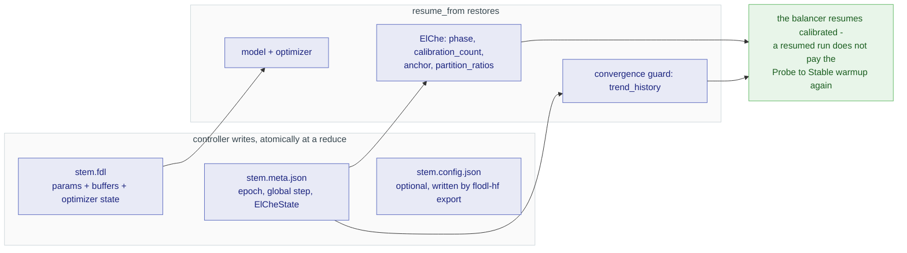

# Distributed Training Reference

Canonical reference for flodl's multi-GPU and multi-host training surface.
For progressive introductions, see
[Multi-GPU Training](../tutorials/11-multi-gpu.md) and
[Heterogeneous & Multi-Host DDP](../tutorials/12-async-ddp.md).

flodl has one training entry - `Trainer::builder(...).run()` (chained
form) or `Trainer::run(model_factory, optim_factory, train_fn, cfg)`
(config-bag form). The same call runs identically on:

- a single CPU,
- a single GPU,
- N GPUs on one host (auto-promoted to process-per-rank when
  `detect_gpus() >= 2`),
- N GPUs across many hosts (driven by `fdl.cluster.yml` or
  `ClusterBuilder`).

No code changes between tiers. Scaling is a configuration decision, not
a code rewrite. (For the API-tier rationale - universal builder, manual
`Ddp::wrap` bypass, the deprecated self-driven setup tier - see the
[trainer execution tiers design note](../design/trainer-execution-tiers.md).)

---

## Quick start

### Universal form - `Trainer::builder` + step closure

The recommended shape. Works on every tier without modification.

```rust
use flodl::*;
use std::sync::Arc;

let dataset: Arc<dyn BatchDataSet> = Arc::new(MyDataset::new());

// One training step: forward + loss, returns the loss Variable.
// The framework owns backward, optimizer step, gradient sync.
fn train_step(model: &impl Module, batch: &[Tensor]) -> Result<Variable> {
    let input  = Variable::new(batch[0].clone(), false);
    let target = Variable::new(batch[1].to_dtype(DType::Int64)?, false);
    cross_entropy_loss(&model.forward(&input)?, &target)
}

let handle = Trainer::builder(
        |dev| build_model_on(dev),         // model factory
        |params| Adam::new(params, 1e-3),  // optimizer factory
        train_step,                        // one-step closure
    )
    .dataset(dataset)
    .batch_size(64)
    .num_epochs(50)
    .run()?;

let state: TrainedState = handle.join()?;  // params + buffers (CPU)
```

`state.params` / `state.buffers` are CPU tensors aligned with
`build_model_on(Device::CPU)?.parameters()` and `.buffers()`. Drop them
into a fresh CPU model for inference, or continue training via
`Trainer::builder(...).resume_from(stem)` (or `TrainerConfig::resume_from`).

Per-sample datasets plug in the same way: implement
`DataSet::get(index)` (or use a shipped disk-backed reader like
`Cifar10Disk`) and hand it to `.sample_dataset(ds)` instead of
`.dataset(ds)` - or `TrainerConfig::from_dataset(ds)` in the
config-bag form. Batching, RAM caching, and reservation staging are
the framework's job; rank workers read samples ahead of the training
frontier through the shared staging tier, so storage-backed data
(local files, network mounts) trains through the same entry as
RAM-resident tensors.

### Graph models: the same entry

A flodl `Graph` (any `FlowBuilder`) is a `Module`, so it trains through the
exact entry above - just return the built graph from the `model_factory`
closure:

```rust
fn build_model(device: Device) -> Result<Box<dyn Module>> {
    let g = FlowBuilder::from(Linear::on_device(784, 10, device)?)
        .through(GELU)
        .build()?;
    Ok(Box::new(g))
}
// then: Trainer::builder(build_model, |p| Adam::new(p, 1e-3), train_step)
//           .dataset(dataset).batch_size(64).num_epochs(5).run()?;
```

`flodl-hf` task-head wrappers train the same way (task heads `impl Module`
directly, so return the wrapper from `model_factory`). To keep the loop
yourself, use the cooperative tier - `Trainer::builder(...).into_worker()?`
returns a `Worker` whose loop body you own while the controller keeps
cadence, partition, eval-election, and checkpointing. For an explicit
per-rank loop use `Ddp::wrap` (the bypass tier).

### Config-bag form - `Trainer::run`

For config-driven launchers, the umbrella `TrainerConfig<M>` gathers
every knob into one struct:

```rust
let cfg = TrainerConfig::new(dataset)
    .batch_size(64)
    .num_epochs(50)
    .elche(ElCheConfig::nccl_cadence())   // recommended NCCL default; see "ElCheMode" below
    .resume_from("ckpts/run42.fdl")       // optional
    .checkpoint_every(5)
    .save_path("ckpts/run43");

Trainer::run(
    |dev|    build_model_on(dev),
    |params| Adam::new(params, 1e-3),
    train_step,
    cfg,
)?
.join()?;
```

`Trainer::run` and `Trainer::builder().run()` reach the same launcher
trampoline; pick whichever shape your call site prefers.

> **Invariant - "no CUDA before `Trainer::run`"**: user binaries must
> not touch libtorch's CUDA context before reaching `Trainer::run`. That
> means no `flodl::tensor::gpu_device_count()`, no
> `Module::on_device(CUDA(_))`, no CUDA-Tensor construction in `main()`.
> Cluster fan-out exits the launcher process without running training;
> touching CUDA there corrupts spawned children's context on
> heterogeneous-GPU rigs. Use `flodl::sys::detect_gpus()` (CUDA-free)
> for any pre-run GPU query.

---

## ElCheMode - cadence × backend in one name

The five ways to do parameter averaging are named directly. Each name
is a `(when to average) × (how to average)` pair. `ElCheConfig::default()`
returns `NcclCadence` (the recommended NCCL mode).

| Mode | When | How | Best for |
|---|---|---|---|
| `NcclSync` | Every slow-rank step (see note below) | NCCL AllReduce | Homogeneous GPUs, correctness-first baseline |
| `NcclCadence` | Anchor-based (ElChe) | NCCL AllReduce | **Recommended NCCL default** - heterogeneous rigs; ElChe tunes the anchor so the slow device sets the pace, fast devices process proportionally more batches per averaging window |
| `CpuSync` | Every slow-rank step (see note below) | CPU averaging | Sync without NCCL (peer-access unavailable, A/B against NCCL) |
| `CpuCadence` | Anchor-based | CPU averaging | Heterogeneous rigs without fast peer links |
| `CpuAsync` | Anchor + overshoot | CPU averaging + EASGD blending (α=0.5 default) | Genuine async - averaging decoupled from the GPU pipeline via a separate channel, barrier-free application, fault-tolerant. Trades a small early-run wall surplus for it (the divergence guard grows async's window more cautiously; the surplus amortizes on long runs). Pair with the DiLoCo outer optimizer for the best eval quality on the reference rig. |

> **What "sync" means in flodl.** The `*-sync` modes are the tightest
> cadence of the same ElChe-scheduled engine, not per-batch lockstep
> DDP. Data is dispatched as an **equal split** (standard-DDP-like
> sharding), but the reduce fires as soon as **every alive rank has
> made at least one step since the last reduce**, with each rank's
> contribution work-weighted (sum-and-count). On a homogeneous rig
> this degenerates to classic synchronous DDP - one step per rank per
> reduce. On a heterogeneous rig the fast GPU runs several steps per
> reduce within its equal share instead of stalling at a per-batch
> barrier, and idles once that share is exhausted (which is why sync
> rows show high fast-GPU idle in the benchmark tables). The
> difference vs `*-cadence`: cadence waits for each rank to complete
> its **planned proportional window** (ElChe's `batch_counts`) before
> reducing, and dispatches data proportionally to measured throughput.

Every mode routes through the same machinery, so switching between
them is one line.

> **Note**: `NcclAsync` used to exist as a sixth mode (NCCL + per-rank
> cross-epoch dispatch). It was dropped - measured benefit over
> `NcclCadence` was within noise on every tested rig, and the
> in-place AllReduce writeback raced with autograd on heterogeneous
> Pascal+Blackwell setups. CPU Async (`CpuAsync`) is the real
> asynchronous mode: averaging is decoupled from the GPU pipeline
> through a separate channel.

### `ElCheConfig` - presets + overrides

```rust
let elche = ElCheConfig::nccl_cadence()  // also the value of ElCheConfig::default()
    .max_anchor(20)
    .overhead_target(0.05);
```

| Preset constructor | Mode |
|---|---|
| `ElCheConfig::nccl_sync()` | `NcclSync` |
| `ElCheConfig::nccl_cadence()` | `NcclCadence` (**default**) |
| `ElCheConfig::cpu_sync()` | `CpuSync` |
| `ElCheConfig::cpu_cadence()` | `CpuCadence` |
| `ElCheConfig::cpu_async()` | `CpuAsync` (see [A/B testing modes](03-internals.md#ab-testing-modes)) |

Or build the value directly with a struct literal:

```rust
let elche = ElCheConfig {
    mode: ElCheMode::NcclCadence,
    max_anchor: Some(20),
    overhead_target: Some(0.05),
    ..Default::default()
};
```

### `ElCheConfig` knobs

| Field / setter | Default | Description |
|---|---|---|
| `.mode(ElCheMode)` | `NcclCadence` | The (when × how) pair. `ElCheConfig::default()` returns `nccl_cadence()`. |
| `.anchor(n)` | 10 (Cadence/Async); 1 (Sync) | Initial anchor count. |
| `.min_anchor(n)` / `.max_anchor(n)` | `None` (auto) | Anchor bounds. |
| `.overhead_target(f)` | `0.05` | Upper bound on `sync_ms / max(compute_ms)` per anchor window. ElChe grows the anchor when overhead exceeds the target, shrinks it when overhead drops below half. **Cadence + Async modes only** - Sync modes fire the reduce per slow-rank step (every alive rank ≥1 step; see "What sync means" above) and ignore the anchor knob. See [the anchor auto-tune section](03-internals.md#anchor-auto-tune). |
| `.max_batch_diff(n)` | `None` | Cap on how far the fastest rank may lead the slowest. `Some(0)` = strict lockstep regardless of mode. |
| `.relax_up(bool)` | `false` | Allow ElChe to grow the anchor in `Phase::Stable` when convergence stays clean. |
| `.partition_ratios(Vec<f64>)` | auto | Static per-rank data split (e.g. `[0.7, 0.3]`). **Honored on `Sync` policy only**; Cadence/Async use progressive dispatch driven by ElChe and ignore the static ratios. For dynamic heterogeneous scheduling under those policies, ElChe's throughput-based auto-rebalancing is the intended path. |
| `.meta_controller(bool)` | `true` | LR-aware meta-controller - watches LR + anchor + divergence; nudges anchor down on sharp LR drops or sustained divergence. On by default (LR drops are always worth catching); opt out for unconditioned-trajectory instrumentation. |
| `.convergence_guard(g)` | `TrendGuard` at the EASGD-aware threshold | Divergence guardrail. `NoGuard`, `TrendGuard`, or `MsfGuard` (rate-based). The default threshold is keyed on param-adoption semantics: `0.05` for overwrite modes, `0.3` when `easgd_alpha` is set (elastic blending keeps a deliberate standing spread that a lower floor would read as permanent divergence). |
| `.easgd_alpha(α)` | `Some(0.5)` on `CpuAsync`; `None` elsewhere | EASGD elastic blend on the `CpuAsync` path (`0 < α ≤ 1.0`) - on by default there (full overwrite is the degenerate α=1.0 case). Ignored outside `CpuAsync`. |
| `.gamma(γ)` | `1.0` | Consensus allocation-weighting exponent applied when the outer optimizer / averaging weights ranks by work. `1.0` = pre-gamma (plain work-weighting). |
| `.bf16_wire(bool)` | `false` | Ship the CPU-averaging plane's model traffic as bfloat16: halves pinned snapshots, relay fold traffic, and wire payloads both directions. Averaging still accumulates in f32 (bf16 exists only at the wire/buffer boundary); control traffic, checkpoints, and the final trained weights stay exact f32. CPU averaging modes only - `.run()` errors loudly on NCCL modes. Must match across the cohort. |
| `.divergence_threshold(f)` | `None` | Legacy primitive feeding the default `TrendGuard` threshold when no explicit `convergence_guard` is set. Prefer `.convergence_guard(...)`. |
| `.no_divergence_guard()` | `false` | Disable the divergence guardrail entirely (overhead auto-tune drives cadence alone). Use only when the workload is known stable. |
| `.max_overshoot(n)` | `None` (auto) | Max batches a rank may run past its planned sync point before being held. **`CpuAsync` only**; ignored by Sync/Cadence. |

### Convergence guards

`ElCheConfig::convergence_guard(g)` plugs an implementation of the
`ConvergenceGuard` trait into the controller. After each averaging
round it returns one of `ConvergenceAction::{Stable, SuppressGrowth,
NudgeDown { factor }}`, which the coordinator uses to drive ElChe's
anchor.

| Guard | Behavior |
|---|---|
| `NoGuard` | Passive baseline - always `Stable`. Use for instrumented runs that want an unconditioned trajectory. |
| `TrendGuard::new(thresh)` | **Production default.** Three-rises-above-threshold rule on the per-rank `\|\|pre - post\|\| / \|\|post\|\|` ring buffer (last 5 events). Returns `SuppressGrowth` on persistent rising drift. |
| `MsfGuard::default().with_suppress(s, n).with_nudge(t, n, factor)` | Rate-based detector built on the across-event MSF proxy `λ_ema = EMA((1/k_max) * log(D_t / D_{t-1}))`. Soft + hard thresholds: sustained `λ_ema > suppress_threshold` → `SuppressGrowth`; sustained `λ_ema > nudge_threshold` → `NudgeDown` with `factor` (`0.5` halves the anchor). Opt-in. |

`TrendGuard` state (the divergence ring buffer) is part of
`ElCheState` and round-trips through `resume_from` - a resumed run
inherits the calibration trajectory. `MsfGuard`'s EMA + streak
counters re-warm from scratch across resume (by design, since the
across-event proxy is a derivative signal that recovers quickly).

### Guard authority over `overhead_target`

`overhead_target`'s anchor auto-tune is **proposed**, not committed,
inside `report_timing`. The convergence guard's verdict drives the
commit:

| Verdict | Effect |
|---|---|
| `Stable` | Commit the proposal - grow or shrink the anchor by the proposed amount. |
| `SuppressGrowth` | Drop a proposed grow; **apply** a proposed shrink (shrink is the safe direction when divergence is rising). |
| `NudgeDown { factor }` | Drop the proposal entirely; nudge supersedes by shrinking the current anchor by `factor`. |

This makes the convergence guard authoritative: rising weight-space
divergence vetoes anchor growth *before* it lands, rather than
catching up after `overhead_target` has already moved the anchor. The
two-sided trade-off - `overhead_target` proposes growth on throughput
pressure, guard vetoes when convergence pressure rises - runs through
one explicit commit/veto pipeline.

---

## `TrainerConfig<M>` - the umbrella

Every knob `Trainer::run` needs sits on `TrainerConfig`. The chained
`Trainer::builder()` API exposes the same setters; pick whichever
matches your call site.

```rust
let cfg = TrainerConfig::new(dataset)
    .batch_size(64)
    .num_epochs(50)
    .elche(ElCheConfig::nccl_cadence().relax_up(true))
    .max_grad_norm(5.0)
    .checkpoint_every(5)
    .save_path("ckpts/run43")
    .resume_from("ckpts/run42.fdl")
    // .epoch_callback_policy(EpochCallbackPolicy::Fastest)  // default - pin a specific rank with EpochCallbackPolicy::Rank(n)
    .checkpoint_fn(Arc::new(|epoch, model| {
        model.save_checkpoint(&format!("ckpts/run43-ep{epoch}.fdl"))
    }))
    .eval_dataset(test_set)
    .eval_fn(Arc::new(|model, input, target| {
        let pred = model.forward(&Variable::new(input.clone(), false))?;
        // ... return f64
        Ok(0.0)
    }))
    .eval_result_fn(Arc::new(|epoch, val| {
        eprintln!("eval epoch={epoch} value={val}");
    }))
    .metrics_fn(Arc::new(|m| {
        eprintln!("epoch={} loss={:.4}", m.epoch, m.avg_loss);
        Ok(())
    }));
```

| Setter | Type | Notes |
|---|---|---|
| `.batch_size(n)` | `usize` | Per-rank batch size. |
| `.num_epochs(n)` | `usize` | Total epochs. |
| `.elche(cfg)` | `ElCheConfig` | DDP cadence + backend + tuning. |
| `.max_grad_norm(f)` | `f64` | Per-rank gradient clip applied before AllReduce. Fused kernel. |
| `.checkpoint_every(n)` | `usize` | Save a checkpoint every `n` epochs/aggregations. |
| `.save_path(p)` | `String` | Stem for checkpoint bundles (writes `<stem>.fdl` + `<stem>.meta.json`). |
| `.resume_from(p)` | `String` | Load bundle at start; restores params, buffers, optimizer, ElCheState. |
| `.checkpoint_fn(f)` | `CheckpointFn<M>` | Called on the elected callback rank with `(epoch, &M)`. |
| `.epoch_fn(f)` | `EpochFn<M>` | Per-epoch worker callback (`(epoch, &mut GpuWorker<M>)`). |
| `.metrics_fn(f)` | `MetricsFn` | Host-side per-epoch callback (`&EpochMetrics`). |
| `.scheduler_fn(f)` | `SchedulerFn` | Per-worker LR scheduler factory. |
| `.sample_dataset(ds)` | `impl DataSet` | Per-sample alternative to `.dataset()`: implement `get(index)`, the framework batches, caches, and stages. `TrainerConfig::from_dataset(ds)` is the config-bag twin. |
| `.eval_dataset(ds)` | `Arc<dyn BatchDataSet>` | Held-out data for evaluation. |
| `.eval_fn(f)` | `EvalFn<M>` | Receives `(&M, &Tensor, &Tensor)`, returns `Result<f64>`. |
| `.eval_result_fn(f)` | `EvalResultFn` | Controller-side `(epoch, scalar)` sink. |
| `.epoch_callback_policy(p)` | `EpochCallbackPolicy` | `Fastest` (default) or `Rank(n)`. |
| `.outer_optimizer(factory)` | `Fn() -> Box<dyn OuterOptimizer>` | Outer-loop optimizer on the consensus (SlowMo / DiLoCo). Default = plain work-weighted averaging (`OuterAvg`). See [Outer optimizer](03-internals.md#outer-optimizer---slowmo--diloco). |
| `.checkpoint_at_epoch(n)` | `usize` | One-shot coverage-granular checkpoint at the epoch any rank first reaches (progressive modes). Pairs with `.save_path`. |
| `.eval_every(n)` | `usize` | Fire `eval_fn` every `n` epochs (`0` disables). The chained `DdpBuilder::eval_every` takes an `EvalCadence` instead. |
| `.reports_per_epoch(n)` | `usize` | Emit up to `n` sub-epoch monitor reports per epoch, at reduce boundaries (`0` = off, the default). Fills the curve *between* epoch points — see [Sub-epoch reports](#sub-epoch-reports---reports_per_epoch). |
| `.record_log(dir, max_bytes)` | `(String, u64)` | Persist the monitor record stream as append-only JSONL under `dir`, one drop-oldest ring per node capped at `max_bytes` (`0` = default). Off by default — see [Persisting the record stream](#persisting-the-record-stream---record_log). |
| `.save_dashboard(path)` | `String` | Write the run's dashboard as one self-contained HTML file at teardown (the full portal, no server, no sibling files). Off by default — see [Saving the dashboard](#saving-the-dashboard---save_dashboard). |
| `.dashboard_theme(theme)` | `String` | Pin the saved dashboard's theme (`"light"` / `"dark"` / `"auto"`). Unset, a saved page follows the reader's `prefers-color-scheme`. `"light"` is the publication setting. |
| `.scalar_reduction(key, r)` | `(String, Reduction)` | Declare how a **user scalar** rolls up across ranks (`Sum` / `Max` / `Min` / `Mean` / `Last`). Repeatable. Non-core keys default to `Mean`, which is wrong for a count — see [Declaring how a scalar rolls up](#declaring-how-a-scalar-rolls-up---scalar_reduction). |
| `.timeline(t)` | `Arc<Timeline>` | Inject DDP events into a profiler stream. |
| `.with_vram_pool(b)` | `bool` | Device-resident sample pool on each rank (default `true`; `FLODL_VRAM_POOL=off` is the runtime kill-switch). |
| `.with_vram_max_usage(f)` | `f64` | Fraction of total VRAM each rank's data plane (prefetch channel + sample pool) may use. Default `0.90`, clamped to `[0.50, 0.99]` - same knob as the solo loader's `vram_max_usage`. |
| `.with_ram_max_usage(f)` | `f64` | Fraction of available host RAM each rank's staging tiers may retain; co-hosted ranks split it in proportion to their schedule share. Default `0.50`, clamped to `[0.0, 0.90]`; `0.0` disables staging retention. Same knob as the solo loader's `ram_max_usage`. |
| `.with_sample_cache(b)` | `bool` | Pinned RAM sample retention in each rank's staging tier. `false` pins the retained cache at zero - the flow window keeps the whole staging share, nothing persists across epochs. Default `true` - same knob as the solo loader's `sample_cache`. |
| `.with_disk_stage(gb)` | `u64` | Local-disk overflow tier under each rank's sample cache, in GB: samples the RAM budget declines spill to an ephemeral per-rank pack file and re-read at local-disk speed instead of source speed. Default `0` (off) - same knob as the solo loader's `disk_stage`. Pair with `.with_disk_stage_dir(path)` to point at a fast local drive. |
| `.with_augment(k)` | `usize` | Views per sample per epoch: the schedule becomes `len()*k` picks, sharded and balanced exactly like samples. Data variation comes from the transform. |
| `.with_transform(f)` | closure | Deterministic delivery transform, keyed by `PickKey { sample, repeat, epoch, seed }` per row; runs on each rank after device transfer. The chained `DdpBuilder` twins are `.augment(k)` / `.transform(f)`. See the [data-loading tutorial](../tutorials/13-data-loading.md#augmentation-repeated-picks--a-keyed-transform). |
| `.cluster(c)` | `FullCluster` | Programmatic cluster topology (overrides any active overlay). |

`TrainerConfig::cluster(full)` is the seam for programmatic
multi-host launches (see [Programmatic clusters](#programmatic-clusters---clusterbuilder)
below).

---

## Host-side callbacks: `metrics_fn` / `eval_fn`

`Trainer::builder().run()?.join()?` is the canonical "just train" shape,
but per-epoch logging, monitor wiring, and held-out evaluation all want
a host-side callback that fires once per epoch with the aggregated
metrics.

### `metrics_fn`

```rust
let handle = Trainer::builder(model_factory, optim_factory, train_step)
    .dataset(dataset)
    .batch_size(64)
    .num_epochs(100)
    .metrics_fn(Arc::new(|m: &EpochMetrics| {
        eprintln!(
            "epoch={} loss={:.4} acc={:.3} {:.0}ms",
            m.epoch, m.avg_loss,
            m.scalars.get("accuracy").copied().unwrap_or(0.0),
            m.epoch_ms,
        );
        Ok(())
    }))
    .run()?;

handle.join()?;
```

Fires once per epoch on the host thread, after all ranks have reported.
Composes with the polling API (`handle.next_metrics()` /
`handle.poll_metrics()`) - the same `EpochMetrics` reaches both. Callback
errors are logged to stderr; training continues.

Transparent across tiers: fires identically on single-GPU, single-host
multi-GPU, and multi-host clusters.

### `eval_fn` + `eval_dataset` + `eval_result_fn`

```rust
.eval_dataset(test_set)
.eval_fn(Arc::new(|model, input, target| {
    let pred = model.forward(&Variable::new(input.clone(), false))?;
    let acc  = pred.argmax(-1, false)?.eq_tensor(target)?.sum()?.item::<f64>()?
             / target.shape()[0] as f64;
    Ok(acc)
}))
.eval_result_fn(Arc::new(|epoch, value| {
    eprintln!("[eval] epoch={epoch} acc={value:.4}");
}))
```

The coordinator dispatches `eval_fn` per-epoch on the elected callback
rank, and forwards the returned scalar to `eval_result_fn` on the host.

### `EpochCallbackPolicy`

Controls which rank executes per-epoch callbacks (`checkpoint_fn`,
`epoch_fn`, `eval_fn`).

| Variant | Behavior |
|---|---|
| `Rank(n)` | Pin to a fixed **global rank** in `[0, world_size)`. Ranks are assigned sequentially by worker order in the cluster topology (worker 0 owns ranks `[0..N0)`, worker 1 owns `[N0..N0+N1)`, etc.). On a 4-rank cluster across two 2-GPU hosts, `Rank(0)` fires on the first rank of the first worker host, `Rank(3)` on the last rank of the last host. Loud-errors if `n >= world_size`. |
| `Fastest` (**default**) | Cost-aware: pick the global rank with the lowest `smoothed_ms_per_batch`. On heterogeneous rigs the fastest rank has the most idle time at the sync barrier, so eval / save runs as free compute. Sticky within a run; re-resolves only on rank death. On a single-GPU run the only rank trivially satisfies "fastest". |

### `EpochMetrics` fields

| Field | Type | Description |
|---|---|---|
| `epoch` | `usize` | 0-based. |
| `avg_loss` | `f64` | Loss averaged across all ranks. |
| `epoch_ms` | `f64` | Wall time for the epoch (slowest rank). |
| `scalars` | `HashMap<String, f64>` | Aggregated custom scalars (`record_scalar(...)` inside `train_fn`). |
| `per_rank` | `Vec<HashMap<String, f64>>` | Per-rank custom scalars. |
| `per_rank_throughput` | `Vec<f64>` | Batches per second per rank. |
| `per_rank_batch_share` | `Vec<f64>` | Fraction of total batches handled per rank. |
| `device_indices` | `Vec<u8>` | CUDA device index for each rank. |

---

## Slicing a pass into epochs - `epoch_splits`

"Epoch" normally fuses two things: a full pass over the data, and a
periodic event during training. They coincide until you train **one pass**,
which is the normal regime for LLM pretraining — and then the run has no
interior boundary at all, so no eval, no checkpoint and no reduce-window
bound until it ends. On rented hardware that can vanish, a lost box is a
lost run.

`epoch_splits` separates the two. `num_epochs` keeps counting **data
passes**; `epoch_splits` says how finely to slice one:

```rust
Trainer::builder(model_factory, optim_factory, train_step)
    .dataset(dataset)
    .num_epochs(1)         // one pass over the corpus
    .epoch_splits(20)      // delivered as 20 epochs, no sample seen twice
    .run()?;
```

| invocation | data passes | epochs | repeats |
|---|---|---|---|
| `num_epochs(10)` | 10 | 10 | yes — the default, unchanged |
| `num_epochs(1).epoch_splits(20)` | 1 | 20 | **no** |
| `num_epochs(2).epoch_splits(20)` | 2 | 40 | yes, twice |

Repetition is never implicit: it is `num_epochs` passes, visible in the
call.

- **Everything that keys off the epoch boundary follows**, with no extra
  configuration: eval cadence, `checkpoint_every`, `reports_per_epoch`, and
  the load-bearing `window <= epoch` cap — the coordinator bounds a reduce
  window by one epoch, so slicing the epoch tightens the window too. That
  shared boundary is why one knob is enough.
- **The permutation is unchanged.** A pass is still one shuffle covering
  every sample exactly once; splitting only decides how much of it an epoch
  consumes. Concatenating the epochs of a pass reproduces that pass exactly,
  so slices are disjoint and jointly complete by construction.
- **The LR schedule is untouched.** Total steps stay `batches x passes`, so
  a split run and an unsplit one follow the same curve.
- **At `epoch_splits(1)` (the default) nothing changes** — same scheduling,
  same logs, byte-identical shuffle to runs that predate the knob.
- **Refused rather than silently degraded:** splitting a pass into more
  epochs than it has batches would leave epochs with no work *and* leave the
  reduce window unbounded, so it errors at construction naming a usable
  bound.
- **The tail.** An epoch trains whole batches, so `epoch_samples %
  batch_size` picks per epoch fall outside the last one. They are dropped
  *before* allocation (never dispatched, so nothing waits on them), and the
  run prints the geometry it settled on. The tail is re-drawn every pass, so
  multi-pass runs average it away — across 200 passes a given sample is
  missed ~0.3 times. A **single-pass** run averages with nothing, so it warns
  and asks you to size the dataset to a multiple of
  `epoch_splits * batch_size`. In `ddp-bench` the token models do exactly
  that: `--train-tokens` snaps the staged corpus so the pass divides exactly.
- **Scope.** `TrainerConfig::with_epoch_splits`, `builder.epoch_splits(n)`,
  and the solo `SplitSampler` for non-distributed loaders. In `ddp-bench`:
  `--epoch-splits N` (DDP modes; the solo baseline drives its own loop and
  refuses the flag rather than ignoring it).

---

## Sub-epoch reports - `reports_per_epoch`

`metrics_fn` and the dashboard are driven by the **per-epoch** feed, which
is one data point per pass over the dataset. For a long epoch — and
decisively for **single-epoch (one-pass LLM) training** — that is a curve
with one point. `reports_per_epoch(n)` adds a *second*, finer feed:

```rust
Trainer::builder(model_factory, optim_factory, train_step)
    .dataset(dataset)
    .num_epochs(1)              // one pass over a token corpus
    .reports_per_epoch(20)      // ~20 loss points across the run
    .run()?;
```

- **Cadence.** A report fires at the first **reduce boundary** past each
  `epoch_work / n` slice of realized work (`epoch_work` = steps per epoch,
  known ahead from the dataset). Early small windows accumulate across
  several reduces; the rate settles toward one report per window as the
  cadence window grows. Reports always land *at* a sync boundary, never
  mid-window, and they ride the existing step clock — reporting observes
  the cadence, it never gates or delays it.
- **At most `n` per epoch.** An epoch that ends with residual work below
  the final threshold simply reports fewer times. That is not a gap: the
  epoch-boundary point comes from the per-epoch feed, so the two feeds
  compose — sub-epoch fills the interior, per-epoch marks the boundary.
- **Content.** Each report is a path-keyed node tree (`root` → host → rank,
  collapsing to `root` → rank on a single host) carrying per-rank `loss`,
  `throughput`, `compute_only_ms` and `batch_share`, with each interior
  node aggregating **its direct children only**. Cross-rank means are
  weighted by realized work, so a hierarchical rollup equals the flat one.
  A metric a rank did not measure this window is **absent**, never zeroed.
- **Cost.** Zero extra wire traffic — the per-batch loss already reaches
  the controller on the existing timing frames. Disabled (the default) the
  whole path is one `Option` check per reduce.
- **Scope.** Cluster / auto-promoted multi-GPU runs (the controller path).
  The per-epoch `metrics_fn` contract is untouched. In `ddp-bench`:
  `--reports-per-epoch N`.

Aggregation vocabulary (`Reduction`, the node record schema) lives in
`flodl::monitor::record`; the cadence scheduler in
`flodl::monitor::cadence`.

---

## Persisting the record stream - `record_log`

Reports are live-only unless you ask for them on disk:

```rust
Trainer::builder(model_factory, optim_factory, train_step)
    .dataset(dataset)
    .reports_per_epoch(20)
    .record_log("runs/exp1/records", 0)   // 0 = default per-node cap
    .run()?;
```

A record's `path` **is** its filesystem path, so the run leaves a tree
that mirrors the cluster:

```text
runs/exp1/records/
  root.log                      # cohort aggregate, one JSON per line
  root/exa-cuda.log             # host aggregate
  root/exa-cuda/rank0.log       # rank leaf, raw values
  root/flodl-pascal.log
  root/flodl-pascal/rank1.log
  root/flodl-pascal/rank2.log
```

- **JSONL, one record per line.** Each line is a standalone JSON object
  carrying `ts` / `sev` / `path`, so the files ingest into fluentd / GCP
  Cloud Logging as-is, and `jq` works on them directly.
- **Bounded, drop-oldest.** Each node's log is a ring capped at
  `max_bytes` (default 32 MiB): when the active segment fills it rotates
  and the oldest is dropped. A long run **cannot fill the disk** — the
  whole tree bounds to `nodes × max_bytes`.
- **Never fails training.** Every I/O error here is swallowed and warned
  once. A full or read-only disk costs you observability, nothing else.
- **Tail-read resume.** Every `node` record is an absolute snapshot, so
  catching up is reading the last N lines
  (`RecordLog::tail(path, n)`) — no index, no checkpoint replay.

Files stay plain JSONL while live (gzip cannot be appended to or cheaply
tailed). In a containerized run, point `dir` at a **mounted** path — a
container-local path is written inside the container and vanishes with it.

### Alerts in the same stream

Metrics records are `kind: "node"`. The stream also carries
`kind: "event"` records — the alert lane — written to the **same** files,
because an alert's `path` is the node it happened to:

```json
{"v":1,"ts":1737766000000,"sev":"critical","path":"root/flodl-pascal/rank2",
 "kind":"event","class":"rank_lost","detail":"rank 2 declared dead — heartbeat stale (>30s)","count":1}
```

| `class`        | `sev`    | raised when                                                 |
|----------------|----------|-------------------------------------------------------------|
| `rank_lost`    | critical | a rank was declared dead (heartbeat staleness or child exit) |
| `control_drop` | critical | a control broadcast did not reach every live rank            |
| `drift`        | warn     | the convergence guard had to correct the anchor              |
| `overflow`     | warn     | alerts were dropped by the live cap (never silent)           |

So `jq 'select(.kind=="event")' runs/exp1/records/root/*/*.log` is the
run's incident list, and a rank's own log holds its metrics *and* the
alert that ended it, in order. Alerts are always printed to stdout too —
you do not need `-v`, and you do not need `record_log`, to see them.

The lane is bounded: repeats of the same `(class, path)` within 10s
collapse into one record (the first occurrence is never delayed; the
absorbed repeats ride the `count` of the next one, so counts sum to the
true total), and at most 200 live entries are retained. There is no knob
— an alert stream you have to tune is one you cannot trust.

### Reading the stream live, by path

`record_log` is the stream's history on disk. Its live twin is served on
the dashboard port, addressed by the same paths:

```
GET /paths                       GET /history?path=root&n=200
GET /node?path=root/exa          GET /stream?path=root/exa    (SSE)
```

`/node` answers with one level — that node plus its **direct children**,
so a query costs `O(children)` and not `O(cluster)` at any depth — and
`/history` returns exactly what `/stream` would have sent, so
read-then-subscribe has no seam. Details:
[monitor tutorial → Querying the run by path](../tutorials/09-monitor.md#querying-the-run-by-path).

## Saving the dashboard - `save_dashboard`

`record_log` gives you the stream as JSONL. `save_dashboard` gives you the
**page**: one self-contained HTML file carrying the whole portal — every level
browsable, both metric cadences interleaved, the model graph SVG and the
hyperparameters inline. Open it in a browser with no server and no sibling
files.

```rust
Trainer::builder(model, opt, step)
    .save_dashboard("runs/exp1/dashboard.html")
```

`ddp-bench` exposes it as `--save-dashboard`, which writes
`<run_dir>/dashboard.html` beside `timeline.html`.

Three properties make it safe to leave on:

- **It needs no dashboard port.** Persisting a dashboard does not require
  serving one, so a headless cluster run produces the same artifact.
- **It cannot grow without bound.** The record plane is a ring, so a longer run
  shortens the archive's *horizon* rather than enlarging its *file* — which is
  what keeps it attachable to a ticket.
- **It is written at teardown**, after the record stream has drained, so it
  captures the end of the run rather than whatever had been flushed early.

Ask for it through the **builder**, not through your own `Monitor`: on a cluster
run `Monitor::serve` returns early and the launcher's sink owns the server and
the records, so `monitor.save_html(...)` would write a page with no levels.

### Theme

The saved page follows the reader's OS by default, exactly as the live
dashboard does, and carries a toggle. Pin it when the artifact is headed
somewhere with a fixed look — a figure in a paper should not change appearance
with the reviewer's desktop:

```rust
    .save_dashboard("runs/exp1/dashboard.html")
    .dashboard_theme("light")
```

Nothing is locked in at training time: every saved page exposes the choice as a
single line near the top (`const ARCHIVE_THEME=null;`), so re-theming an
artifact you already have is one edit, and the reader's own toggle still
overrides whatever is pinned.

## Declaring how a scalar rolls up - `scalar_reduction`

Framework metrics have authoritative reductions (`loss` is a work-weighted
mean, `throughput` sums, `data_starve` takes the worst rank). **Your** scalars
cannot be guessed, so they default to `Mean` — right for a rate or an accuracy,
wrong for a count or an extremum:

```rust
Trainer::builder(model, opt, step)
    .scalar_reduction("tokens_seen", Reduction::Sum)
    .scalar_reduction("peak_mem_gb", Reduction::Max)
```

This matters more than a wrong number usually would, because the portal
**states** the reduction in its legend: an undeclared count renders as
`tokens_seen (mean)`, asserting something false rather than merely being off.

Declarations reach every consumer automatically — they ride the record stream's
`meta` record, which each subscriber receives ahead of any data record, so a
viewer can never interpret a metric without knowing how it was rolled up. Core
keys ignore any declaration here.

The dashboard at that same port **is** these paths, rendered: one view
repeated per level, a breadcrumb for navigation, and a drill-down that
re-subscribes to the child path. It watches the level you are on rather
than the whole cluster, so cost does not grow with rank count. See
[monitor tutorial → One view, repeated per level](../tutorials/09-monitor.md#one-view-repeated-per-level).

---

## CUDA-free GPU detection - `flodl::sys::detect_gpus`

`detect_gpus() -> Vec<GpuInfo>` enumerates GPUs without loading
libtorch, returning per-device `index`, `vendor`, `name`, `arch` and
`total_memory_mb`. Honors `CUDA_VISIBLE_DEVICES`, so the result matches
the view the auto-promote path and child processes will see. Its sibling
`detect_gpus_physical()` ignores visibility masks, which is what
provisioning questions ("does this box's libtorch cover its cards") want.

`arch` is vendor-shaped (`GpuArch::Sm { major, minor }` on NVIDIA), so
`arch_label()` is the display form and `sm_major()` / `sm_minor()` return
`Option` for the NVIDIA-specific consumers.

```rust
use flodl::sys::detect_gpus;

let gpus = detect_gpus();
for g in &gpus {
    eprintln!("GPU {}: {} ({}, {} MB)",
        g.index, g.name, g.arch_label(), g.total_memory_mb);
}

// Use the count for partition planning, but do NOT instantiate
// CUDA tensors here.
let world_size = gpus.len();
```

This is the canonical pre-`Trainer::run` GPU query. The previous habit
of calling `flodl::tensor::gpu_device_count()` from `main()`
initializes libtorch's CUDA context in the launcher process; that
context then poisons spawned children on heterogeneous-GPU rigs.
`detect_gpus` does not touch CUDA.

---

## Auto-promote: single host, N GPUs

When `Trainer::builder().run()` (or `Trainer::run`) fires on a host
where `detect_gpus() >= 2` and no cluster overlay is set, the framework
synthesizes a single-host cluster covering every visible CUDA device
and fans out one process per rank. The user's binary process becomes
the launcher; rank children run training.

```rust
// On a 2× GPU host: this auto-promotes to a 2-rank process-per-rank
// run. No code change vs the single-GPU shape above.
let handle = Trainer::builder(model_factory, optim_factory, train_step)
    .dataset(dataset)
    .batch_size(64)
    .num_epochs(50)
    .run()?;
handle.join()?;
```

Auto-promote is `cfg(not(test))`-gated for flodl's own test suite (so
`Ddp::wrap` keeps driving the thread-based multi-GPU tests in-process).
External crates that want to scope down to a single rank in tests can
set `CUDA_VISIBLE_DEVICES=0`.

---

## Programmatic clusters - `ClusterBuilder`

For tests and binaries that want to launch a multi-host cluster from
inside `main()` without depending on a yml on disk:

```rust
use flodl::ClusterBuilder;

let cluster = ClusterBuilder::new()
    .controller("controller.example.com")
        .port(1337)
        .path("/opt/flodl")
    .done()
    .host("worker-a")
        .ranks([0, 1])
        .devices([0, 1])
        .nccl_socket_ifname("enp1s0")
        .path("/opt/flodl")
        .ssh("worker-a.example.com")
        .ssh_port(22)
        .ssh_user("ubuntu")
        .ssh_identity_file("/home/me/.ssh/cluster_key")
    .done()
    .host("worker-b")
        .ranks([2])
        .devices([0])
        .nccl_socket_ifname("enp1s0")
        .path("/srv/flodl")
    .done()
    .build()?;

let cfg = TrainerConfig::new(dataset)
    .batch_size(64)
    .num_epochs(50)
    .elche(ElCheConfig::nccl_cadence())
    .cluster(cluster);

Trainer::run(model_factory, optim_factory, train_step, cfg)?.join()?;
```

`ClusterBuilder` mirrors `fdl.cluster.yml` 1:1 - same fields, same
validation, same launcher contract. `controller(...)` and `host(...)`
are sibling sub-builders, matching the YAML's `controller:` /
`workers[]:` shape. A `FullCluster` reaches the launcher the same way
an overlay-driven cluster does (via `FLODL_INTERNAL_FULL_CLUSTER_JSON`), so
`Trainer::run` accepts both.

### `ClusterBuilder::all_local_gpus()`

Single-host convenience:

```rust
let cluster = ClusterBuilder::all_local_gpus()?;
// One worker, every visible CUDA device, loopback controller.
```

This is what auto-promote synthesizes internally; expose it explicitly
when you want to drive the same shape from a test.

---

## Resume + checkpoints

`Trainer::builder(...).resume_from(stem)` (or `TrainerConfig::resume_from`
on the config-bag entry) loads a checkpoint bundle and continues training. The bundle is three files:

| File | Contents |
|---|---|
| `<stem>.fdl` | Model parameters + buffers + optimizer state. |
| `<stem>.meta.json` | `CheckpointMeta`: `ElCheState` (phase, calibration_count, anchor, partition_ratios, ring buffer) + `SaveReason`. |
| `<stem>.config.json` | (optional) Source config sidecar - `flodl-hf` writes this on export. |

```rust
TrainerConfig::new(dataset)
    .batch_size(64)
    .num_epochs(100)
    .save_path("ckpts/run43")
    .resume_from("ckpts/run42")     // loads ckpts/run42.{fdl,meta.json}
    .checkpoint_every(5);
```

The controller writes meta atomically alongside the model + optimizer
files. Compatible with `.meta.json` from any prior flodl run.

A resume restores more than weights. The meta file carries the balancer's
learned trajectory, so the cadence controller comes back **calibrated**
rather than starting over at `Probe`:



The restore is strict about cohort shape: a snapshot taken at one
`world_size` is rejected loudly rather than reinterpreted, since
`partition_ratios` are per-rank and would otherwise be silently
misapplied. See [Phase lifecycle](03-internals.md#phase-lifecycle) for what
each restored phase unlocks.

### `SaveReason`

| Variant | Trigger |
|---|---|
| `Checkpoint` | A mid-run checkpoint taken atomically at a reduce (`checkpoint_every` / `checkpoint_at_epoch`); training continues. |
| `GracefulShutdown` | Normal cluster shutdown after reaching end-of-training. |
| `MaxFailureExceeded` | User-configured `max_failure` threshold was breached. |
| `SingleSurvivor` | NCCL cohort dropped below 2 ranks; the lone survivor saves before exiting (NCCL needs world_size >= 2). |
| `AllRanksLost` | CPU cohort lost its last survivor. |
| `ReduceStall` | A reduce cycle stalled past its hard ceiling with the cohort still alive (scheduler wedge); save + shut down rather than hang. |

---

## Elastic membership

Ranks can die without aborting the run. The controller owns the
lifecycle; workers just report and follow: a dead rank is evicted for
the remainder of the run and its unprocessed work is redistributed
across survivors.

Membership only ever **shrinks**. The world is formed once, at the join
window (see [Dial-in membership](02-cluster-guide.md#dial-in-membership-the-join-window));
after that, neither a new rank nor a previously dead one can join the
cohort. Elastic scale-up (mid-training join) is designed but not yet
implemented - see `.design/hierarchical-elastic-ddp.md` for the
direction and its consistency invariant.

### What happens when a rank dies

1. **Death detection** - the launcher's child-exit report reaches the
   controller within milliseconds of the process dying; heartbeat
   staleness (30s) is the backstop for silent hangs. Either path
   transitions the rank to `Dead` in per-rank state and elastically
   renormalizes `partition_ratios` across survivors. (A rank that
   *completes* cleanly announces `Exiting` instead - the
   clean-completion latch - so a finished rank is never mistaken for a
   death; an error exit never sends it, so a death is never masked as
   completion.)
2. **Lone NCCL survivor** - short-circuits the wait and exits
   immediately rather than blocking on a dead-quorum AllReduce.
3. **`max_failure` threshold** - when survivor count drops below this,
   the cluster aborts cleanly. Coordinator drives a final
   `ShutdownWithSave` checkpoint through whichever rank still has the
   freshest state, then signals every survivor to exit.
4. **NCCL rendezvous-timeout retry** - if `ncclCommInitRank` doesn't
   quorum within the timeout, the coordinator picks the largest
   contiguous survivor subset, rebuilds the comm, and retries. Used at
   run start and after mid-run rank death.

### Controller-driven checkpoint retry / role failover

A save failure on the elected callback rank does not poison the run.
The coordinator picks a new callback rank from survivors (cost-aware:
lowest `smoothed_ms_per_batch` first, sticky within a run), re-issues
the save, and resumes. Failed callbacks are time-excluded from
rank-cost accounting so retry latency doesn't bias the next dispatch
decision.

<!-- nav: generated by site/build_guide.py — do not edit below -->

---

Previous: [HuggingFace Integration](../tutorials/14-flodl-hf.md) | Next: [Multi-Host Cluster Guide](02-cluster-guide.md)
