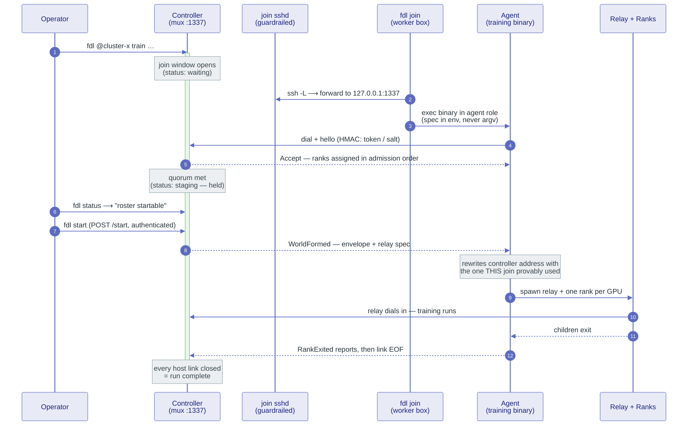
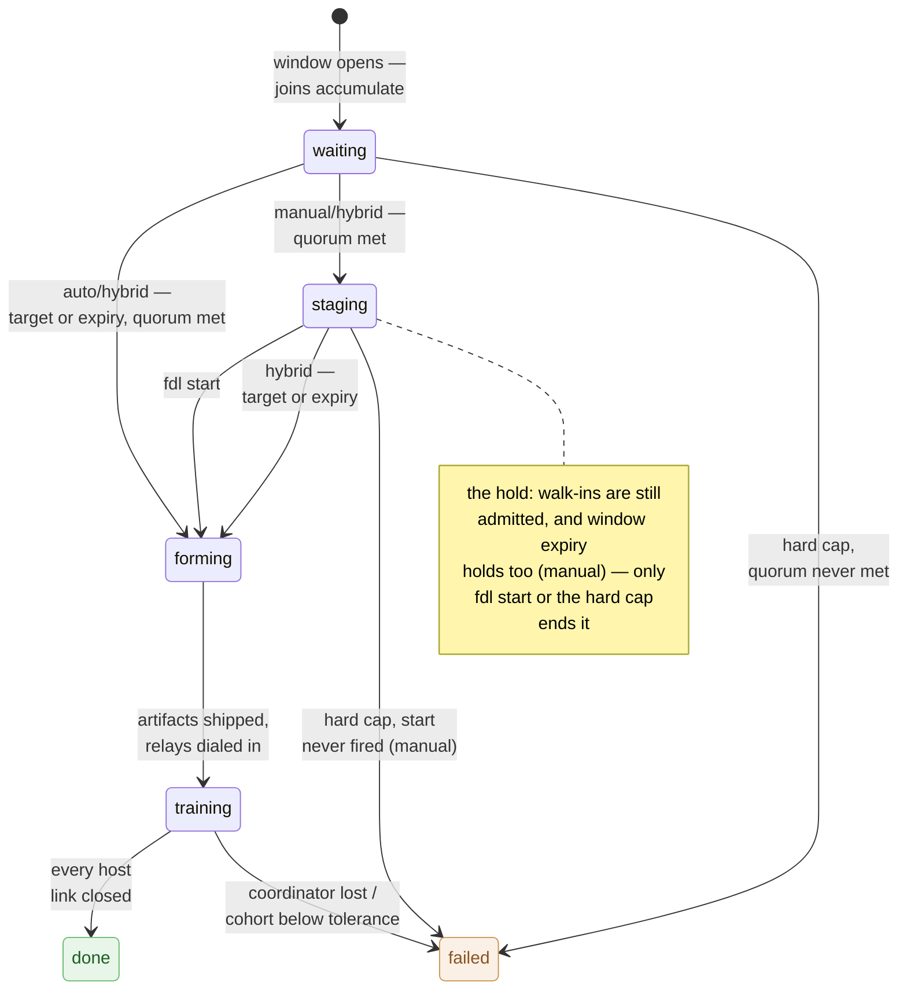

# Multi-Host Cluster Guide

A cluster spans hosts via `fdl.cluster.yml` (deployment) or
`ClusterBuilder` (programmatic). The orchestrator host fdl-cli runs on
is the **controller** and is never a NCCL rank itself; every
rank-carrying host lives under **workers**.

### `fdl.cluster.yml` schema

```yaml
cluster:
  controller:
    host: 192.168.122.1           # controller bind address
    port: 1337                    # the single controller port (default 1337)
    path: /opt/flodl              # controller's view of the shared project root
    # docker: cuda                # optional pre-flight build service
    # arch: precompiled/cu128     # optional libtorch variant for pre-flight build
    # join:                       # membership-window overrides (see below)
    #   min_rank_start: 2
    #   join_timeout: 300
    #   target_ranks: 4
    #   max_join_timeout: 600
    #   open_admission: false

  workers:
    - host: node-a                # worker identifier; default SSH target
      local_devices: [0]          # 1 device -> 1 rank
      nccl_socket_ifname: virbr0
      path: /opt/flodl
      arch: precompiled/cu128     # libtorch variant under <path>/libtorch/
      docker: cuda                # optional: training runs in this compose service

    - host: node-b
      ssh:                        # optional SSH sub-block
        target: node-b
        port: 2222
        user: ubuntu
        identity_file: /home/me/.ssh/cluster_key
        options:
          - ProxyJump=bastion
          - StrictHostKeyChecking=no
      # tunnel: true              # route training traffic through the SSH
      #                           # session (CPU ElChe modes only; see below)
      local_devices: all          # probed at dispatch via SSH+nvidia-smi
      nccl_socket_ifname: enp1s0
      path: /srv/flodl
      arch: builds/sm61-sm120     # different variant per worker is fine

  # Cluster-scope env vars (apply to every rank child)
  # env:
  #   NCCL_DEBUG: INFO
```

Conventions:

- One process per rank; each worker owns one rank per visible CUDA
  device. Global ranks are assigned sequentially by worker order:
  worker 0 owns `[0..N0)`, worker 1 owns `[N0..N0+N1)`, etc.
- `local_devices: all` probes the host at dispatch time via SSH +
  `nvidia-smi`. Explicit lists carry their own count.
- `nccl_socket_ifname:` is required on every worker when the cluster
  spans multiple hosts.
- `path:` is the project checkout dir on this host (heterogeneous
  mounts are fine - `/opt/flodl` on one host, `/srv/flodl` on another).
- `arch:` is the libtorch variant subpath under `<path>/libtorch/` on
  this host. For heterogeneous rigs, each worker can select a different
  variant (e.g. one host on `precompiled/cu128`, another on
  `builds/sm61-sm120`); the convention path stays stable while the
  variant differs per host.
- `docker:` (optional) names the compose service for training on this
  host. Per-host: mixed deployments (controller in Docker, worker
  bare-metal) are common.
- `tunnel:` (optional) routes this worker's training traffic through
  its fan-out SSH session instead of a direct TCP connection - see
  below.

### Dial-in membership: the join window

Workers **join** a run; the controller admits them. At launch the
controller opens a join window on its port; every worker - fan-out-
managed and self-deployed alike - dials in with a hello (host name,
GPU inventory, libtorch variant, dataset signature) and is assigned
its global ranks **in admission order** (contiguous by construction).
When the window closes, the world freezes: `world_size` is whatever
actually joined, and all coordination infrastructure (ElChe schedule,
heartbeats, rendezvous) is sized to that world.

`fdl @cluster <cmd>` fan-out is sugar over this protocol: it starts
one worker agent per host over SSH, and those agents dial back in like
any worker would. The defaults make fan-out behave exactly like a
fixed topology - quorum and early-close target both default to the
configured capacity, so the window closes the instant every configured
rank is in (zero added latency) and the run cannot start below full
strength.

#### The big picture, end to end

One run, every moving part - a discovery controller holding a manual
window, one worker walking in through a guardrailed sshd tunnel
(`fdl join --ssh`), the operator firing the start. Fan-out agents and
direct-dial walk-ins enter the exact same sequence at the "dial +
hello" step; only the road differs:



Three properties worth reading off the picture:

- **The join connection never closes.** The same TCP stream carries
  the hello, the admission reply, the formed-world artifacts, per-rank
  exit reports upstream, and abort orders downstream - and its EOF is
  the host's exit event. A walk-in host is nobody's child process, so
  that link IS how the controller supervises it: the run is over when
  every host link has closed, and a failing run sends `Abort` down the
  links instead of leaving agents to guess.
- **The agent trusts its own road, not the controller's map.** The
  formed-world artifacts name a controller address, but the controller
  authors it from *its* view of the topology - wrong on a host whose
  tunnel sits on an ephemeral local port, wrong behind NAT. The agent
  rewrites that address with the one its own join just provably used,
  so the relay dials a road that is known to work.
- **Ranks never learn any of this exists.** Everything downstream of
  `WorldFormed` is byte-identical to the fixed-topology era; the
  training code cannot tell a walk-in world from an enumerated one.

The window itself is a small state machine. `auto` runs entirely on
the clock; `manual` inserts an operator-held `staging` phase between
quorum and formation; `hybrid` is both (the clock still closes, the
operator may fire earlier):



Every state here is what `fdl status` prints as the lifecycle phase,
live from before the window opens to the terminal verdict.

Override via `controller.join:` to allow degraded starts or to hold
the window open for extra dial-in workers:

| Knob | Meaning | Default |
|---|---|---|
| `min_rank_start` | Quorum in ranks; the run cannot start below it. | configured capacity |
| `join_timeout` | Window in seconds. Quorum reached early does NOT close it - late workers within the window still join. | 300 |
| `target_ranks` | The window closes the moment this many ranks are in. Raise it above capacity to wait for self-deployed workers. | configured capacity |
| `max_join_timeout` | Hard cap in seconds; quorum still unmet when it expires fails the run loudly. | 600 (or the window length when set higher) |
| `open_admission` | Accept joins without the pre-shared session salt on a non-loopback bind (loudly warned). | false |
| `discovery` | Roster-free formation: the window alone defines the world, so `workers:` may be empty (walk-ins self-register). Requires an explicit `min_rank_start`; the window closes only on `target_ranks` or expiry. | false |
| `token` | Pre-shared session salt, hex (32 chars / 16 bytes), replacing the per-run generated salt so a fleet-create-injected credential can be presented by walk-ins. Forces credential-checked admission even behind sshd; contradicts `open_admission: true` (loud error). | generated per run |
| `tunnel_only` | Discovery-only: bind the controller loopback-only so walk-ins must arrive through sshd forwards (reachability = authentication). Requires a CPU averaging mode. | false |
| `start` | Who closes the window once quorum is met: `auto` (clock — target/expiry), `manual` (only the operator via `fdl start`; refuses `target_ranks`, holds through window expiry, fails loudly at the hard cap if never fired), `hybrid` (clock, and the operator may fire earlier). | auto |

Admission is authenticated by the join frames' HMAC key: fan-out
agents receive the per-run session salt through their SSH session, so
a peer without it cannot join. A **loopback** bind (every remote
worker tunneled) is open by construction - the only path to the port
is through sshd, so reachability itself is the authentication, and the
salt is handed out in the accept reply. `open_admission: true` extends
that hand-out to a network bind: any peer that can reach the port can
then join (and therefore influence) the run, which is why flodl warns
loudly - sound only on a fully trusted segment.

A **self-deployed worker** needs nothing but the controller address:
`fdl join` (below) starts one on any GPU host. Under the hood it is a
process started with `FLODL_INTERNAL_AGENT_JSON` set to the
hex-encoded spec `{"host": "...", "controller_host": "...",
"controller_port": 1337}` (see `AgentSpec` in the API docs) - it
resolves its own GPUs, joins, receives the formed-world artifacts, and
spawns its relay and rank children; the training code is
byte-identical to the fan-out path. Pair it with `target_ranks` above
the configured capacity (or a bare-bones one-host config) so the
window waits for it.

`discovery: true` takes that shape to its limit: no roster at all. The
controller opens the window from its bind address plus the join
credential (`token`, or sshd reachability under `tunnel_only`), holds
it for `join_timeout` seconds, and the world is whoever walked in -
the cloud shape, where worker addresses do not exist before the VMs
boot. Fan-out and discovery compose: an enumerated rig fans out as
usual while cloud legs self-register into the same window.

**The staging hold and `fdl start`.** With `start: manual` (or
`hybrid`) the window becomes an operator surface: once quorum is met
the run shows as `staging` in `fdl status` - the roster is startable
but held - and `fdl start` fires the topology freeze. Manual is the
scavenged-credit shape ("launch instances until the money runs out,
start when the roster looks full enough"): the window never closes on
its own, only the hard cap bounds the hold, so pair it with a generous
`max_join_timeout`. Firing follows the same trust model as joining: on
the controller host (or through the sshd tunnel) no credential is
needed; from anywhere else pass `--token` with the run's `join.token`.
Refusals name their reason - auto mode, quorum not met, window already
closed - and arming below quorum is refused rather than queued, so the
operator always knows what they started.

**Walking in: `fdl join`.** The worker-side command for all of the
above - it dials a window, offers the box's GPUs, and runs your
training binary in agent role:

```bash
# Direct dial (LAN / trusted segment), authenticated by the run token:
fdl join 10.0.0.1:1337 --token <hex> --bin target/release/train -- --model resnet

# Through a guardrailed sshd on the controller box (reachability =
# authentication; the controller binds loopback under `tunnel_only`):
fdl join --ssh flodl-join@ctrl.example.com --bin target/release/train
```

`--ssh [user@]host[:port]` brings up a local `ssh -L` forward of the
controller port (fresh per attempt, `ExitOnForwardFailure`, never a
password prompt) and dials through it; the positional address is then
the controller as seen FROM the ssh host, defaulting to
`127.0.0.1:1337` - the sshd-on-the-controller-box convention. The
forward's local port is ephemeral, which is safe because of the
address rewrite in the walkthrough above: the agent stamps the
formed-world artifacts with the address its own join used, so the
relay dials through the same forward.
Arguments after `--` go to the binary verbatim and must match the run:
rank children re-enter the binary with them. `--devices 0,1` scopes
the offer (default: every GPU on the box), `--host` names the worker
in the roster, and when fdl runs inside a project the active
libtorch's `lib/` rides `LD_LIBRARY_PATH` automatically.

Every flag defaults from a top-level `join:` block in fdl.yml, so a
golden image bakes the whole recipe and boots into bare `fdl join`:

```yaml
join:
  ssh:                        # full ssh shape: target / port / user /
    target: ctrl.example.com  #   identity_file / options
    user: flodl-join
    identity_file: /etc/flodl/join_key
  bin: target/release/train
  args: ["--model", "resnet"]
  persist: true               # re-dial with backoff when the agent
                              #   exits — the systemd loop
```

With `persist` the command never gives up: no window open yet, run
finished, controller rebooted - the agent exits, `fdl join` backs off
(5s doubling to 60s) and dials again, so a fleet of workers can sit
ready before the operator ever launches, walk into the staging hold,
and be re-armed for the next run the moment one ends.

**Guardrailing the join sshd.** When workers arrive from outside the
private network, the sshd their tunnels land on is the trust boundary
- under `tunnel_only` it is the ONLY door, which is the point. The
recipe keeps a compromised join key from being worth anything more
than a port forward:

```
# authorized_keys entry for the join key — both lines of defense in one:
restrict,port-forwarding,permitopen="127.0.0.1:1337",command="/usr/sbin/nologin" ssh-ed25519 AAAA... flodl-join
```

`restrict` turns off everything sshd can hand out (pty, X11, agent
forwarding, user rc) in one future-proof word; `port-forwarding` turns
the single needed capability back on; `permitopen` pins it to the
controller mux port and nothing else; the forced `command=` neutralizes
command execution, so `ssh -N` (what `fdl join` runs) is the only
useful thing the key can do. For a permanent setup, put the key on a
dedicated no-shell user and repeat the same restrictions at the daemon
level so a mistake in either layer is caught by the other:

```
# sshd_config
Match User flodl-join
    AllowTcpForwarding local
    PermitOpen 127.0.0.1:1337
    ForceCommand /usr/sbin/nologin
    PermitTTY no
    X11Forwarding no
    AllowAgentForwarding no
```

Expose it on a non-standard external port (a router forward to the
box's 22, or a dedicated sshd instance on its own port), and hand
workers `fdl join --ssh flodl-join@host:<port> --identity <key>`.

The ephemeral variant of the same recipe is a **dedicated sshd
instance whose lifetime brackets the run**: its own config, its own
port, an authorized_keys carrying ONLY join keys - brought up right
before the window opens, torn down after the run ends. A container
works (any image with sshd + `network_mode: host`); so does
`sshd -f <own config>` on a >1024 port, which needs no root at all.
One asymmetry to respect when bounding the window: closing the door is
not closing the hallway. Established forwards ARE the tunneled
workers' transport for the entire run - after the world forms, disable
new admissions (drop the router rule, remove the key) but tear the
sshd itself down only once the run is over.

One contract for user binaries: `Trainer::run` dispatches the cluster
roles (agent, relay, rank) internally, so a binary that goes straight
to `Trainer::run` needs nothing. But a binary that **gates before**
`Trainer::run` (checks GPU counts, parses modes, validates datasets,
and possibly exits) must short-circuit the internal worker roles first
- otherwise the worker agent falls into the gate on the remote host
(seeing ONE host of a multi-host world) and exits without ever
joining, and the window idles to its hard cap:

```rust
fn main() {
    // Worker-role short-circuit BEFORE any gating/exit logic. Runs the
    // relay/agent role and exits when this process is one; returns
    // immediately otherwise.
    flodl::distributed::launcher::exit_if_worker_role();
    // ... your pre-run gating, then Trainer::run(...)
}
```

### One port, and tunneled workers

All cross-host traffic (membership join, NCCL bootstrap rendezvous,
CPU-reduce data, coordinator control) accepts on the single
`controller.port`; connections identify their channel with a 4-byte
magic. The same port answers plain HTTP GETs with the run's membership
state (see `fdl status` below). The traffic is HMAC-authenticated but
NOT encrypted, and flodl warns loudly whenever a cleartext channel
touches a peer outside private address space (loopback / RFC1918 /
link-local / CGNAT-shared).

`tunnel: true` on a worker is the supported way to leave the private
network: the launcher adds a remote forward
(`-R 127.0.0.1:<port>:127.0.0.1:<port>`) to that host's relay SSH
session and points the host at `127.0.0.1:<port>` - its loopback end
of the tunnel. Everything the host sends then rides the (encrypted)
SSH session; the fan-out credential is the only credential involved.
Two constraints, both validated loudly at launch:

- **CPU ElChe modes only** (`cpu_sync` / `cpu_cadence` / `cpu_async`).
  NCCL's data plane is peer-to-peer between GPU hosts and cannot ride
  a controller tunnel; CPU-mode traffic all flows through the per-host
  relay's single upstream connection, which is exactly what the
  forward carries.
- **Remote hosts only** - the launcher host already reaches the
  controller over loopback.

When every remote worker sets `tunnel: true`, the controller binds
loopback only: the training port is then unreachable except through
sshd on the controller host.

### Activating the overlay

Three equivalent forms (a command-line selector overrides `FDL_ENV`):

```bash
fdl @cluster <cmd>            # @ sigil (pre-command position only)
fdl --env cluster <cmd>       # explicit flag (position-independent)
FDL_ENV=cluster fdl <cmd>     # environment variable
```

`fdl @cluster <cmd>` fans out to every worker via SSH, pre-builds the
target binary per-host with the right libtorch variant, dispatches the
remote rank children, and tears them down on parent exit.

See [CLI reference](../cli/03-cluster-commands.md#fdl-cluster-cmd---multi-host-fan-out) for the full command surface.

### Per-case libtorch (heterogeneous rigs)

One libtorch checkout can support multiple per-host variants via
`libtorch/.active.<case>` pointer files. The `FDL_LIBTORCH_CASE=<case>`
env var selects which pointer to read; cluster.yml's per-host `arch:`
can point directly at a case file (`…/libtorch/.active.<case>`) so
cluster fan-out resolves each host's variant correctly.

Single-host setups keep using bare `.active`.

### NCCL version skew

When one host's libtorch ships NCCL 2.27.x and another's ships 2.26.x,
NCCL refuses handshake across the major.minor skew. Build a matching
libnccl on the easier side:

```bash
fdl nccl build                  # auto-detects target NCCL tag + local archs
```

Wire it in via the worker's `env: LD_PRELOAD:` block in cluster.yml.
See [CLI reference](../cli/03-cluster-commands.md#fdl-nccl) for full options.

### Readiness gate - `fdl probe`

Before launching, audit the cluster:

```bash
fdl probe                       # single-host: GPU + libtorch + NCCL + shared-data path
fdl @cluster probe               # cluster: SSHes each worker, aggregates
fdl @cluster probe --json        # machine-readable for CI gating
```

Errors loudly on misconfig; the green path is silent enough to use as
a CI smoke test. Returns non-zero on errors; zero on green or
warnings-only. See [CLI reference](../cli/03-cluster-commands.md#fdl-probe) for the full
field listing.

### Live run status - `fdl status`

While a run is up, the controller port answers plain HTTP GETs with
the run's membership state as `state.json` - lifecycle phase
(`waiting` / `staging` / `forming` / `training` / `done` / `failed`),
who has joined with what hardware, the join-window countdowns while it
is still open, and the start switch's mode and armed state on manual /
hybrid runs (a staging roster renders "startable, fire with
`fdl start`"):

```bash
fdl @cluster status              # pretty summary from the overlay's controller
fdl status --addr host[:port]    # explicit target (all a self-deployed
                                 # worker's operator needs)
fdl @cluster status --json       # raw state.json for scripts
curl http://<controller>:1337/state.json   # no fdl required
```

```text
cluster run @ 192.168.122.1:1337 - training
  ranks: 3 joined across 2 host(s)   (quorum 3, target 3)
  hosts:
    node-a  ranks [0]     1x RTX 5060 Ti   libtorch precompiled/cu128  joined +0s
    node-b  ranks [1, 2]  2x GTX 1060 6GB  libtorch builds/sm61-sm120  joined +1s
```

The endpoint lives exactly as long as the launcher process: it is up
from before the join window opens (so `waiting` and `forming` are
observable), and connection-refused afterwards is the honest "no run
listening" signal (`fdl status` exits 1 with a note). GETs are
read-only; the one write this surface carries is the authenticated
`POST /start` behind `fdl start` (see the staging hold above).
Reachability follows the port's bind scope - an all-tunneled run
exposes it through sshd only. See
[CLI reference](../cli/03-cluster-commands.md#fdl-status) for address resolution details.

<!-- nav: generated by site/build_guide.py — do not edit below -->

---

Previous: [Configuration Reference](01-reference.md) | Next: [Internals and Expert APIs](03-internals.md)
