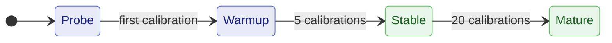

# DDP Internals and Expert APIs

The cadence balancer has two control layers.

### Phase lifecycle

The balancer earns trust over time. Phases are monotonic (a phase never
regresses) and `>=`-comparable, so gating logic reads as "at least Stable".
Transitions are driven purely by how many calibrations have landed:



Two consumers read the phase, and they move in **opposite directions** as
confidence accumulates: ElChe progressively *unlocks* actions, while the
LR-aware meta-controller progressively *softens* its corrections and lowers
the evidence bar for acting on them.

| Phase | ElChe unlocks | Meta-controller nudge | Sustain `K` |
|---|---|---|---|
| `Probe` | Equal split; gather first timings. No calibration-driven action. | `0.3` (defensive; excluded at the call site) | 5 |
| `Warmup` | Anchor pin **held** - the initial pick stands. Window growth allowed from the second calibration, but a proposal must clear the overhead target by a margin. | `0.3` | 5 |
| `Stable` | Anchor **election** opens. Auto-tune fires at the real overhead target. Hysteresis on anchor changes. `relax_up` activates. | `0.5` | 3 |
| `Mature` | Same gates as Stable. | `0.7` | 2 |

Reading the last two columns: the nudge factor is a multiplicative anchor
shrink, so a **lower** number is a **harsher** correction - an untrusted phase
cuts hard (`0.3`) while a trusted one eases off (`0.7`). Sustain `K` is how
many consecutive divergence verdicts must agree before the pattern fires, so a
cautious phase demands more evidence (5) and a confident one reacts sooner (2).
`Mature` therefore is **not** behaviourally identical to `Stable`: it gates the
same ElChe actions, but it is the gentlest and fastest-reacting phase in the
meta-controller.

Why the anchor pin is held through `Warmup`: cold-start noise on the
larger or newer GPU can transiently make it look slow, and an election
running on that noise would flip the anchor away from the genuinely slow
rank. Growth is deliberately *not* held to the same gate - its signal is
dominated by the measured reduce wall, and cold-start skew inflates the
anchor's marginal cost, which **under**-proposes. That is the safe error
direction, so growth opens earlier.

### Anchor auto-tune

After each averaging round, `(overhead = sync_ms / (wall_ms - sync_ms))`
is the fraction of compute time spent in AllReduce.

- `overhead > target`: increase anchor by `ceil(anchor * overhead /
  target)` (proportional to excess - overhead is wasted GPU time).
- `overhead < target/2`: decrease anchor by 1 (gradual - lower anchor
  means fresher gradients).
- 5% dead-zone: anchor changes smaller than 5% of current are no-ops.

Anchor is clamped to `[min_anchor, max_anchor]`.

### Weighted gradient averaging

When batch counts are unequal, each replica's gradient is scaled by its
batch contribution before AllReduce Sum:

```
weight[rank]  = count[rank] / sum(counts)
grad_avg      = sum(weight[rank] * grad[rank])
```

Mathematically correct mean gradient regardless of per-device batch
counts.

Weight consensus follows the same principle at every sync (shaped by
`gamma`), on both backends. Non-learnable f32 buffers - BatchNorm
running stats and the like - ride the same sync but are averaged with
*equal* weight among the ranks that stepped in the window, never
`gamma`-weighted: running statistics must not inherit a fast rank's
dominance. Non-f32 buffers (deterministic integer counters, updated
identically on every rank) keep their local value.

### LR-aware meta-controller

`ElCheConfig::meta_controller(true)` enables an observer above ElChe
that watches LR trajectory + anchor trend + convergence-guard verdicts
in a rolling window. Reactively nudges the anchor down on sharp LR
drops or sustained divergence, and reports `is_settled()` once the
metric stops moving. On by default (opt out with
`.meta_controller(false)` for unconditioned-trajectory
instrumentation).

### EASGD elastic averaging

`ElCheConfig::easgd_alpha(α)` tunes the EASGD-style blending on the
`CpuAsync` path (on by default there at α=0.5):

```
local_t1   = (1 - α) * local_t0  +  α * center_t0
center_t1  = (1 - α) * center_t0 +  α * mean(local_t0)
```

Smooths divergence in long async runs. Honored on `CpuAsync` only;
ignored elsewhere. Note that blending keeps replicas on a deliberate
elastic spread around the consensus - the divergence guard's default
threshold accounts for it (see the `convergence_guard` knob above).

---

## Outer optimizer - SlowMo / DiLoCo

By default the cluster averages replicas with a plain work-weighted mean.
An **outer optimizer** adds a second optimization loop applied to the
work-weighted consensus *between* the reduce and the broadcast, on top of
the inner per-rank optimizers - the hook for communication-efficient
methods like SlowMo and DiLoCo. Configure it on the builder or
`TrainerConfig`:

```rust
use flodl::{NesterovMomentum, SlowMomentum, OuterAvg};

Trainer::builder(model_factory, optim_factory, train_fn)
    .dataset(dataset).batch_size(32).num_epochs(20)
    .elche(ElCheConfig::nccl_cadence())
    .outer_optimizer(|| Box::new(NesterovMomentum::new(0.7, 0.9)))  // DiLoCo
    .run()?;
```

| Variant | Behavior |
|---|---|
| `OuterAvg` (default) | Stateless identity passthrough - reproduces plain work-weighted averaging. No momentum, no artifact. |
| `SlowMomentum::new(lr, mu)` | SlowMo heavy-ball momentum on the pseudo-gradient; continuous inner loop. |
| `NesterovMomentum::new(lr, mu)` | DiLoCo-style Nesterov outer step; `resets_inner()` makes each worker reset its inner optimizer per outer round. |

- Built once per site: controller-side on the CPU backend, per-rank
  replicated lock-step on NCCL.
- `ElCheConfig::gamma(γ)` sets the consensus allocation-weighting exponent
  (default `1.0` = pre-gamma behavior).
- **Checkpointing**: momentum-bearing variants persist their slow momentum
  to a `<stem>.outer.fdl` sidecar alongside the model / optim / meta
  bundle, and reload it on resume so the outer trajectory is faithful.
  `OuterAvg` writes no sidecar.
- `ddp-bench`: `--outer-optimizer none|slowmo|diloco` plus `--outer-lr` /
  `--outer-mu` / `--gamma`.

## A/B testing modes

Five modes via `ElCheMode`. One line per mode:

```rust
// Build the base
let base = || Trainer::builder(model_factory.clone(), optim_factory.clone(), train_step)
    .dataset(dataset.clone())
    .batch_size(64)
    .num_epochs(5)            // just enough to see the trend
    .max_grad_norm(5.0);

let a = base().elche(ElCheConfig::cpu_async()).run()?.join()?;
let b = base().elche(ElCheConfig::nccl_cadence()).run()?.join()?;   // also ElCheConfig::default()
let c = base().elche(ElCheConfig::nccl_sync()).run()?.join()?;
```

Same model, same data, same seed; change one line.

| Suggested order | Rationale |
|---|---|
| 1. **`NcclCadence`** (default) | Recommended NCCL default. ElChe tunes the anchor so the slow device sets the pace, fast devices process proportionally more batches per averaging window. Anchor-based cadence with AllReduce at every boundary. |
| 2. **`CpuCadence`** | Fastest wall time in the published benchmark (512s vs 548s nccl-cadence on the 200-epoch flagship). Same cadence semantics without NCCL - the natural pick when peer access is unavailable or the rig spans hosts without fast links. Cost: a decent CPU on the controller host. |
| 3. **`CpuAsync` (+ DiLoCo)** | Genuine async: barrier-free application, averaging decoupled from the GPU pipeline, EASGD blending on by default. A few percent of wall time behind `CpuCadence` on fixed-epoch runs (the divergence guard grows its window more cautiously early on; amortizes at length) - in exchange for jitter tolerance and the strongest convergence behavior: with the DiLoCo outer optimizer it posted the best eval of all modes in the published benchmark (0.9236 vs 0.9210 solo), holding the generalization peak that solo training overfits past. |
| 4. `NcclSync` | Tightest-cadence baseline. Tells you whether near-per-step synchronization helps for your specific model. Equal data split like vanilla DDP; the reduce fires per slow-rank step, not per batch (see the "What sync means" note above) - degenerates to vanilla DDP on homogeneous rigs. |

Compare on: `loss at epoch N`, `wall time per epoch`, and `loss per
wall-second` - that last metric is usually the decider. The `ddp-bench`
suite drives every mode through the same harness; see
[the benchmark report](../ddp-benchmark.md) for the published numbers and
[`ddp-bench`](https://github.com/flodl-labs/flodl/tree/main/ddp-bench)
for the canonical worked example.

---

## Manual control - `Ddp::wrap`

For complex training patterns (GAN, RL, progressive growing) where you
need explicit per-step replica control, `Ddp::wrap` is the low-level
per-rank gradient-sync primitive. It is **not** the production multi-GPU
entry (that auto-promotes to process-per-rank); it wraps **one** replica
per rank against a shared rendezvous, and it is also what each cluster
rank uses internally. One rank per thread (single-process testing) or per
process; the world size comes from the rendezvous.

```rust
// Per rank: wrap this rank's replica. `global_rank` in [0, world_size),
// `rdv` a TcpRendezvous all ranks share.
let ddp = Ddp::wrap(&model, device, global_rank, &rdv)?;

ddp.sync_params()?;
// ... forward + backward ...
ddp.all_reduce_gradients()?;                            // unweighted
ddp.weighted_all_reduce_gradients(&batch_counts)?;      // ElChe-style
ddp.sync_buffers()?;
```

For all other use cases reach for `Trainer::run` or
`Trainer::builder().run()` - the process-based path is the production
one, with per-rank logs, rank death survival, and cluster fan-out.

---

## Data pipeline

Each rank constructs its own `DataLoader` against its own dataset
shard. The coordinator computes proportional sharding from
`ElCheConfig::partition_ratios` (or auto-balances by throughput) and
pushes the epoch plan to each worker. The DataLoader is otherwise
unaware that a cluster exists.

### Modes

| Mode | Description | When |
|---|---|---|
| **Resident** | Dataset loaded into GPU VRAM once. Per-epoch reshuffling via GPU-side `index_select`. | Dataset fits in ~75% of free VRAM. |
| **Streaming** | Persistent background worker thread, async H2D on a dedicated CUDA stream. Prefetch depth auto-adapts. | Dataset too large for VRAM. |

A 16 GB rank can go resident while a 6 GB rank on the same training
run uses streaming - each rank picks its own mode independently. No
lowest-common-denominator constraint.

### VRAM-aware prefetch

In streaming mode the prefetch depth is computed automatically:

```
depth = clamp(free_vram * headroom / batch_bytes, 2, max_depth)
```

- **Bootstrap**: 4 batches at construction time (model not yet loaded).
- **epoch(0)**: re-probes VRAM after model allocation; fills to cap.
- **epoch(N)**: re-probes each epoch, adapts to fragmentation.
- **`vram_max_usage(0.90)`**: use up to 90% of total VRAM (default).
- **`.prefetch(n)`**: manual override, disables automatic adaptation.
- **OOM fallback**: if resident mode fails with CUDA OOM, automatically
  retries with streaming mode.

See [Data Loading](../tutorials/13-data-loading.md) for the
full `DataLoader` reference.

---

## NCCL primitives

For the rare cases where you need to drop below `Trainer`. The
init-on-main + `split()` pattern is enforced everywhere
(`ncclCommInitRank` from worker threads corrupts CUDA context on
heterogeneous GPUs).

### `NcclComms`

Group communicator for multi-GPU collectives. RAII: destroyed on drop.

```rust
let comms = NcclComms::new(&[Device::CUDA(0), Device::CUDA(1)])?;
comms.all_reduce(&[&tensor_a, &tensor_b], ReduceOp::Avg)?;
comms.broadcast(&[&params_0, &params_1], 0)?;

// Overlapped variants
comms.all_reduce_on_streams(&tensors, ReduceOp::Avg, &streams)?;
comms.broadcast_on_streams(&tensors, 0, &streams)?;
```

### `NcclComms::split()` → `Vec<NcclRankComm>`

```rust
let group = NcclComms::new(&devices)?;        // main thread
let rank_comms: Vec<NcclRankComm> = group.split()?;
// Move rank_comms[i] into thread i; NcclRankComm is Send.
```

Never call `NcclRankComm::init_rank()` from worker threads on
heterogeneous hardware - use `split()`.

### `NcclAbortHandle`

```rust
let handle = comm.abort_handle();
handle.abort()?;                              // unblocks stuck collectives
```

After abort, the communicator's `Drop` is a no-op.

### `ReduceOp`

| Variant | Op |
|---|---|
| `Sum` | Element-wise sum |
| `Prod` | Element-wise product |
| `Max` / `Min` | Element-wise max/min |
| `Avg` | Element-wise average |

---

## GPU synchronization primitives

### `GpuEvent`

```rust
let event = GpuEvent::new(GpuEventFlags::Default)?;
event.record()?;                  // on current stream
event.record_on(&stream)?;        // on specific stream
event.synchronize()?;             // CPU blocks until complete
let done = event.is_complete()?;  // non-blocking poll

let ms = GpuEvent::elapsed_time(&start, &end)?;
```

Use `GpuEventFlags::DisableTiming` for pure synchronization (lower
overhead; `elapsed_time` will error).

### `GpuStream`

```rust
let stream = GpuStream::new(Device::CUDA(0), false)?;  // normal priority
stream.synchronize()?;
stream.wait_event(&event)?;        // stream waits for event
```

### `StreamGuard`

```rust
{
    let _guard = StreamGuard::new(&stream);
    tensor.copy_(&source, true)?;  // non-blocking copy on `stream`
}
// Default stream restored on drop.
```

<!-- nav: generated by site/build_guide.py — do not edit below -->

---

Previous: [Multi-Host Cluster Guide](02-cluster-guide.md) | Next: [Troubleshooting](04-troubleshooting.md)
