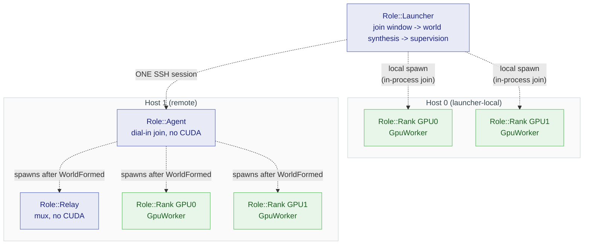
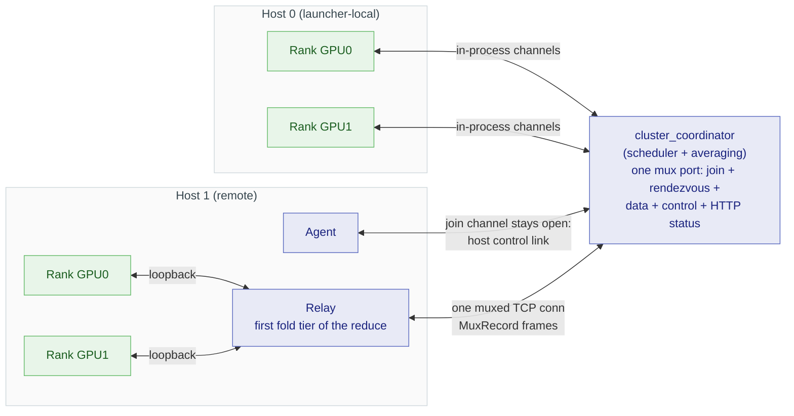
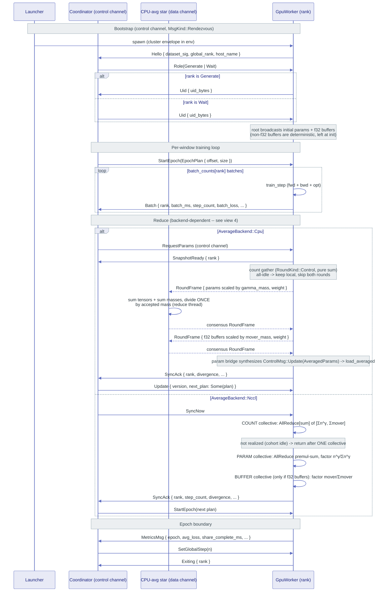
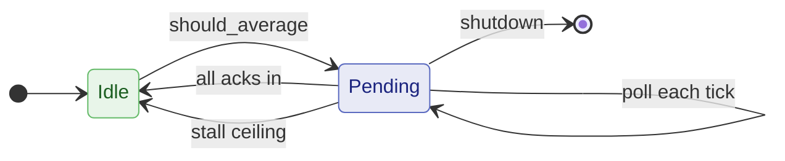
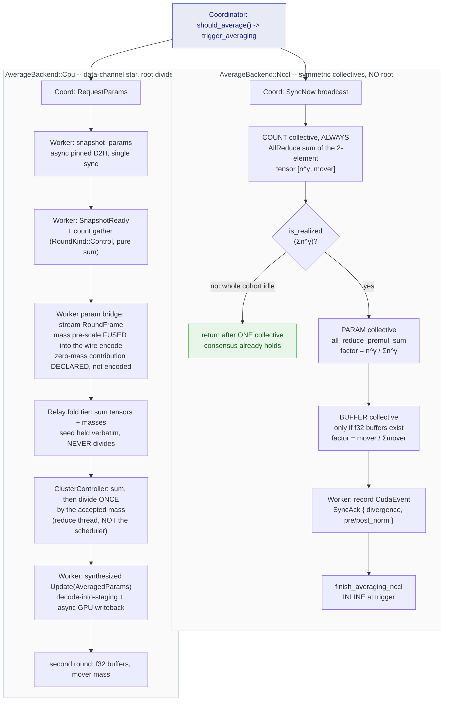
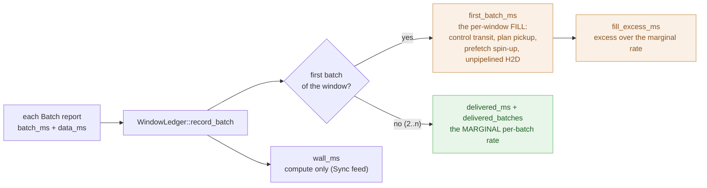
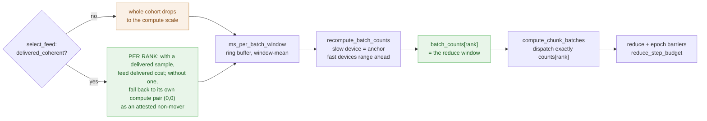
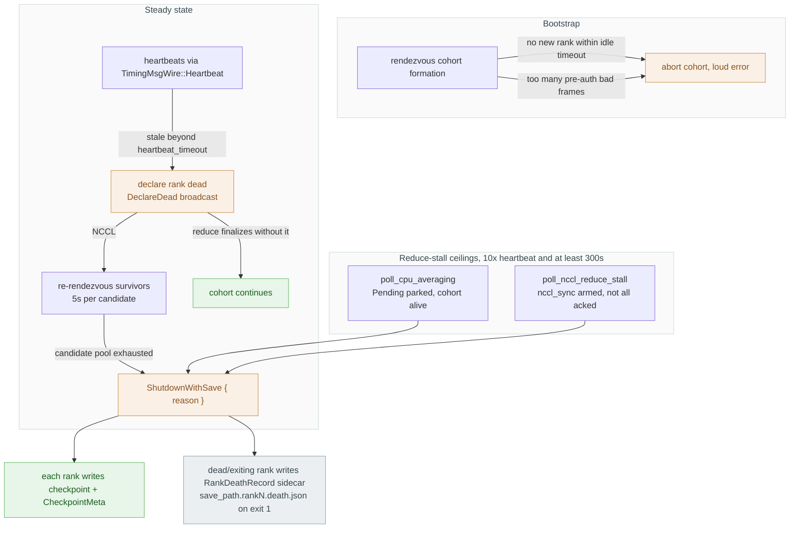

# Distributed architecture

> **Internals, not a tutorial.** This page describes how flodl's distributed
> engine is built, for contributors and for anyone debugging a cluster run. You
> do not need any of it to train on multiple GPUs - start from
> [Multi-GPU Training](../tutorials/11-multi-gpu.md) for that, and the
> [DDP reference](../ddp/01-reference.md) for the configuration surface. Names here are
> internal and change without notice.

This document maps the **entire distributed pattern** - the data, the
communication, and the logic that move parameters between heterogeneous GPUs
and hosts during DDP training.

The orchestration is not one flow but **three orthogonal flows over a shared
role topology**. A single mega-chart would be unreadable, so each flow gets its
own view, in the diagram type that fits it:

| View | What it answers | Diagram |
|---|---|---|
| [1. Role topology](#1-role-topology) | Who runs where? Process vs thread boundaries. | flowchart |
| [2. Training lifecycle](#2-training-lifecycle) | What happens end to end, in order? | sequence |
| [3. Coordinator state machine](#3-coordinator-state-machine) | How does CPU averaging stay non-blocking? | state |
| [4. Reduce backends](#4-reduce-backends) | NCCL in-place collective vs CPU data-channel star - the key divergence. | flowchart |
| [5. ElChe scheduling](#5-elche-scheduling-data-flow) | How does work get allocated per rank? | flowchart |
| [6. Message catalog](#6-message-catalog) | Which message carries what, between whom? | tables |
| [7. Failure handling](#7-failure-handling) | What stops a wedge or a dead rank from hanging the run? | flowchart |

> Every diagram cites its source file(s). When the code moves, re-sync the
> diagram from the cited enum/struct - the variant names below are pulled
> verbatim so drift is greppable.

The user-facing strategy is a single **`ElCheMode`** (`nccl_sync`,
`nccl_cadence`, `cpu_sync`, `cpu_cadence`, `cpu_async`) on
[`ElCheConfig`]. Internally each mode decomposes into the two axes that
parameterize everything below:

- **`ApplyPolicy`** - the *pacing* clock: `Sync` (K=1), `Cadence` (K=N via
  ElChe), `Async` (Cadence + bounded lookahead). `Sync`/`Cadence` are
  *barrier-paced* (a rank is held at its window until the reduce resets it);
  `Async` opts out.
- **`AverageBackend`** - the *transport*: `Nccl` (in-place GPU AllReduce) or
  `Cpu` (snapshot round-trip through the coordinator). **Orthogonal to
  pacing** - five of the six combinations are valid modes (`Async + Nccl`
  was dropped and hard-errors at `.run()`), which is what makes NCCL-vs-CPU
  A/B testing possible.

> Source: `flodl/src/distributed/config.rs` (`ElCheMode`, `ElCheMode::split`),
> `flodl/src/distributed/ddp_run/mod.rs` (`ApplyPolicy`, `AverageBackend`).

[`ElCheConfig`]: https://docs.rs/flodl/latest/flodl/distributed/struct.ElCheConfig.html

### Realized work: the mass semantics both backends share

Every reduce in this document is **work-weighted, not a plain average**, and both
backends share one vocabulary for it. A *mass* is the scalar realized-work weight
riding a contribution. The algebra has three moves and only three:

1. **Pre-scale at the source.** The contributing unit scales its tensors by its
   mass. On the CPU wire the mass travels atomically with them in the same frame;
   on NCCL it is fused into the collective as a premultiply factor.
2. **Sum through folds.** Scaled tensors and masses sum element-wise through any
   number of fold tiers (per-host relay today). Summation is associative, so fold
   depth never changes the result - no averaging-of-averages. **A fold tier that
   divided would break the law below; only the root divides.**
3. **Divide once**, by the summed mass of *exactly the contributions accepted into
   that round*.

The load-bearing law: **the sum and its divisor come from the same accepted
contributions.** Work that was never accepted (dead rank, lost frame) enters
neither, so they cannot disagree, whatever the cohort did between rounds.

Mass is **policy-supplied**, and a sync runs **two rounds with different
policies**:

| round | mass | meaning |
|---|---|---|
| params | `gamma_mass(n, γ)` = `n^γ` over optimizer steps since the last sync | `γ = 1.0` (default) plain work-weighting; `γ = 0.0` unweighted average over movers; `γ = -1.0` per-step-equal |
| buffers | `mover_mass(n)` = 0/1 indicator | moved ranks equal-weighted, idle excluded - never γ-weighted |

Two rules are part of the vocabulary rather than implementation details:

- **The idle guard.** A unit that did no work has zero mass for *any* policy
  parameter. Left to raw `powf`, IEEE gives `0^0 = 1` (an idle unit voting at full
  weight when `γ = 0`) and `0^{γ<0} = ∞` (poisoning the cohort mass into NaN).
  Both backends import `gamma_mass` so the guard cannot drift between them.
- **The zero-mass round rule** (`is_realized`). A round whose accepted mass is zero
  realized nothing; its summed tensors are meaningless zeros and **receivers keep
  their local state**.

Where the divide happens is the one thing the backends do *not* share - see
[view 4](#4-reduce-backends).

> Source: `flodl/src/distributed/realized_work.rs` (`gamma_mass`, `mover_mass`,
> `is_realized`), `controller/round_frame.rs` (`RoundFrame::weight`, `RoundKind`).

---

## 1. Role topology

A run is a tree of processes formed by **dial-in membership**: the
**launcher** (no CUDA) opens a join window on the controller port; one
**agent** per worker host (no CUDA) dials in, joins, and — once the world
forms — spawns its host's children: one **relay** multiplexing the host's
ranks onto a single connection to the controller, plus one **rank** process
per GPU. Ranks are assigned in admission order; `world_size` freezes at
window close. Fan-out is sugar over this protocol (the launcher starts the
agents over SSH, and its defaults close the window the instant every
configured rank is in); a self-deployed agent with nothing but the
controller address joins the same way. The **coordinator** is the scheduler
the ranks talk to.

**Who closes the window is configurable.** `StartMode::Auto` (the default) is
the clock-driven case described above. Under `Manual` only the operator closes
it - `target_ranks` is refused at validation and window expiry *holds* rather
than forming - and `Hybrid` allows both. Quorum met with the door still open
and the operator holding the close is its own phase, `ClusterPhase::Staging`,
between `Waiting` and `Forming`. The join window's own protocol, message
sequence and phase machine are documented for operators in the
[DDP reference](../ddp/02-cluster-guide.md#dial-in-membership-the-join-window); this view is
only concerned with the process tree it produces.

Note the asymmetry the tree makes obvious: launcher-local ranks are **direct**
children of the launcher, while a remote host's children are spawned one hop
further out, by its agent, and only after `WorldFormed`.

Spawning is only half of it. The **channel** topology over those same processes
is a different shape, and it is the one the reduce travels:

The agent's join connection stays open past formation as the **host control
link**: the agent reports per-rank exits up it (`RankExited`, feeding the
launcher's elastic supervision), the launcher sends `Abort` down it, and EOF
means the whole host died. Launcher-local hosts run the same join protocol
on a thread (dialing loopback), so their children stay direct launcher
children — same supervision, no SSH.

Local ranks (same host as the controller) talk over in-process channels;
remote ranks talk loopback to their host's relay, which carries the host's
traffic over one connection as `MuxRecord`s. On the control channel each
rank's frames cross untouched, tagged by rank; on the data channel the relay
is the first fold tier of the reduce — it sums its local ranks'
contributions (masses included) into one `HostFrame` per round and fans the
controller's single `Broadcast` consensus back out, so K local ranks cost 1×
the model bytes on the host uplink per direction instead of K×.

The mux port also answers plain HTTP GETs with the membership state as
`state.json` (`fdl status`) — live from before the window opens, read-only,
reachability = the port's bind scope.

> Source: `launcher/mod.rs` (`Role`, `dispatch()`), `launcher/agent.rs`
> (`AgentSpec`, `run_agent`), `membership.rs` (`MembershipLedger`,
> `run_join_window`, `StartMode`, `ClusterPhase`), `status.rs`
> (`serve_status`), `relay/agent.rs` (`ChannelKind`), `relay/mux.rs`
> (`MuxRecord`, `RelayControlMsg`).

---

## 2. Training lifecycle

End to end for one cluster run: bootstrap rendezvous, then the repeating
**dispatch -> train -> reduce -> average -> re-arm** window. Shown for the
`Cadence` pacing; the `Update.next_plan` atomic-dispatch fold (CPU path)
collapses the post-reduce control round-trip.

CPU averaging is a **data-channel star** (`ClusterController` /
`CpuReduceClient`): each rank ships its contribution as a `RoundFrame` carrying
the payloads *and* its mass, the controller sums both and divides once by the
accepted mass, and the consensus frame returns on the same channel - the
scheduler's `Update { version, next_plan }` carries only the next schedule, never
the weights. The scheduler stays free throughout (see view 3).

Two rounds run per sync, params then buffers, with the mass policies from
[Realized work](#realized-work-the-mass-semantics-both-backends-share). On the CPU
path only the **f32 subset** of buffers rides the reduce: the transport is
f32-only, and non-f32 buffers (integer counters and the like) are deterministic
values updated identically on every rank, so passing the local value through is
correct rather than a dropped sync. The merge back is positional. The weight-space
divergence triple is computed *between* the two rounds, so a buffer-round error
cannot mask the params triple.

The `share_complete_ms` in `MetricsMsg` (not `epoch_ms`) is the honest
balancer denominator; ElChe's per-batch signal is the coordinator-measured
**delivered** cost, not `batch_ms` (compute only) - see view 5.

> Source: `wire.rs` (`RendezvousMsgWire`), `ddp_run/mod.rs` (`ControlMsg`,
> `TimingMsg`, `MetricsMsg`), `cluster_coordinator/epoch_dispatch.rs`,
> `cluster_coordinator/averaging.rs`, `controller.rs` (`ClusterController`),
> `cpu_reduce.rs` (`CpuReduceClient`), `cluster_worker.rs` (param bridge),
> `ddp_run/worker/sync.rs`, `ddp_run/orchestrator/rank_entry.rs` (initial broadcast).

---

## 3. Coordinator state machine

CPU averaging must **never block the scheduler** - the coordinator keeps
servicing `check_throttle` and timing reports while a reduce is in flight. The
production cluster scheduler does this with a **2-state** machine: it broadcasts
`RequestParams`, parks in `Pending`, and the actual averaging happens
out-of-band on the data-channel star (view 2). `poll_cpu_averaging` (driven
every `tick`) finalizes one tick later, once every alive rank's bridge `SyncAck`
has landed - no background-thread join, the scheduler never owns the tensors.

What each transition actually does - kept out of the diagram because state-machine
edge labels do not wrap and collide at this length:

| transition | mechanism |
|---|---|
| `Idle -> Pending` | `should_average()` fires; `trigger_averaging` broadcasts `RequestParams` and snapshots `last_step_count` into the cycle's step slot |
| `Pending -> Pending` | `poll_cpu_averaging` runs every `tick` while the scheduler keeps servicing `check_throttle` and timing reports |
| `Pending -> Idle` (normal) | every alive rank's bridge `SyncAck` has landed; `finish_averaging_cpu` finalizes and re-arms |
| `Pending -> Idle` (stall) | parked past the ceiling (10x heartbeat, at least 300s) - `ShutdownWithSave(ReduceStall)`, see [view 7](#7-failure-handling) |

**Invariants that keep this correct:**

- **subtract-not-zero**: `last_step_count` is snapshotted into `nccl_sync_step`
  at trigger time and `steps_since_avg` is reset inside the finalize, so timing
  is attributed to the right window even though work continues during the cycle.
- **single-consumer reuse**: the worker's `ParamSnapshot` shares storage with
  persistent pinned buffers; the `Idle -> Pending -> Idle` cycle issues exactly
  one `RequestParams` per cycle and the worker re-snapshots only after the
  `Update` round-trips back, so a snapshot is never overwritten while in flight.
- **finalize on the divergence evidence, not the raw ack** - the CPU bridge
  `SyncAck` is the only signal the round-trip finished, and its `step_count` is
  *not* meaningful for the cadence clock (the inner worker does not bump
  `local_step` on `RequestParams`). Folding it into the coordinator's
  `last_step_count` would poison the next cycle's step snapshot and wedge the
  NCCL re-arm gate - a bug that happened once as an unguarded shared handler.
  That knowledge now lives in `AvgCycleState::sync_ack_step_meaningful` rather
  than as a backend `if` inside the event loop.

> Source: `cluster_coordinator/cycle_state.rs` (`AvgCycleState`, `CycleMachine`,
> `CpuAvgPhase`), `cluster_coordinator/averaging.rs` (`trigger_averaging`),
> `cluster_coordinator/cycle_cpu.rs` (`poll_cpu_averaging`,
> `finish_averaging_cpu`).
>
> The two-state phase is `CpuAvgPhase { Idle, Pending }`, held inside
> `CycleMachine::Cpu { phase, pending_since, throttled }`. Its sibling
> `CycleMachine::NcclInline` has no interior phase at all - the collective paces
> the cycle, so `finish_averaging_nccl` runs inline at trigger. Shared per-cycle
> evidence (trigger instant, step snapshot, acks, divergence/norm triple,
> measured latencies) lives on `AvgCycleState` alongside the machine.
>
> The single-host threaded path (`ddp_run/coordinator/{mod,cpu_avg}.rs`) still
> ships a 3-state `Idle -> Collecting -> Computing` machine that gathers
> `ParamSnapshot`s and averages on a background thread; it is the retiring /
> test path, not what cluster runs use.

---

## 4. Reduce backends

The single most important divergence in the codebase: **NCCL reduce is an
in-place GPU collective; CPU reduce is a data-channel star round-trip while the
scheduler stays free.** They are gated on `AverageBackend`, independent of
pacing.

Key asymmetries (each a hard-won fix):

- **Where the divide happens - the deepest difference.** NCCL has **no root**:
  the count collective gives every rank the same `Σn^γ`, so each rank
  pre-normalizes locally by `n^γ / Σn^γ` and the premultiply is fused *inside*
  the collective, leaving the output needing **no post-divide** at all (the old
  scale-then-AllReduce-then-divide bookend kernels are gone). The CPU path
  instead ships the mass with the payload and the **controller divides once** by
  the accepted mass. Same algebra, opposite placement.
- **Collective count is variable, and that is a hazard.** A NCCL sync issues up
  to **three** collectives: COUNT always, PARAM unless the cohort is idle, BUFFER
  only when the model has f32 buffers. A cohort desync therefore shows up as
  ranks issuing a *different number* of collectives for the same `seq` - one rank
  takes the idle skip and does one while its peers do two, leaving them waiting
  on a phantom collective (NCCL busy-waits at 100% CPU with no peers). The
  `-vvv` ENTER/EXIT logging per collective exists to pin exactly which one a
  stuck rank parked in.
- **Memory**: NCCL is zero-extra (in-place); CPU is `O(world_size *
  model_size)` host RAM at the star controller.
- **Blocking**: NCCL sync at a collective barrier (fast GPU waits); CPU never
  blocks the scheduler - it parks in `Pending` (view 3) while the star reduces.
- **Timing feed**: CPU+Cadence/Async and NCCL+Cadence ride the transport-aware
  delivered feed (view 5); `Sync` on either backend stays on the compute-only
  `wall_ms` feed. The delivered cost is accumulated **continuously from each
  `Batch`**, so it is present at sync by construction - there is no
  completion-frame race, and no drain step, for either backend.
- **Snapshot readout** (CPU): `snapshot_params` does batched **async** D2H into
  reused **pinned** host buffers, then a single `synchronize()` per window -
  not per-param synchronous copies. Under `bf16_wire` the D2H casts on the GPU
  and ships half the bytes; every accumulator still sums in f32, bf16 existing
  only at the wire and buffer boundary.

> Source: `ddp_run/mod.rs` (`AverageBackend`),
> `ddp_run/worker/sync.rs` (`weighted_allreduce_nccl`, `snapshot_params`,
> `load_averaged`), `cluster_coordinator/averaging.rs` (`trigger_averaging`),
> `cluster_coordinator/cycle_nccl.rs` (`finish_averaging_nccl`),
> `controller/mod.rs` (`ClusterController`), `controller/round_frame.rs`
> (`RoundFrame`, `RoundKind`, sum/divide-once), `cpu_reduce.rs`
> (`CpuReduceClient::all_reduce_scaled`, `stream_zeros_frame`),
> `cluster_worker/param_bridge.rs` (`sumcount_reduce`).

---

## 5. ElChe scheduling data flow

ElChe turns per-rank timing into a `batch_counts[rank]` schedule vector (the
reduce window). N GPUs are treated as **one logical GPU partitioned into
heterogeneous per-rank step counts**. The window is capped at one epoch so
syncs never collapse below 1/epoch.

Then the feed picks a scale and the scale drives the schedule:

Four things constrain the anchor `recompute_batch_counts` settles on. They are
listed rather than drawn: as diagram nodes they each needed an edge back into the
same box, which stretched the chart vertically and buried the main path.

| constraint | effect |
|---|---|
| `overhead_target` | keeps the reduce under ~10% of wall time |
| `convergence_guard` | `SuppressGrowth` / `NudgeDown` when convergence degrades |
| `set_max_total_batches` | caps the window at one epoch, so syncs never collapse below 1/epoch |
| `Phase` (`Probe -> Warmup -> Stable -> Mature`) | hysteresis: how readily the anchor is allowed to move at all |

The delivered-cost feed is what closed the cpu-cadence idle prize: ranks pay
compute + data + transport, but ElChe was scheduling on compute-only timing, so
it over-allocated the fast RTX and left it idle at the barrier. Scheduling on
delivered cost instead made cpu-cadence track nccl-cadence, and NCCL+Cadence
later joined the same feed.

Two refinements matter, because both are easy to get backwards:

- **The feed is marginal, not total.** The window's first batch is deliberately
  *excluded* from the delivered accumulators, because it absorbs the fixed
  per-window fill (control transit, plan pickup, prefetch spin-up, the first
  unpipelined H2D). Batches `2..n` form the marginal rate ElChe schedules on, so
  a fixed cost that does not scale with allocation cannot pollute the per-batch
  cost that does. The first batch's excess over that rate is kept separately as
  `fill_excess_ms`.
- **Fallback is per rank, gated on coherence.** `select_feed` first asks whether
  the window is `delivered_coherent`; if not, the *whole cohort* drops to the
  compute scale for that window, because mixing the two scales would invert
  ElChe's relative allocation. When it *is* coherent the selection is per rank:
  a rank holding a delivered sample feeds delivered cost, and a rank without one
  is a non-mover by the caller's attestation and contributes `(0, 0)` on either
  scale.

The ledger is **advisory scheduling state**: it drives *when* windows fire and
*how* work is allocated. It is deliberately not the reduce's divisor - that is the
mass computed rank-side at snapshot time and carried with the contribution
([Realized work](#realized-work-the-mass-semantics-both-backends-share)). A rank
the coordinator believes did `n` steps may realize a different count at its
snapshot; the reduce is exact either way.

> Source: `el_che.rs` (`ElChe`, `Phase`, `recompute_batch_counts`,
> `WindowReport::select_feed`),
> `cluster_coordinator/window_ledger.rs` (`WindowLedger::record_batch`,
> `fill_excess_ms`), `cluster_coordinator/epoch_dispatch.rs`
> (`compute_chunk_batches`, `take_next_chunk_plan`).

---

## 6. Message catalog

Two communication layers. **In-process channels** carry Rust types (including
`Tensor` handles) between coordinator and local worker threads. **Wire frames**
strip tensor handles (data travels paired on a data channel) and are
HMAC-signed with the session salt for cross-host transport.

### Wire frames (cross-host)

Every frame is tagged with a `MsgKind` and carried in an HMAC-signed
`ControlFrame`.

| `MsgKind` | Direction | Payload | Carries |
|---|---|---|---|
| `Control` | coord -> worker | `ControlMsgWire` | RequestParams / Update{version,next_plan} / SyncNow / StartEpoch / DeclareDead / ShutdownWithSave{reason} / ... |
| `Timing` | worker -> coord | `TimingMsgWire` | Batch / SyncAck / SnapshotReady / Heartbeat / LrUpdate / Exiting / EvalResult |
| `Metrics` | worker -> coord | `MetricsMsgWire` | per-epoch avg_loss, share_complete_ms, samples |
| `ParamSnapshotMeta` | - | *(orphan / reserved)* | `ParamSnapshotMetaWire` deleted; tag kept for byte-layout stability, no-op on receipt |
| `Heartbeat` | - | *(orphan / reserved)* | `HeartbeatWire` deleted; live liveness rides `TimingMsgWire::Heartbeat` on the `Timing` row |
| `Rendezvous` | both | `RendezvousMsgWire` | Hello / Role / Uid bootstrap |
| `Join` | agent <-> controller | `JoinMsgWire` | Hello / Accept / Reject / WorldFormed / RankExited / Abort — dial-in membership. Pre-admission frames are keyed by trust mode (pre-shared salt, or the zero key under open admission); post-admission frames always carry the session salt. |

> Source: `wire.rs` (`MsgKind`, `ControlMsgWire`, `TimingMsgWire`,
> `RendezvousMsgWire`, `JoinMsgWire`).

### In-process channels (local threads)

| Channel | Direction | Type | Notable variants |
|---|---|---|---|
| control | coord -> worker | `ControlMsg` | RequestParams, Update(AveragedParams), SyncNow, StartEpoch(EpochPlan), ExtendPartition, DeclareDead, NewNcclSession, RequestNewNcclId, Throttle, SetGlobalStep |
| timing | worker -> coord | `TimingMsg` | Batch, SyncAck, SnapshotReady, Heartbeat, LrUpdate, Exiting, EvalResult, CheckpointResult |
| metrics | worker -> coord | `MetricsMsg` | epoch, avg_loss, batches_processed, share_complete_ms, samples_processed |
| data | both | `RoundFrame` | tensor payloads (ParamSnapshot, AveragedParams) **plus the realized-work mass** in `weight`, atomic with the contribution it scales |

These are the inner `GpuWorker`'s channels, and they are present in **both**
paths - the cluster path wraps the same `GpuWorker` and the `cluster_worker`
bridge translates wire frames to and from them. So the cluster path's wire-side
`Update { version, next_plan }` (schedule only) and the in-process
`Update(AveragedParams)` are two different things: the param bridge synthesizes
the latter from the data-channel star round-trip (view 4), the worker never sees
the wire `Update` directly.

The wire types are otherwise 1:1 mirrors of the in-process types with tensor
handles removed; the relay's `MuxRecord` wraps these into one connection per
host (`Data` per-rank on the control channel; folded `HostFrame` up /
`Broadcast` consensus down on the data channel), and `RelayControlMsg`
(Hello / HelloAck / RankExit / DeclareDead) manages the relay-to-controller
leg.

> Source: `ddp_run/mod.rs` (`ControlMsg`, `TimingMsg`, `MetricsMsg`),
> `controller.rs` (`RoundFrame`), `relay/mux.rs` (`MuxRecord`,
> `RelayControlMsg`).

---

## 7. Failure handling

The orchestration is **nuke-ready**: every place a rank can vanish or a reduce
can wedge has a bounded ceiling that escalates to a *diagnosed checkpoint*
rather than a silent overnight hang. Nothing in views 2-3 can block forever.

The rendezvous deadline is `RENDEZVOUS_IDLE_TIMEOUT` (120s) with a
`MAX_REJECTED_CONNECTIONS` (1024) cap on pre-auth bad frames; NCCL
re-rendezvous gives each survivor candidate `NCCL_RENDEZVOUS_TIMEOUT_SECS`
(5s); the death sidecar is `<save_path>.rank<N>.death.json`.

`SaveReason` (the `reason` byte on `ShutdownWithSave`) records *why* the run
ended so a resume can reason about it:

| `SaveReason` | Trigger |
|---|---|
| `GracefulShutdown` | normal end / user stop |
| `MaxFailureExceeded` | too many ranks reaped to continue |
| `AllRanksLost` | the whole cohort died |
| `SingleSurvivor` | only one rank left - no peer to average with |
| `ReduceStall` | a reduce wedged past its ceiling (either backend) |
| `Checkpoint` | a periodic / requested checkpoint, not a run-ending event |

The two reduce-stall ceilings are twins: the CPU backend parks in
`CpuAvgState::Pending` so its backstop lives in `poll_cpu_averaging`; the NCCL
backend finishes inline so `poll_nccl_reduce_stall` watches the `nccl_sync_start`
arm instead. Both fire only with the cohort *alive but not acking* (a genuine
wedge), well past any real reduce. A rank that simply died is the heartbeat
detector's job, not the stall ceiling's.

> Source: `rendezvous.rs` (`RENDEZVOUS_IDLE_TIMEOUT`,
> `MAX_REJECTED_CONNECTIONS`), `cluster_coordinator/averaging.rs`
> (`poll_cpu_averaging`, `poll_nccl_reduce_stall`),
> `cluster_coordinator/dead_ranks.rs`, `cluster_coordinator/callback_roles.rs`
> (`ShutdownWithSave` broadcast), `checkpoint_meta.rs` (`SaveReason`,
> `RankDeathRecord`), `ddp_run/orchestrator/rank_entry.rs` (death sidecar).

<!-- nav: generated by site/build_guide.py — do not edit below -->

---

Previous: [Working in the Source Checkout](../cli/06-source-checkout.md) | Next: [Mac / Apple Silicon](../mac-apple-silicon.md)
