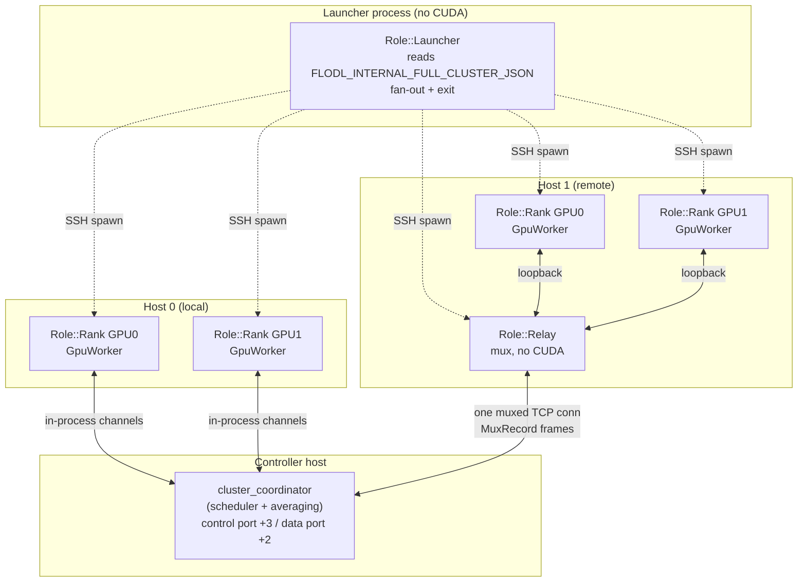
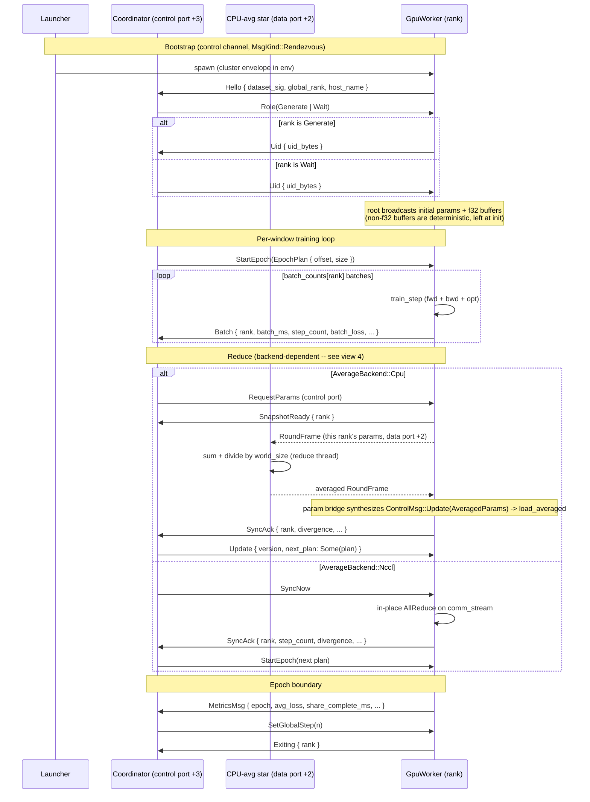
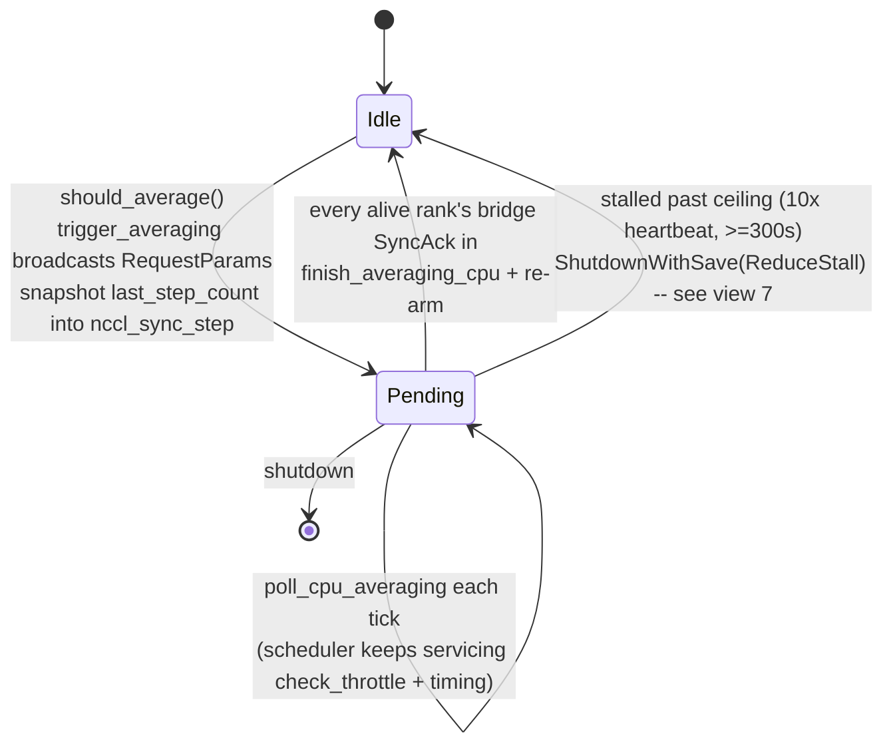
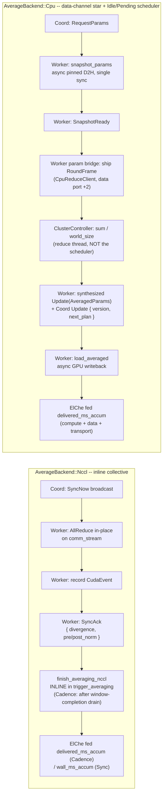
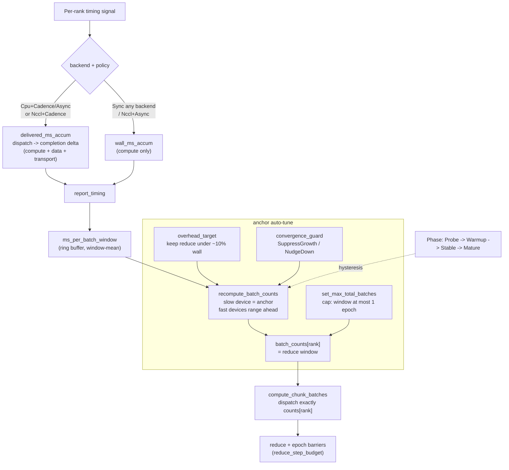
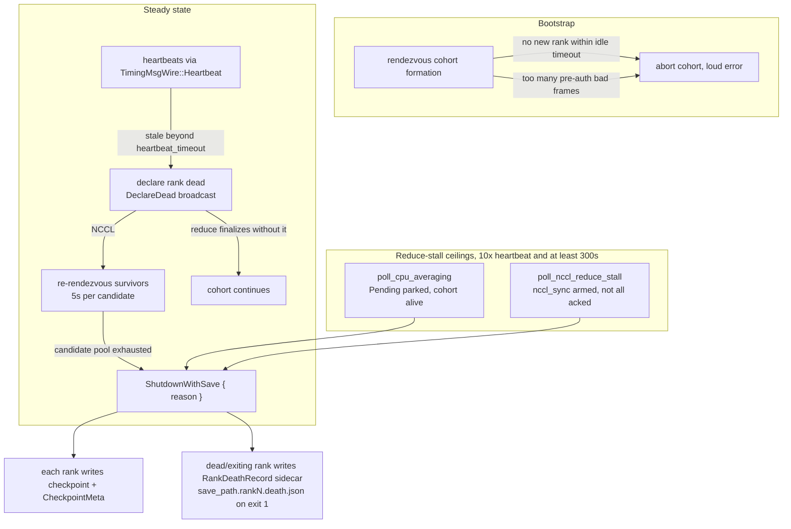

# Distributed architecture

This document maps the **entire distributed pattern** - the data, the
communication, and the logic that move parameters between heterogeneous GPUs
and hosts during DDP training.

The orchestration is not one flow but **three orthogonal flows over a shared
role topology**. A single mega-chart would be unreadable, so each flow gets its
own view, in the diagram type that fits it:

| View | What it answers | Diagram |
|---|---|---|
| [1. Role topology](#1-role-topology) | Who runs where? Process vs thread boundaries. | flowchart |
| [2. Training lifecycle](#2-training-lifecycle) | What happens end to end, in order? | sequence |
| [3. Coordinator state machine](#3-coordinator-state-machine) | How does CPU averaging stay non-blocking? | state |
| [4. Reduce backends](#4-reduce-backends) | NCCL in-place collective vs CPU data-channel star - the key divergence. | flowchart |
| [5. ElChe scheduling](#5-elche-scheduling-data-flow) | How does work get allocated per rank? | flowchart |
| [6. Message catalog](#6-message-catalog) | Which message carries what, between whom? | tables |
| [7. Failure handling](#7-failure-handling) | What stops a wedge or a dead rank from hanging the run? | flowchart |

> Every diagram cites its source file(s). When the code moves, re-sync the
> diagram from the cited enum/struct - the variant names below are pulled
> verbatim so drift is greppable.

The user-facing strategy is a single **`ElCheMode`** (`nccl_sync`,
`nccl_cadence`, `cpu_sync`, `cpu_cadence`, `cpu_async`) on
[`ElCheConfig`]. Internally each mode decomposes into the two axes that
parameterize everything below:

- **`ApplyPolicy`** - the *pacing* clock: `Sync` (K=1), `Cadence` (K=N via
  ElChe), `Async` (Cadence + bounded lookahead). `Sync`/`Cadence` are
  *barrier-paced* (a rank is held at its window until the reduce resets it);
  `Async` opts out.
- **`AverageBackend`** - the *transport*: `Nccl` (in-place GPU AllReduce) or
  `Cpu` (snapshot round-trip through the coordinator). **Orthogonal to
  pacing** - five of the six combinations are valid modes (`Async + Nccl`
  was dropped and hard-errors at `.run()`), which is what makes NCCL-vs-CPU
  A/B testing possible.

> Source: `flodl/src/distributed/config.rs` (`ElCheMode`, `ElCheMode::split`),
> `flodl/src/distributed/ddp_run/mod.rs` (`ApplyPolicy`, `AverageBackend`).

[`ElCheConfig`]: ../../flodl/src/distributed/config.rs

---

## 1. Role topology

A run is a tree of processes. The **launcher** never touches CUDA (it exits
after fan-out); each **rank** is its own process owning one GPU; one **relay**
per remote host multiplexes that host's ranks onto a single connection to the
controller. The **coordinator** is the scheduler the ranks talk to.

Local ranks (same host as the controller) talk over in-process channels;
remote ranks talk loopback to their host's relay, which carries every local
rank's frames over one connection as `MuxRecord` blobs tagged by rank.

> Source: `launcher/mod.rs` (`Role`, `dispatch()`), `relay/agent.rs`
> (`ChannelKind`), `relay/mux.rs` (`MuxRecord`, `RelayControlMsg`).

---

## 2. Training lifecycle

End to end for one cluster run: bootstrap rendezvous, then the repeating
**dispatch -> train -> reduce -> average -> re-arm** window. Shown for the
`Cadence` pacing; the `Update.next_plan` atomic-dispatch fold (CPU path)
collapses the post-reduce control round-trip.

CPU averaging is a **data-channel star** (`ClusterController` / `CpuReduceClient`
on data port +2): each rank ships its params as a `RoundFrame`, the controller
sums and divides by `world_size`, and the averaged frame returns on the same
channel - the scheduler's `Update { version, next_plan }` carries only the next
schedule, never the weights. The scheduler stays free throughout (see view 3).

The `share_complete_ms` in `MetricsMsg` (not `epoch_ms`) is the honest
balancer denominator; ElChe's per-batch signal is the coordinator-measured
**delivered** cost, not `batch_ms` (compute only) - see view 5.

> Source: `wire.rs` (`RendezvousMsgWire`), `ddp_run/mod.rs` (`ControlMsg`,
> `TimingMsg`, `MetricsMsg`), `cluster_coordinator/epoch_dispatch.rs`,
> `cluster_coordinator/averaging.rs`, `controller.rs` (`ClusterController`),
> `cpu_reduce.rs` (`CpuReduceClient`), `cluster_worker.rs` (param bridge),
> `ddp_run/worker/sync.rs`, `ddp_run/orchestrator/rank_entry.rs` (initial broadcast).

---

## 3. Coordinator state machine

CPU averaging must **never block the scheduler** - the coordinator keeps
servicing `check_throttle` and timing reports while a reduce is in flight. The
production cluster scheduler does this with a **2-state** machine: it broadcasts
`RequestParams`, parks in `Pending`, and the actual averaging happens
out-of-band on the data-channel star (view 2). `poll_cpu_averaging` (driven
every `tick`) finalizes one tick later, once every alive rank's bridge `SyncAck`
has landed - no background-thread join, the scheduler never owns the tensors.

**Invariants that keep this correct:**

- **subtract-not-zero**: `last_step_count` is snapshotted into `nccl_sync_step`
  at trigger time and `steps_since_avg` is reset inside the finalize, so timing
  is attributed to the right window even though work continues during the cycle.
- **single-consumer reuse**: the worker's `ParamSnapshot` shares storage with
  persistent pinned buffers; the `Idle -> Pending -> Idle` cycle issues exactly
  one `RequestParams` per cycle and the worker re-snapshots only after the
  `Update` round-trips back, so a snapshot is never overwritten while in flight.
- **finalize on `nccl_sync_divergence`, not `nccl_ack`** - the CPU bridge
  `SyncAck` (which populates `nccl_sync_divergence`) is the only signal the
  AllReduce round-trip finished; its `step_count` is not meaningful for the
  cadence clock, so re-arm is driven by `cpu_avg_state`, not the ack.

> Source: `cluster_coordinator/mod.rs` (`CpuAvgState`),
> `cluster_coordinator/averaging.rs` (`trigger_averaging`,
> `poll_cpu_averaging`, `finish_averaging_cpu`).
>
> The single-host threaded path (`ddp_run/coordinator/{mod,cpu_avg}.rs`) still
> ships a 3-state `Idle -> Collecting -> Computing` machine that gathers
> `ParamSnapshot`s and averages on a background thread; it is the retiring /
> test path, not what cluster runs use.

---

## 4. Reduce backends

The single most important divergence in the codebase: **NCCL reduce is an
in-place GPU collective; CPU reduce is a data-channel star round-trip while the
scheduler stays free.** They are gated on `AverageBackend`, independent of
pacing.

Key asymmetries (each a hard-won fix):

- **Memory**: NCCL is zero-extra (in-place); CPU is `O(world_size *
  model_size)` host RAM at the star controller.
- **Blocking**: NCCL sync at a collective barrier (fast GPU waits); CPU never
  blocks the scheduler - it parks in `Pending` (view 3) while the star reduces.
- **Timing feed**: CPU+Cadence/Async and NCCL+Cadence ride the transport-aware
  `delivered_ms_accum` feed (view 5). NCCL+Cadence earns it because
  `trigger_averaging` now drains the window-completion frames (the deterministic
  window-completion wait) *before* the inline `finish_averaging_nccl` consumes
  the feed - the staleness that originally forced NCCL onto compute-only is
  gone. `Sync` (either backend) and the hypothetical NCCL+Async stay on the
  compute-only `wall_ms_accum` feed.
- **Snapshot readout** (CPU): `snapshot_params` does batched **async** D2H into
  reused **pinned** host buffers, then a single `synchronize()` per window -
  not per-param synchronous copies.

> Source: `ddp_run/mod.rs` (`AverageBackend`),
> `cluster_coordinator/averaging.rs` (`timing_feed`, `trigger_averaging`,
> `finish_averaging_nccl`), `controller.rs` (`ClusterController`),
> `cpu_reduce.rs` (`CpuReduceClient`), `cluster_worker.rs` (param bridge),
> `ddp_run/worker/sync.rs` (`snapshot_params`, `load_averaged`).

---

## 5. ElChe scheduling data flow

ElChe turns per-rank timing into a `batch_counts[rank]` schedule vector (the
reduce window). N GPUs are treated as **one logical GPU partitioned into
heterogeneous per-rank step counts**. The window is capped at one epoch so
syncs never collapse below 1/epoch.

The delivered-cost feed is what closed the cpu-cadence idle prize: ranks pay
compute + data + transport, but ElChe was scheduling on compute-only timing, so
it over-allocated the fast RTX and left it idle at the barrier. Feeding the
coordinator-measured dispatch-to-completion delta (which excludes the
reduce-barrier wait) made cpu-cadence track nccl-cadence. NCCL+Cadence later
joined the delivered feed too - its inline finish drains the window-completion
frames first, so the spans are no longer stale by feed time. The feed is
**all-or-none per window**: if any stepping rank lacks a closed delivered span,
every rank falls back to the compute scale for that window (mixing the two
scales would invert ElChe's relative allocation).

> Source: `el_che.rs` (`ElChe`, `Phase`, `recompute_batch_counts`),
> `cluster_coordinator/epoch_dispatch.rs` (`compute_chunk_batches`,
> `take_next_chunk_plan`), `cluster_coordinator/averaging.rs` (`timing_feed`).

---

## 6. Message catalog

Two communication layers. **In-process channels** carry Rust types (including
`Tensor` handles) between coordinator and local worker threads. **Wire frames**
strip tensor handles (data travels paired on a data channel) and are
HMAC-signed with the session salt for cross-host transport.

### Wire frames (cross-host)

Every frame is tagged with a `MsgKind` and carried in an HMAC-signed
`ControlFrame`.

| `MsgKind` | Direction | Payload | Carries |
|---|---|---|---|
| `Control` | coord -> worker | `ControlMsgWire` | RequestParams / Update{version,next_plan} / SyncNow / StartEpoch / DeclareDead / ShutdownWithSave{reason} / ... |
| `Timing` | worker -> coord | `TimingMsgWire` | Batch / SyncAck / SnapshotReady / Heartbeat / LrUpdate / Exiting / EvalResult |
| `Metrics` | worker -> coord | `MetricsMsgWire` | per-epoch avg_loss, share_complete_ms, samples |
| `ParamSnapshotMeta` | - | *(orphan / reserved)* | `ParamSnapshotMetaWire` deleted; tag kept for byte-layout stability, no-op on receipt |
| `Heartbeat` | - | *(orphan / reserved)* | `HeartbeatWire` deleted; live liveness rides `TimingMsgWire::Heartbeat` on the `Timing` row |
| `Rendezvous` | both | `RendezvousMsgWire` | Hello / Role / Uid bootstrap |

> Source: `wire.rs` (`MsgKind`, `ControlMsgWire`, `TimingMsgWire`,
> `RendezvousMsgWire`).

### In-process channels (local threads)

| Channel | Direction | Type | Notable variants |
|---|---|---|---|
| control | coord -> worker | `ControlMsg` | RequestParams, Update(AveragedParams), SyncNow, StartEpoch(EpochPlan), ExtendPartition, DeclareDead, NewNcclSession, RequestNewNcclId, Throttle, SetGlobalStep |
| timing | worker -> coord | `TimingMsg` | Batch, SyncAck, SnapshotReady, Heartbeat, LrUpdate, Exiting, EvalResult, CheckpointResult |
| metrics | worker -> coord | `MetricsMsg` | epoch, avg_loss, batches_processed, share_complete_ms, samples_processed |
| data | both | `RoundFrame` | tensor payloads (ParamSnapshot, AveragedParams) |

These are the inner `GpuWorker`'s channels, and they are present in **both**
paths - the cluster path wraps the same `GpuWorker` and the `cluster_worker`
bridge translates wire frames to and from them. So the cluster path's wire-side
`Update { version, next_plan }` (schedule only) and the in-process
`Update(AveragedParams)` are two different things: the param bridge synthesizes
the latter from the data-channel star round-trip (view 4), the worker never sees
the wire `Update` directly.

The wire types are otherwise 1:1 mirrors of the in-process types with tensor
handles removed; the relay's `MuxRecord` wraps these into one connection per
host, and `RelayControlMsg` (Hello / HelloAck / RankExit) manages the
relay-to-controller leg.

> Source: `ddp_run/mod.rs` (`ControlMsg`, `TimingMsg`, `MetricsMsg`),
> `controller.rs` (`RoundFrame`), `relay/mux.rs` (`MuxRecord`,
> `RelayControlMsg`).

---

## 7. Failure handling

The orchestration is **nuke-ready**: every place a rank can vanish or a reduce
can wedge has a bounded ceiling that escalates to a *diagnosed checkpoint*
rather than a silent overnight hang. Nothing in views 2-3 can block forever.

The rendezvous deadline is `RENDEZVOUS_IDLE_TIMEOUT` (120s) with a
`MAX_REJECTED_CONNECTIONS` (1024) cap on pre-auth bad frames; NCCL
re-rendezvous gives each survivor candidate `NCCL_RENDEZVOUS_TIMEOUT_SECS`
(5s); the death sidecar is `<save_path>.rank<N>.death.json`.

`SaveReason` (the `reason` byte on `ShutdownWithSave`) records *why* the run
ended so a resume can reason about it:

| `SaveReason` | Trigger |
|---|---|
| `GracefulShutdown` | normal end / user stop |
| `MaxFailureExceeded` | too many ranks reaped to continue |
| `AllRanksLost` | the whole cohort died |
| `SingleSurvivor` | only one rank left - no peer to average with |
| `ReduceStall` | a reduce wedged past its ceiling (either backend) |

The two reduce-stall ceilings are twins: the CPU backend parks in
`CpuAvgState::Pending` so its backstop lives in `poll_cpu_averaging`; the NCCL
backend finishes inline so `poll_nccl_reduce_stall` watches the `nccl_sync_start`
arm instead. Both fire only with the cohort *alive but not acking* (a genuine
wedge), well past any real reduce. A rank that simply died is the heartbeat
detector's job, not the stall ceiling's.

> Source: `rendezvous.rs` (`RENDEZVOUS_IDLE_TIMEOUT`,
> `MAX_REJECTED_CONNECTIONS`), `cluster_coordinator/averaging.rs`
> (`poll_cpu_averaging`, `poll_nccl_reduce_stall`),
> `cluster_coordinator/dead_ranks.rs`, `cluster_coordinator/callback_roles.rs`
> (`ShutdownWithSave` broadcast), `checkpoint_meta.rs` (`SaveReason`,
> `RankDeathRecord`), `ddp_run/orchestrator/rank_entry.rs` (death sidecar).

---
