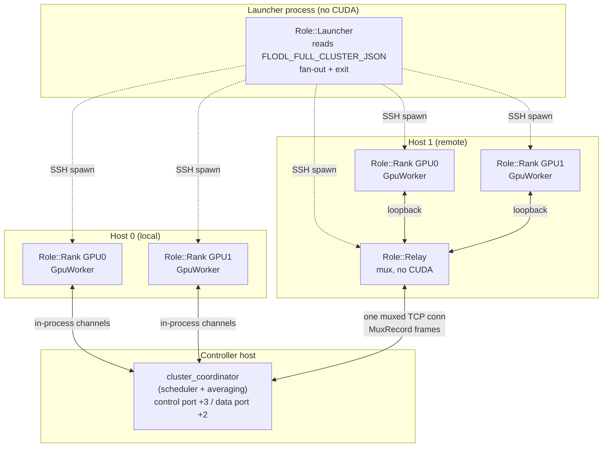
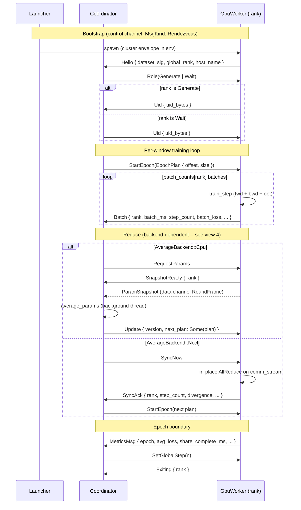
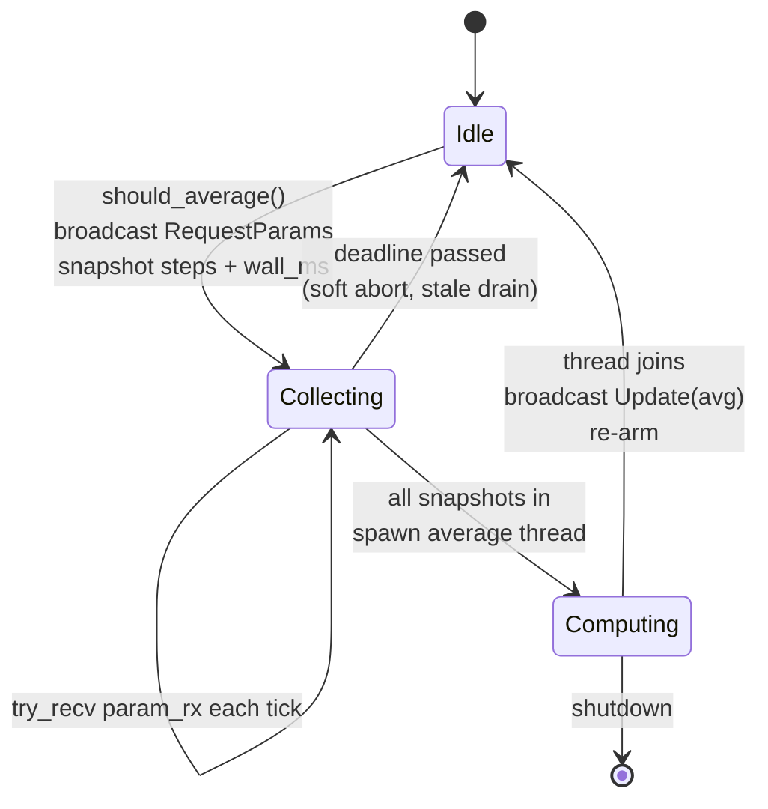
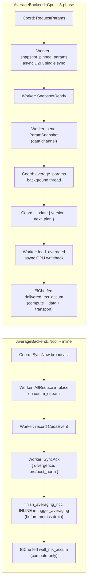
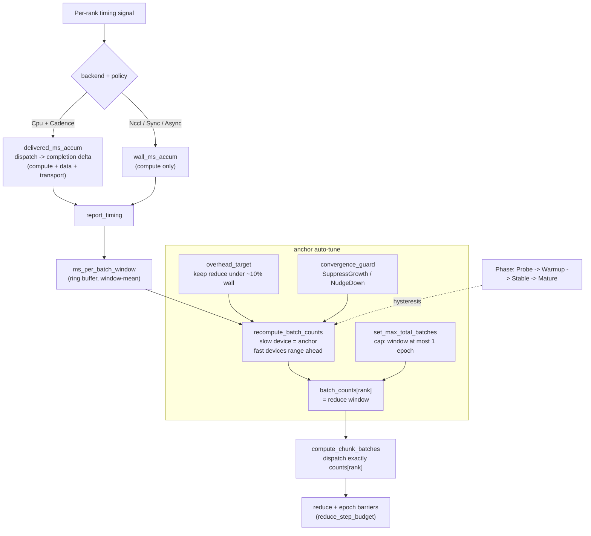

# Distributed architecture

This document maps the **entire distributed pattern** -- the data, the
communication, and the logic that move parameters between heterogeneous GPUs
and hosts during DDP training.

The orchestration is not one flow but **three orthogonal flows over a shared
role topology**. A single mega-chart would be unreadable, so each flow gets its
own view, in the diagram type that fits it:

| View | What it answers | Diagram |
|---|---|---|
| [1. Role topology](#1-role-topology) | Who runs where? Process vs thread boundaries. | flowchart |
| [2. Training lifecycle](#2-training-lifecycle) | What happens end to end, in order? | sequence |
| [3. Coordinator state machine](#3-coordinator-state-machine) | How does CPU averaging stay non-blocking? | state |
| [4. Reduce backends](#4-reduce-backends) | NCCL inline vs CPU 3-phase -- the key divergence. | flowchart |
| [5. ElChe scheduling](#5-elche-scheduling-data-flow) | How does work get allocated per rank? | flowchart |
| [6. Message catalog](#6-message-catalog) | Which message carries what, between whom? | tables |

> Every diagram cites its source file(s). When the code moves, re-sync the
> diagram from the cited enum/struct -- the variant names below are pulled
> verbatim so drift is greppable.

The user-facing strategy is a single **`ElCheMode`** (`nccl_sync`,
`nccl_cadence`, `cpu_sync`, `cpu_cadence`, `cpu_async`) on
[`ElCheConfig`]. Internally each mode decomposes into the two axes that
parameterize everything below:

- **`ApplyPolicy`** -- the *pacing* clock: `Sync` (K=1), `Cadence` (K=N via
  ElChe), `Async` (Cadence + bounded lookahead). `Sync`/`Cadence` are
  *barrier-paced* (a rank is held at its window until the reduce resets it);
  `Async` opts out.
- **`AverageBackend`** -- the *transport*: `Nccl` (in-place GPU AllReduce) or
  `Cpu` (snapshot round-trip through the coordinator). **Orthogonal to
  pacing** -- five of the six combinations are valid modes (`Async + Nccl`
  was dropped and hard-errors at `.run()`), which is what makes NCCL-vs-CPU
  A/B testing possible.

> Source: `flodl/src/distributed/config.rs` (`ElCheMode`, `ElCheMode::split`),
> `flodl/src/distributed/ddp_run/mod.rs` (`ApplyPolicy`, `AverageBackend`).

[`ElCheConfig`]: ../../flodl/src/distributed/config.rs

---

## 1. Role topology

A run is a tree of processes. The **launcher** never touches CUDA (it exits
after fan-out); each **rank** is its own process owning one GPU; one **relay**
per remote host multiplexes that host's ranks onto a single connection to the
controller. The **coordinator** is the scheduler the ranks talk to.

Local ranks (same host as the controller) talk over in-process channels;
remote ranks talk loopback to their host's relay, which carries every local
rank's frames over one connection as `MuxRecord` blobs tagged by rank.

> Source: `launcher/mod.rs` (`Role`, `dispatch()`), `relay/agent.rs`
> (`ChannelKind`), `relay/mux.rs` (`MuxRecord`, `RelayControlMsg`).

---

## 2. Training lifecycle

End to end for one cluster run: bootstrap rendezvous, then the repeating
**dispatch -> train -> reduce -> average -> re-arm** window. Shown for the
`Cadence` pacing; the `Update.next_plan` atomic-dispatch fold (CPU path)
collapses the post-reduce control round-trip.

The `share_complete_ms` in `MetricsMsg` (not `epoch_ms`) is the honest
balancer denominator; ElChe's per-batch signal is the coordinator-measured
**delivered** cost, not `batch_ms` (compute only) -- see view 5.

> Source: `wire.rs` (`RendezvousMsgWire`), `ddp_run/mod.rs` (`ControlMsg`,
> `TimingMsg`, `MetricsMsg`), `cluster_coordinator/epoch_dispatch.rs`,
> `ddp_run/worker/sync.rs`.

---

## 3. Coordinator state machine

CPU averaging must **never block the scheduler** -- the coordinator keeps
servicing `check_throttle` and timing reports while a reduce is in flight. It
does this with a 3-state machine that snapshots counters at trigger time and
runs the average on a background thread.

**Invariants that keep this correct:**

- **subtract-not-zero**: `steps_snapshot` / `wall_ms_snapshot` are captured at
  trigger time, so timing is attributed to the right window even though work
  continues during the cycle.
- **single-consumer reuse**: the worker's `ParamSnapshot` shares storage with
  persistent pinned buffers; the `Idle -> Collecting -> Computing -> Idle`
  cycle issues exactly one `RequestParams` per cycle and the worker
  re-snapshots only after the `Update` round-trips back, so a snapshot is
  never overwritten while in flight.
- **re-arm via `cpu_avg_state`** (back to `Idle`), *not* `nccl_ack` -- the CPU
  `SyncAck` carries no meaningful `step_count`.

> Source: `ddp_run/coordinator/cpu_avg.rs` (`CpuAvgState`),
> `ddp_run/coordinator/mod.rs`.

---

## 4. Reduce backends

The single most important divergence in the codebase: **NCCL reduce is inline;
CPU reduce is the 3-phase state machine.** They are gated on `AverageBackend`,
independent of pacing.

Key asymmetries (each a hard-won fix):

- **Memory**: NCCL is zero-extra (in-place); CPU is `O(world_size *
  model_size)` host RAM.
- **Blocking**: NCCL sync at a collective barrier (fast GPU waits); CPU never
  blocks a GPU.
- **Timing feed**: NCCL's `finish_averaging_nccl` runs *before* the metrics
  drain, so its delivered cost would be stale -- it keeps the compute-only
  `wall_ms_accum` feed. CPU+Cadence gets the transport-aware
  `delivered_ms_accum` feed (view 5).
- **Snapshot readout** (CPU): batched **async** D2H into reused **pinned** host
  buffers, then a single `synchronize()` per window -- not per-param
  synchronous copies.

> Source: `ddp_run/mod.rs` (`AverageBackend`),
> `cluster_coordinator/averaging.rs`, `ddp_run/worker/sync.rs`
> (`snapshot_pinned_params`, `load_averaged`).

---

## 5. ElChe scheduling data flow

ElChe turns per-rank timing into a `batch_counts[rank]` schedule vector (the
reduce window). N GPUs are treated as **one logical GPU partitioned into
heterogeneous per-rank step counts**. The window is capped at one epoch so
syncs never collapse below 1/epoch.

The delivered-cost feed is what closed the cpu-cadence idle prize: ranks pay
compute + data + transport, but ElChe was scheduling on compute-only timing, so
it over-allocated the fast RTX and left it idle at the barrier. Feeding the
coordinator-measured dispatch-to-completion delta (which excludes the
reduce-barrier wait) made cpu-cadence track nccl-cadence.

> Source: `el_che.rs` (`ElChe`, `Phase`, `recompute_batch_counts`),
> `cluster_coordinator/epoch_dispatch.rs` (`compute_chunk_batches`,
> `take_next_chunk_plan`), `cluster_coordinator/averaging.rs` (`timing_feed`).

---

## 6. Message catalog

Two communication layers. **In-process channels** carry Rust types (including
`Tensor` handles) between coordinator and local worker threads. **Wire frames**
strip tensor handles (data travels paired on a data channel) and are
HMAC-signed with the session salt for cross-host transport.

### Wire frames (cross-host)

Every frame is tagged with a `MsgKind` and carried in an HMAC-signed
`ControlFrame`.

| `MsgKind` | Direction | Payload | Carries |
|---|---|---|---|
| `Control` | coord -> worker | `ControlMsgWire` | RequestParams / Update{version,next_plan} / SyncNow / StartEpoch / DeclareDead / ... |
| `Timing` | worker -> coord | `TimingMsgWire` | Batch / SyncAck / SnapshotReady / Heartbeat / LrUpdate / Exiting / EvalResult |
| `Metrics` | worker -> coord | `MetricsMsgWire` | per-epoch avg_loss, share_complete_ms, samples |
| `ParamSnapshotMeta` | worker -> coord | `ParamSnapshotMetaWire` | pre-snapshot metadata, paired with a data-channel RoundFrame |
| `Heartbeat` | worker -> coord | `HeartbeatWire` | liveness (distinguishes "alive at barrier" from "dead") |
| `Rendezvous` | both | `RendezvousMsgWire` | Hello / Role / Uid bootstrap |

> Source: `wire.rs` (`MsgKind`, `ControlMsgWire`, `TimingMsgWire`,
> `RendezvousMsgWire`).

### In-process channels (local threads)

| Channel | Direction | Type | Notable variants |
|---|---|---|---|
| control | coord -> worker | `ControlMsg` | RequestParams, Update(AveragedParams), SyncNow, StartEpoch(EpochPlan), ExtendPartition, DeclareDead, NewNcclSession, RequestNewNcclId, Throttle, SetGlobalStep |
| timing | worker -> coord | `TimingMsg` | Batch, SyncAck, SnapshotReady, Heartbeat, LrUpdate, Exiting, EvalResult, CheckpointResult |
| metrics | worker -> coord | `MetricsMsg` | epoch, avg_loss, batches_processed, share_complete_ms, samples_processed |
| data | both | `RoundFrame` | tensor payloads (ParamSnapshot, AveragedParams) |

The wire types are 1:1 mirrors of the in-process types with tensor handles
removed; the relay's `MuxRecord` wraps these into one connection per host, and
`RelayControlMsg` (Hello / HelloAck / RankExit) manages the relay-to-controller
leg.

> Source: `ddp_run/mod.rs` (`ControlMsg`, `TimingMsg`, `MetricsMsg`),
> `controller.rs` (`RoundFrame`), `relay/mux.rs` (`MuxRecord`,
> `RelayControlMsg`).

---

## How to keep this in sync

Each diagram cites the enum/struct it was built from. When you touch one of
those types, re-render the affected view -- the variant names here are pulled
verbatim, so a `grep` for a renamed variant finds every stale diagram. Mermaid
renders natively on GitHub and on flodl.dev; no build step.
