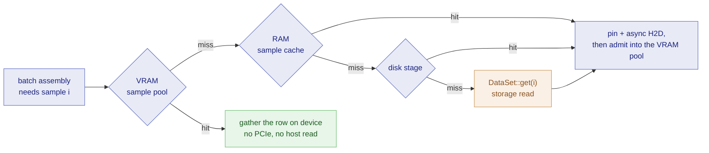

# Data Loading

Async data loading with automatic VRAM management. The `DataLoader`
handles batching, shuffling, device transfer, and prefetching so your
training loop stays clean.

> **Prerequisites**: [Tensors](/guide/0.8.x/tensors) and
> [Training](/guide/0.8.x/training). CUDA GPU recommended but not required.

> **Time**: ~15 minutes.

## Quick start

```rust
use flodl::*;
use std::sync::Arc;

// Implement the dataset trait
struct MyDataset { /* ... */ }

impl BatchDataSet for MyDataset {
    fn len(&self) -> usize { 60_000 }
    fn get_batch(&self, indices: &[usize]) -> Vec<Tensor> {
        let images = /* load images for indices */;
        let labels = /* load labels for indices */;
        vec![images, labels]
    }
}

let dataset = Arc::new(MyDataset::new());

let mut loader = DataLoader::from_batch_dataset(dataset)
    .batch_size(32)
    .device(Device::CUDA(0))
    .names(&["image", "label"])
    .build()?;

for epoch in 0..100 {
    for batch in loader.epoch(epoch) {
        let batch = batch?;
        let images = &batch["image"];   // already on GPU
        let labels = &batch["label"];
        // ... training ...
    }
}
```

## Dataset traits

floDl provides two dataset traits. Choose based on how your data is
stored:

### DataSet (per-item)

Returns one sample at a time. The loader stacks samples into batches
automatically.

```rust
impl DataSet for MnistDataset {
    fn len(&self) -> usize { self.images.len() }

    fn get(&self, index: usize) -> Vec<Tensor> {
        vec![
            self.images[index].clone(),
            self.labels[index].clone(),
        ]
    }
}
```

Best for: datasets where each sample is a separate file or DB row.

### BatchDataSet (per-batch)

Returns an entire batch at once. More efficient when the data source
supports bulk access (memory-mapped files, databases, pre-batched
tensors).

```rust
impl BatchDataSet for PreloadedDataset {
    fn len(&self) -> usize { self.num_samples }

    fn get_batch(&self, indices: &[usize]) -> Vec<Tensor> {
        let idx = Tensor::from_slice_i64(
            &indices.iter().map(|&i| i as i64).collect::<Vec<_>>()
        );
        vec![
            self.images.index_select(0, &idx),
            self.labels.index_select(0, &idx),
        ]
    }
}
```

Best for: pre-loaded datasets, memory-mapped files, GPU-resident data.

Both traits require `Send + Sync` so the prefetch worker can access
them from a background thread.

## Bundled datasets

`flodl::data::datasets` ships parsers for common benchmark data — pure
parsers with no download logic (fetch the files however you like):

- `Mnist` / `Cifar10` — classic vision sets, parsed into RAM.
- `Cifar10Disk` — same files read per sample from disk (the
  larger-than-RAM path; implements `DataSet`, so the staging tiers
  compose above it).
- `Shakespeare` — character-level LM sequences from raw text.
- `TokenShards` — pre-tokenized LM corpora in NumPy `.npy` shard files
  (OLMo / olmo-mix, nanoGPT-style dumps).

`TokenShards` is the path for real LM pretraining data: each shard is
a 1-D array of token ids (`|u1`, `<u2`, `<u4`, `<i4` or `<i8`), and
samples are non-overlapping `seq_len` windows with the target shifted
by one. Shards are read lazily with positioned reads — a multi-GB
corpus costs no RAM up front — and windows never cross shard
boundaries:

```rust
use flodl::data::datasets::{TokenDtype, TokenShards};

// Every .npy in the directory, sorted by name; or TokenShards::open(&paths, seq_len)
let data = TokenShards::open_dir("data/shards", 1024)?;

// Headerless raw dumps (what OLMo's preprocessed shards and nanoGPT
// .bin files actually are, .npy name notwithstanding) state their
// dtype explicitly; a prefix slice of such a file is itself valid:
let data = TokenShards::open_raw(&["data/part-0-00000.npy"], TokenDtype::U16, 1024)?;
println!("{} windows over {} tokens", data.len(), data.total_tokens());

// Per-sample entry point -> staging cascade (RAM cache, disk stage, VRAM pool)
let mut loader = DataLoader::from_dataset(data)
    .batch_size(32)
    .streaming()
    .build()?;
// batch[0]: [32, 1024] Int64 inputs, batch[1]: targets shifted by one
```

## Named batch access

The `Batch` type supports both positional and named access:

```rust
let loader = DataLoader::from_batch_dataset(dataset)
    .batch_size(32)
    .names(&["image", "letter", "case", "origin"])
    .build()?;

for batch in loader.epoch(0) {
    let batch = batch?;

    // Positional access
    let image = &batch[0];

    // Named access
    let image = &batch["image"];
    let letter = &batch["letter"];

    // Introspection
    assert!(batch.has("origin"));
    assert_eq!(batch.names(), &["image", "letter", "case", "origin"]);
    assert_eq!(batch.len(), 4);
}
```

If `.names()` is not called, auto-generated positional names ("0", "1",
...) are used.

## Resident vs streaming mode

The loader automatically selects the best mode based on available VRAM:

### Resident mode

When the dataset fits in 75% of free VRAM, the entire dataset is loaded
onto the GPU once at `build()` time. Per-epoch reshuffling uses GPU-side
`index_select` with a shuffled permutation tensor. Zero CPU-GPU transfer
after the initial load.

```
Build:   pin_memory() -> to_device() (one-time transfer)
Epoch:   index_select(shuffled_permutation) (GPU-only)
```

### Streaming mode

When the dataset is too large, a persistent background worker thread
handles batching and transfer:

```
Worker thread:  get_batch(indices) -> pin_memory() -> StreamGuard + to_device_async()
                -> GpuEvent (signals readiness)
Main thread:    event.synchronize() (typically instant due to prefetch)
                -> use batch
```

The worker runs on a dedicated CUDA stream, overlapping data transfer
with training computation on the default stream.

### Forcing a mode

```rust
// Force streaming (useful for benchmarking or preserving VRAM headroom)
.streaming()

// Force a specific prefetch depth
.prefetch(8)
```

## VRAM-aware prefetch

In streaming mode, the prefetch depth adapts automatically to VRAM:

- **Bootstrap**: 4 batches at `build()` time (conservative, model not yet loaded)
- **epoch(0)**: re-probes free VRAM after model allocation, fills to cap
- **epoch(N)**: re-probes each epoch, adapts to fragmentation and
  activation memory changes
- **OOM fallback**: if resident mode fails with CUDA OOM, automatically
  retries with streaming

### Configuration

```rust
// Use up to 90% of total VRAM for data (default)
.vram_max_usage(0.90)

// Use up to 80% (more headroom for activations)
.vram_max_usage(0.80)

// Manual override (disables automatic adaptation)
.prefetch(16)

// Manual resize between epochs
loader.auto_resize();
```

The default cap of 90% leaves 10% headroom for activation memory,
gradients, and CUDA allocator overhead.

### The reader ring

The streaming pipeline has one stage or two, depending on the target:

- **Single stage** (CPU targets, and the distributed `LoadBatch` path): one
  worker thread fetches from the dataset and forwards on the batch channel.
  The channel itself is the read-ahead buffer.
- **Two stages** (CUDA targets): a *reader* thread fetches batches into a
  bounded pageable-RAM ring, and the *worker* thread drains the ring and runs
  the device transfer - pin, async H2D, completion event.

Splitting them lets storage-read latency overlap the transfer stage's CPU
work, which raises the throughput ceiling from `1/(t_read + t_transfer)` to
`1/max(t_read, t_transfer)`, and the ring absorbs read jitter from network
storage.

Note the two independent bounds, which is why the memory knobs are separate:
the **ring bounds RAM in flight**, while the **depth governor above bounds
VRAM in flight**. `ram_max_usage` covers the ring together with the sample
cache below.

## The staging cascade

Prefetch depth bounds how much is *in flight*. The staging cascade is a
separate mechanism that decides what stays **retained between epochs**.

Streaming mode would otherwise re-read the whole dataset from storage on
every epoch. Instead, three tiers retain samples **by index**, so later
epochs get progressively cheaper. Batching happens above all of them, which
is the point: a batch is not reusable across epochs (a reshuffle changes its
composition) but a *sample* is.



| Tier | Lives in | A hit saves | Sized by | Knob |
|---|---|---|---|---|
| VRAM sample pool | leftover device memory | the PCIe transfer *and* the host read | what `vram_max_usage` leaves after prefetch | `.vram_pool(bool)` |
| RAM sample cache | host RAM | the storage read | `ram_max_usage` (shared with the reader ring) | `.sample_cache(bool)` |
| Disk stage | one append-only pack file | a slow/remote storage read | `.disk_stage(gb)`, off by default | `.disk_stage_dir(path)` |

The VRAM pool fills for free. Every sample crosses PCIe at least once per
epoch anyway, so the pool admits by copying rows device-to-device out of each
just-uploaded batch, on the transfer stream: epoch 1 populates it as a side
effect, and later epochs gather hits in place of uploading them.

### Admission: fill until full, evict nothing

Each tier admits until its budget is spent and then stops - no LRU, no
scoring. That is not a simplification, it is optimal here. Under a uniform
per-epoch reshuffle, every sample is touched exactly once per epoch in a
fresh random order, so a tier holding `K` of `N` samples has an expected hit
rate of `K/N` **for any** eviction policy. No choice of which `K` to keep
beats any other, so admit-until-full delivers the same hit rate with zero
churn. For the same reason, *which* tier a given sample lands in does not
change the hit profile either - so the disk stage takes whatever the RAM
cache had no budget for, and nothing rebalances them.

The exception is the DDP staging path: the coordinator re-partitions per
epoch, so a rank's assigned set changes, the `K`-set tie breaks, and the
cache does evict. Under DDP the same knobs exist on the trainer
(`TrainerConfig::with_sample_cache` / `with_disk_stage` / ...) and govern
each rank with the same defaults.

### Two things that switch the cascade off

- **Resident mode.** The cache is dormant (zero budget, pure pass-through)
  until the *streaming* loader installs a RAM budget. In resident mode the
  dataset is already on the device, so there is nothing to retain.
- **Implementing `BatchDataSet` directly.** Opaque batch datasets bypass the
  per-sample adapter, and therefore the whole cascade, by design - flodl
  cannot key by sample index through an interface that only speaks batches.
  This is the real trade-off behind the two traits: `BatchDataSet` wins on
  bulk-read efficiency *within* an epoch, `DataSet` wins on retention
  *across* epochs. Bundled larger-than-RAM datasets implement `DataSet` for
  exactly this reason.

Because retention is keyed by index and re-served on later epochs, a
`get()` that is not a pure function of its index has its first result frozen
for the whole run - see
[Why not augment inside `get()`?](#why-not-augment-inside-get) for the
contract and the debug-build probe that enforces it.

## Shuffling and sampling

By default, data is shuffled each epoch using a `RandomSampler` with
deterministic per-epoch permutations:

```rust
// epoch 0: seed=42+0 -> permutation A
// epoch 1: seed=42+1 -> permutation B
// epoch 0 again: same seed -> same permutation A (reproducible)
```

### Control shuffling

```rust
// Custom seed
.seed(12345)

// Disable shuffling (sequential order every epoch)
.shuffle(false)

// Custom sampler
.sampler(Box::new(MyCustomSampler::new()))
```

### Drop last batch

```rust
// Drop incomplete final batch (default: true)
.drop_last(true)
```

The default is `true` to avoid a BatchNorm footgun: a final batch of
size 1 produces NaN variance. Set to `false` for evaluation/inference
where every sample matters.

## Augmentation: repeated picks + a keyed transform

flodl treats augmentation as two orthogonal, deterministic pieces
instead of per-call randomness hidden in the dataset:

```rust
let loader = DataLoader::from_dataset(my_data)
    .batch_size(64)
    .augment(4)                       // each sample: 4 views per epoch
    .transform(|mut rows, keys| {     // derive each view from its key
        for (i, key) in keys.iter().enumerate() {
            let mut rng = key.rng();  // same key = same bytes, every run
            // e.g. flip row i when rng.bernoulli(0.5), crop offset from
            // rng.usize(pad), noise from rng.f32() ...
        }
        Ok(rows)
    })
    .build()?;
```

- **`.augment(k)`** is pure scheduling: the epoch becomes a shuffle of
  `len() * k` *picks*, so each sample appears `k` times, spread across
  the epoch, and batch counts scale by `k`. Every pick fetches the same
  raw bytes - staged once across the caching tiers - and counts as one
  unit of work for DDP scheduling. Without a transform, `k > 1` is
  plain oversampling.
- **`.transform(f)`** runs at delivery, after device transfer, on every
  batch. It receives the rows plus one `PickKey { sample, repeat,
  epoch, seed }` per row; `key.rng()` gives a stateless RNG unique to
  that view, so augmentation is exactly reproducible across runs, ranks,
  and checkpoint resumes - statistically equivalent to stochastic
  augmentation, strictly better for debugging. Both knobs exist on
  `TrainerConfig` / `Trainer::builder` for DDP with identical semantics.

### Why not augment inside `get()`?

The PyTorch `__getitem__` habit - random crop/flip inside the dataset -
breaks under flodl's staging tiers: the RAM sample cache, disk stage,
and VRAM pool (all on by default) retain samples **by index** and
re-serve those bytes on later epochs, so per-call randomness would be
silently frozen at its first realization. `DataSet::get()` /
`BatchDataSet::get_batch` therefore carry a purity contract: same
index, same bytes, every call. Debug builds probe it (one double-fetch
compare per run) and panic with an explanation if it is violated;
release builds skip the probe.

The payoff for keeping raw bytes in the tiers: a VRAM-pooled sample
uploads once and derives all `k` views on device, and the transform can
never corrupt the retained data - delivered batches are always freshly
assembled storage. Keep transforms as tensor ops (they run on the
target device); a transform that round-trips to host defeats residency.

## DDP integration

Pass the dataset directly to `Trainer::builder` or `TrainerConfig` -
the framework constructs a per-rank `DataLoader` against each rank's
dataset shard automatically:

```rust
let ddp = Trainer::builder(model_factory, optim_factory, train_fn)
    .dataset(dataset)    // Arc<dyn BatchDataSet>
    .batch_size(32)
    .num_epochs(10)
    .run()?;
```

Under DDP, each rank's loader operates independently:

- **Per-rank backend selection**: a 16 GB rank can go resident while a
  6 GB rank on the same training run streams. No
  lowest-common-denominator constraint.
- **Proportional sharding**: the coordinator computes shard sizes from
  `partition_ratios` (or auto-balances by throughput via ElChe) and
  pushes the epoch plan to each worker. Fast ranks get larger shards.
- **No cross-rank transfer in the data path**: each rank loads its own
  shard from its own `DataSet` impl. The DataLoader is otherwise
  unaware that a cluster exists.

### Streaming from external sources

`DataSet` / `BatchDataSet` are pull-based traits - the body of `get()`
/ `get_batch()` decides where the samples come from. The framework's
"resident" vs "streaming" modes are about CPU → VRAM transfer; the
underlying source can be RAM, mmap, disk, network, S3, a database, or
anything else accessible from Rust.

For source-streaming patterns:

```rust
struct S3Dataset { /* ... bucket handle, prefetch pool, etc. ... */ }

impl BatchDataSet for S3Dataset {
    fn len(&self) -> usize { /* total samples in dataset */ self.total }

    fn get_batch(&self, indices: &[usize]) -> Result<Vec<Tensor>> {
        // Fetch on-demand. Cache locally as you go, parallelize
        // requests if useful - all up to your impl.
        let bytes = self.fetch_indices(indices)?;
        self.decode_to_tensors(&bytes, indices.len())
    }
}
```

The DataLoader's prefetch worker keeps `K` future batches in flight on
a dedicated CUDA stream, so the network round-trip for batch N+1 can
overlap with batch N's compute. No special hooks needed; just
implement the trait and pass it.

## Builder reference

| Method | Default | Description |
|--------|---------|-------------|
| `.batch_size(usize)` | Required | Batch size per rank |
| `.device(Device)` | CPU | Target device (the per-rank loader auto-targets its own CUDA device under DDP) |
| `.seed(u64)` | 42 | RNG seed for shuffling |
| `.shuffle(bool)` | true | Enable shuffling |
| `.sampler(Box<dyn Sampler>)` | - | Custom sampler (overrides shuffle) |
| `.prefetch(usize)` | Auto | Override auto-detected prefetch depth |
| `.vram_max_usage(f64)` | 0.90 | Max VRAM fraction for prefetch |
| `.ram_max_usage(f64)` | 0.50 | Available-RAM fraction for the reader ring + sample cache |
| `.sample_cache(bool)` | true | Read-through RAM sample cache (later epochs read from RAM) |
| `.disk_stage(gb)` | 0 = off | Local-disk overflow tier under the sample cache |
| `.disk_stage_dir(path)` | temp dir | Where the disk stage's pack file lives |
| `.vram_pool(bool)` | true | Device-resident sample pool in leftover VRAM |
| `.gpu_ram_share(f64)` | Auto | Integrated (APU) GPUs only: fraction of `MemTotal` the GPU aperture claims |
| `.activation_reserve(bytes)` | Auto | Declared first-step VRAM reserve for prefetch sizing |
| `.augment(usize)` | 1 | Views per sample per epoch (pick-space schedule) |
| `.transform(fn)` | - | Deterministic delivery transform, keyed per `PickKey` |
| `.streaming()` | Auto | Force streaming mode |
| `.names(&[&str])` | Positional | Name batch tensor positions |
| `.drop_last(bool)` | true | Drop incomplete final batch |

### Integrated GPUs (APUs): `gpu_ram_share`

On a discrete card, VRAM and host RAM are separate pools and the budgets
above are independent. On an integrated GPU they are the same DRAM, so
sizing the host tiers against raw `MemAvailable` prices one pool twice.
flodl detects this (it allocates on the device and checks whether
`MemAvailable` moves, which distinguishes a shared aperture from a BIOS
carve-out) and subtracts the aperture's unrealized headroom before taking
any share. Nothing to configure in the normal case.

Two cases need the knob:

- **The platform under-reports the aperture.** `.gpu_ram_share(f)` states
  the reservation as a fraction of `MemTotal` instead. Values above `1.0`
  are legal, for a platform whose `MemTotal` under-states what the APU can
  address.
- **A multi-socket APU.** Each package carries its own memory and its own
  aperture while `/proc/meminfo` is system-wide, and the kernel exposes no
  per-package `MemAvailable` to correct with. flodl refuses to guess there
  and asks for an explicit share rather than over-committing by the socket
  count. The refusal is an ordinary error out of `.build()` (or rank-worker
  construction under DDP) naming the knob, not a mid-run failure: nothing
  in the verdict changes between epochs, so it is decided once up front.
  NPS / Sub-NUMA Clustering on a *single* socket is not this case and needs
  nothing.

The same knob is on the DDP path: `TrainerConfig::with_gpu_ram_share` and
`DdpRunConfig::with_gpu_ram_share`. On a cluster it is also declarable in
config, because it is host-hardware truth the binary cannot know per box:
`cluster.workers[].gpu_ram_share` for a fan-out host, `join.gpu_ram_share`
in a walk-in's own yml, and a cluster-scope `cluster.gpu_ram_share` as the
fleet default for a farm of identical APU boxes. A declared value fills the
config only when the binary left the knob unset; explicit code wins (see
the [cluster guide](/guide/0.8.x/ddp/cluster-guide)).

Under DDP the same memory knobs exist on the trainer — `TrainerConfig::with_vram_max_usage` / `with_ram_max_usage` / `with_sample_cache` / `with_disk_stage` / `with_disk_stage_dir` (or the chained `DdpBuilder` twins) — and govern each rank's prefetch channel, device sample pool, and staging tiers with the same defaults and clamps. One sizing policy serves both paths; co-hosted ranks split the host-RAM share in proportion to their schedule, each rank's disk stage writes its own pid-unique pack file, and `FLODL_VRAM_POOL=off` now disables the device sample pool on the solo loader path too (previously DDP-only).

## DataLoader methods

| Method | Description |
|--------|-------------|
| `.epoch(n)` | Get epoch iterator (reshuffles, adapts prefetch) |
| `.len()` | Number of samples |
| `.num_batches()` | Number of batches per epoch |
| `.batch_size()` | Batch size |
| `.device()` | Target or gather device |
| `.is_resident()` | Whether in resident mode |
| `.prefetch_depth()` | Current prefetch depth |
| `.set_prefetch_depth(n)` | Override prefetch depth |
| `.set_activation_reserve(bytes)` | Runtime twin of `.activation_reserve(bytes)`; an explicit value is fully trusted (no first-fill discount). No-op for resident loaders |
| `.auto_resize()` | Re-probe VRAM and adapt prefetch |
| `.names()` | Tensor names for each batch position |

